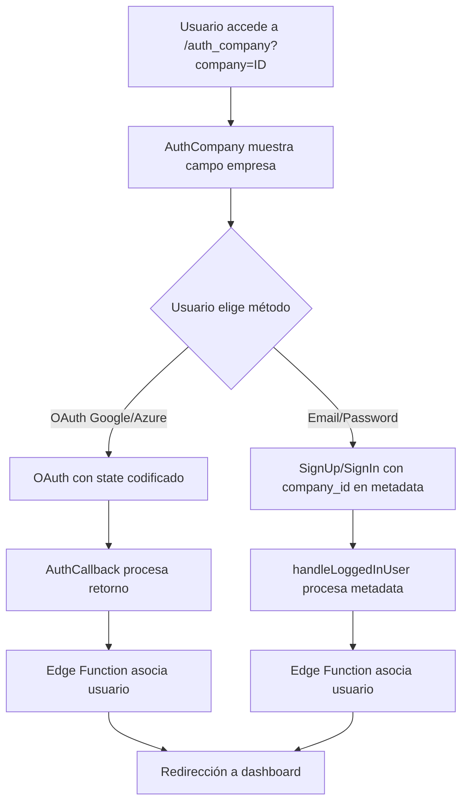

# Implementación de Autenticación OAuth con Asociación de Empresa

Este documento describe la implementación completa del flujo de autenticación OAuth (Google/Azure) y email/contraseña con asociación automática de usuarios a empresas.

## 🏗️ Arquitectura

### Componentes Implementados

1. **AuthCompany.tsx** - Componente de autenticación con campo de empresa
2. **AuthCallback.tsx** - Callback para procesar retornos de OAuth
3. **useCompanyAssociation.ts** - Hook para asociar usuarios con empresas
4. **Edge Function** - Función de Supabase para asociación segura

### Flujo de Autenticación



## 📁 Archivos Creados/Modificados

### Nuevos Archivos
- `src/pages/AuthCallback.tsx` - Callback de OAuth
- `src/hooks/useCompanyAssociation.ts` - Hook de asociación
- `supabase/functions/associate-user-company/index.ts` - Edge Function
- `supabase/functions/associate-user-company/deno.json` - Configuración Deno

### Archivos Modificados
- `src/pages/AuthCompany.tsx` - Actualizado para OAuth y asociación
- `src/App.tsx` - Agregada ruta `/auth/callback`

## 🔧 Configuración Requerida

### 1. Supabase Dashboard

#### Configurar OAuth Providers
```bash
# En Supabase Dashboard > Authentication > Providers
# Habilitar Google y Azure con las credenciales correspondientes
```

#### Configurar Redirect URLs
```bash
# Agregar estas URLs a los providers OAuth:
http://localhost:8080/auth/callback
https://tu-dominio.com/auth/callback
```

### 2. Edge Function Deployment

```bash
# Instalar Supabase CLI
npm install -g supabase

# Login a Supabase
supabase login

# Deploy la Edge Function
supabase functions deploy associate-user-company
```

### 3. Variables de Entorno

Asegúrate de que estas variables estén configuradas en Supabase:

```bash
SUPABASE_URL=tu-supabase-url
SUPABASE_ANON_KEY=tu-anon-key
SUPABASE_SERVICE_ROLE_KEY=tu-service-role-key
```

## 🗄️ Estructura de Base de Datos

### Tabla `maity.users`
```sql
CREATE TABLE maity.users (
  id UUID PRIMARY KEY REFERENCES auth.users(id),
  email TEXT NOT NULL,
  company_id UUID REFERENCES maity.companies(id),
  created_at TIMESTAMP WITH TIME ZONE DEFAULT NOW(),
  updated_at TIMESTAMP WITH TIME ZONE DEFAULT NOW()
);

-- RLS Policies
ALTER TABLE maity.users ENABLE ROW LEVEL SECURITY;

CREATE POLICY "Users can view own data" ON maity.users
  FOR SELECT USING (auth.uid() = id);

CREATE POLICY "Service role can manage users" ON maity.users
  FOR ALL USING (auth.role() = 'service_role');
```

### Tabla `maity.companies`
```sql
CREATE TABLE maity.companies (
  id UUID PRIMARY KEY DEFAULT gen_random_uuid(),
  name TEXT NOT NULL,
  active BOOLEAN DEFAULT true,
  created_at TIMESTAMP WITH TIME ZONE DEFAULT NOW(),
  updated_at TIMESTAMP WITH TIME ZONE DEFAULT NOW()
);

-- RLS Policies
ALTER TABLE maity.companies ENABLE ROW LEVEL SECURITY;

CREATE POLICY "Anyone can view active companies" ON maity.companies
  FOR SELECT USING (active = true);
```

## 🚀 Uso

### URLs de Acceso

```bash
# Autenticación con empresa específica
http://localhost:8080/auth_company?company=9368d119-ec44-4d9a-a94f-b1a4bff39d6d

# Callback de OAuth (automático)
http://localhost:8080/auth/callback?code=...&state=...
```

### Flujo de Usuario

1. **Usuario accede con company_id**: Se muestra el campo de empresa (read-only)
2. **Usuario elige método de autenticación**:
   - **Email/Password**: Company_id se guarda en metadata del usuario
   - **OAuth**: Company_id se codifica en el parámetro `state`
3. **Después de autenticación**: Edge Function asocia automáticamente el usuario con la empresa
4. **Redirección**: Usuario es enviado al dashboard con company_id

## 🔒 Seguridad

### Validaciones Implementadas

1. **UUID Validation**: Se valida el formato del company_id
2. **Company Existence**: Se verifica que la empresa existe y está activa
3. **State Parameter**: Se usa codificación base64 para prevenir CSRF
4. **RLS Policies**: Row Level Security habilitado en todas las tablas
5. **Service Role**: Edge Function usa service role para operaciones privilegiadas

### Prevención de CSRF

```typescript
// El state parameter incluye timestamp para prevenir replay attacks
const stateData = {
  company_id: companyId,
  return_to: returnTo || '/dashboard',
  timestamp: Date.now() // Previene ataques de replay
};
```

## 🐛 Debugging

### Logs Importantes

```typescript
// En AuthCompany.tsx
console.log('[DEBUG] handleOAuthLogin:redirectTarget', { 
  provider, companyId, redirectTarget, stateData, encodedState 
});

// En AuthCallback.tsx
console.log('[DEBUG] AuthCallback: Decoded state', stateData);

// En Edge Function
console.log('[DEBUG] Edge Function: Request data', { user_id, company_id, user_email });
```

### Verificación de Estado

```bash
# Verificar que la Edge Function está desplegada
supabase functions list

# Ver logs de la Edge Function
supabase functions logs associate-user-company
```

## 📝 Notas de Implementación

### Consideraciones Especiales

1. **Google OAuth**: Para validación de dominio, usar el parámetro `hd` en la configuración
2. **Azure OAuth**: Para validación de tenant, usar el parámetro `tid` en la configuración
3. **Rate Limiting**: La Edge Function incluye validaciones para prevenir abuso
4. **Error Handling**: Manejo completo de errores con mensajes informativos

### Extensiones Futuras

1. **Validación de Dominio**: Implementar validación automática de dominios de email
2. **Multi-tenant**: Soporte para usuarios en múltiples empresas
3. **Audit Log**: Logging de todas las asociaciones de usuarios
4. **Bulk Operations**: Operaciones masivas de asociación

## ✅ Testing

### Casos de Prueba

1. **OAuth con company_id válido**: Debe asociar usuario correctamente
2. **OAuth con company_id inválido**: Debe mostrar error apropiado
3. **Email signup con company_id**: Debe asociar después de confirmación
4. **Usuario existente sin empresa**: Debe asociar con nueva empresa
5. **Usuario existente con empresa**: Debe mantener empresa actual

### URLs de Prueba

```bash
# Prueba con empresa válida
http://localhost:8080/auth_company?company=9368d119-ec44-4d9a-a94f-b1a4bff39d6d

# Prueba con empresa inválida
http://localhost:8080/auth_company?company=invalid-uuid

# Prueba sin empresa
http://localhost:8080/auth_company
```
