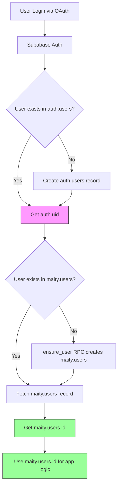

# Database Structure & RLS Policies Reference

**Last Updated:** February 9, 2026
**Version:** 2.7
**Purpose:** Comprehensive reference for implementing new features while avoiding common RLS and permissions errors.

**Recent Changes:**
- Updated `public.my_phase()` to bypass pending invitation flow - users without company now go to REGISTRATION instead of NO_COMPANY (v2.7)
- Added `maity.web_recorder_logs` table for persisting debug logs from web recorder sessions (v2.6)
- Added `public.save_recorder_logs()`, `public.list_recorder_sessions()`, `public.get_recorder_logs()` RPC functions (v2.6)
- Added `public.admin_delete_conversation()` RPC function for admin-only soft delete of Omi conversations (v2.5)
- Added `public.get_omi_admin_insights()` RPC function for platform-wide Omi analytics (v2.4)
- Added `maity.svg_assets` table for SVG Converter & Asset Gallery feature (v2.3)
- Expanded `avatar_character_preset_check` constraint to support all 15 character presets (v2.2)
- Added `maity.omi_conversations` and `maity.omi_transcript_segments` tables for Omi wearable integration (v2.1)
- Added GRANT permissions to `authenticated` role for Omi tables (v2.1)
- Added `maity.avatar_configurations` table for 3D voxel avatar system (v2.0)
- Cleaned up public schema: dropped unused tables (documents, n8n_chat_histories, organizations) (v1.9)
- Documented public schema views (users, voice_pre_practice_questionnaire) (v1.9)
- Added Learning Path system with 4 new tables (v1.8)
- Added `maity.ai_resources` table for admin-managed educational resources (v1.7)
- Added `level` column to `maity.users` for gamification system (v1.6)
- Updated `maity.form_responses` with all 20 questions including consent (q20)

---

## Table of Contents

1. [Quick Start Guide](#quick-start-guide)
2. [Key Concepts](#key-concepts)
   - [auth.uid() vs maity.users.id](#authuid-vs-maityusersid)
   - [Authentication Flow](#authentication-flow)
3. [Database Tables](#database-tables)
   - [Authentication & Users](#authentication--users)
   - [RPC Functions (Stored Procedures)](#rpc-functions-stored-procedures)
   - [Voice/Roleplay System](#voiceroleplay-system)
   - [Evaluations & Interviews](#evaluations--interviews)
   - [Omi Integration](#omi-integration-external-conversations)
   - [Forms & Documents](#forms--documents)
4. [RLS Patterns](#rls-patterns)
   - [By Table](#rls-policies-by-table)
   - [By Operation Type](#rls-policies-by-operation-type)
5. [Common Patterns](#common-patterns)
6. [Troubleshooting](#troubleshooting)
7. [Templates & Snippets](#templates--snippets)

---

## Quick Start Guide

### Checklist for Creating a New Table

- [ ] Design table schema with proper data types
- [ ] Create migration in `supabase/migrations/`
- [ ] Add foreign keys to `maity.users.id` (NOT `auth_id`)
- [ ] Enable RLS: `ALTER TABLE maity.table_name ENABLE ROW LEVEL SECURITY;`
- [ ] Create RLS policies (see [Templates](#templates--snippets))
- [ ] **GRANT permissions to `authenticated` role**
- [ ] Create public wrapper if using RPC functions
- [ ] Test with actual user credentials (not service role)
- [ ] Document in this file

### Most Common Error

```
Error: permission denied for table your_table
Code: 42501
```

**Cause:** Missing `GRANT` permissions even though RLS policies exist.
**Solution:**
```sql
GRANT SELECT, INSERT, UPDATE ON maity.your_table TO authenticated;
```

---

## Key Concepts

### auth.uid() vs maity.users.id

**CRITICAL DISTINCTION:**

| Concept | Type | Description | Example |
|---------|------|-------------|---------|
| `auth.uid()` | PostgreSQL Function | Returns the authenticated user's UUID from Supabase Auth | `550e8400-e29b-41d4-a716-446655440000` |
| `maity.users.auth_id` | Column | Foreign key to `auth.users.id` | Same UUID as `auth.uid()` |
| `maity.users.id` | Column | Primary key of `maity.users` (auto-generated) | `7c9e6679-7425-40de-944b-e07fc1f90ae7` |

#### The Problem

```sql
-- ❌ INCORRECT - Will fail with permission denied
CREATE POLICY "Users can view own sessions"
  ON maity.interview_sessions FOR SELECT
  USING (user_id = auth.uid());
```

**Why it fails:**
- `user_id` references `maity.users.id` (generated UUID)
- `auth.uid()` returns `maity.users.auth_id` (auth UUID)
- These are DIFFERENT values!

#### The Solution

```sql
-- ✅ CORRECT - Use subquery or JOIN
CREATE POLICY "Users can view own sessions"
  ON maity.interview_sessions FOR SELECT
  USING (
    user_id IN (
      SELECT id FROM maity.users WHERE auth_id = auth.uid()
    )
  );
```

#### In TypeScript Code

```typescript
// ❌ INCORRECT - Getting auth_id
const { data: { user } } = await supabase.auth.getUser();
const userId = user.id; // This is auth_id!

await supabase
  .from('interview_sessions')
  .insert({ user_id: userId }); // Will fail RLS!

// ✅ CORRECT - Getting maity.users.id
const { data: { user: authUser } } = await supabase.auth.getUser();

const { data: profile } = await supabase
  .schema('maity')
  .from('users')
  .select('id')
  .eq('auth_id', authUser.id)
  .single();

await supabase
  .schema('maity')
  .from('interview_sessions')
  .insert({ user_id: profile.id }); // Works!
```

### Authentication Flow



**Key Points:**
1. `auth.uid()` is available immediately after login
2. `maity.users.id` must be fetched via query
3. **Always use `maity.users.id` for foreign keys**
4. RLS policies must JOIN to convert `auth.uid()` → `maity.users.id`

---

## Database Tables

### Authentication & Users

#### maity.users

**Purpose:** Main user table linking Supabase Auth to application data.

**Schema:**
```sql
CREATE TABLE maity.users (
  id uuid PRIMARY KEY DEFAULT uuid_generate_v4(),
  company_id uuid REFERENCES maity.companies(id),
  auth_id uuid UNIQUE REFERENCES auth.users(id),
  name text DEFAULT '',
  email text,
  phone text UNIQUE,
  status text DEFAULT 'PENDING',
  registration_form_completed boolean DEFAULT false,
  platform_tour_completed boolean DEFAULT false,
  level integer NOT NULL DEFAULT 1,
  created_at timestamptz DEFAULT now(),
  updated_at timestamptz DEFAULT now(),
  CONSTRAINT users_level_check CHECK (level >= 1 AND level <= 5)
);

CREATE INDEX idx_users_level ON maity.users(level);
```

**Key Columns:**
- `id` - Primary key used in app (NOT auth_id)
- `auth_id` - Links to Supabase Auth (unique)
- `company_id` - Organization membership
- `status` - User lifecycle state
- `level` - User progression level (1-5): 1=Aprendiz, 2=Promesa, 3=Guerrero, 4=Maestro, 5=Leyenda

**RLS Policies:**
```sql
-- Users can view their own data
USING (auth_id = auth.uid())

-- Users can update their own data
USING (auth.uid() = auth_id)
WITH CHECK (auth.uid() = auth_id)
```

**GRANT Permissions:**
```sql
GRANT SELECT, INSERT, UPDATE, DELETE ON maity.users TO authenticated;
```

**Common Queries:**
```typescript
// Get current user's profile
const { data: { user: authUser } } = await supabase.auth.getUser();
const { data: profile } = await supabase
  .schema('maity')
  .from('users')
  .select('*')
  .eq('auth_id', authUser.id)
  .single();
```

---

#### maity.user_roles

**Purpose:** Stores user roles for authorization (admin, manager, user).

**Schema:**
```sql
CREATE TABLE maity.user_roles (
  id uuid PRIMARY KEY DEFAULT gen_random_uuid(),
  user_id uuid UNIQUE REFERENCES maity.users(id),
  role app_role NOT NULL, -- ENUM: 'admin' | 'manager' | 'user'
  created_at timestamptz DEFAULT now()
);
```

**Key Points:**
- `user_id` references `maity.users.id` (NOT auth_id)
- One role per user (enforced by UNIQUE constraint)
- Used by RLS policies to check permissions

**RLS Policies:**
```sql
-- Users can view own role via auth_id
USING (
  user_id IN (
    SELECT id FROM maity.users WHERE auth_id = auth.uid()
  )
)

-- Platform admins can view all roles
USING (has_role(auth.uid(), 'admin'::app_role))

-- Users can insert their own role (for autojoin)
WITH CHECK (
  user_id IN (
    SELECT id FROM maity.users WHERE auth_id = auth.uid()
  )
)
```

**GRANT Permissions:**
```sql
GRANT SELECT, INSERT, UPDATE ON maity.user_roles TO authenticated;
```

---

#### maity.companies

**Purpose:** Organizations/companies that users belong to.

**Schema:**
```sql
CREATE TABLE maity.companies (
  id uuid PRIMARY KEY DEFAULT uuid_generate_v4(),
  name text NOT NULL,
  slug text UNIQUE,
  domain text, -- Email domain for autojoin
  auto_join_enabled boolean DEFAULT false,
  plan text DEFAULT 'free',
  timezone text DEFAULT 'America/Mexico_City',
  is_active boolean DEFAULT true,
  created_at timestamptz DEFAULT now()
);
```

**Key Features:**
- **Autojoin:** Users with matching email domain can auto-join
- `domain` must be lowercase, no @ symbol
- Only ONE company can claim a domain (unique constraint)

**RLS Policies:**
```sql
-- Users can view own company
USING (
  id IN (
    SELECT company_id FROM maity.users
    WHERE auth_id = auth.uid() AND company_id IS NOT NULL
  )
)

-- Authenticated users can view companies with autojoin enabled
USING (auto_join_enabled = true AND is_active = true)

-- Admins can view/manage all companies
USING (
  EXISTS (
    SELECT 1 FROM maity.user_roles ur
    JOIN maity.users u ON u.id = ur.user_id
    WHERE u.auth_id = auth.uid() AND ur.role = 'admin'
  )
)
```

**GRANT Permissions:**
```sql
GRANT SELECT, INSERT, UPDATE, DELETE ON maity.companies TO authenticated;
```

---

#### maity.user_company_history

**Purpose:** Audit trail for user-company associations (autojoin, invites, transfers).

**Schema:**
```sql
CREATE TABLE maity.user_company_history (
  id uuid PRIMARY KEY DEFAULT gen_random_uuid(),
  user_id uuid REFERENCES maity.users(id),
  company_id uuid REFERENCES maity.companies(id),
  action text CHECK (action IN ('assigned', 'transferred', 'invited', 'confirmed')),
  previous_company_id uuid REFERENCES maity.companies(id),
  invitation_source text,
  created_at timestamptz DEFAULT now()
);
```

**RLS Policies:**
```sql
-- Users can view their own history
USING (
  user_id IN (
    SELECT id FROM maity.users WHERE auth_id = auth.uid()
  )
)

-- Users can insert their own history (for autojoin)
WITH CHECK (
  user_id IN (
    SELECT id FROM maity.users WHERE auth_id = auth.uid()
  )
)
```

**GRANT Permissions:**
```sql
GRANT INSERT ON maity.user_company_history TO authenticated;
-- Note: Only INSERT for regular users, SELECT via RLS
```

---

#### maity.invite_links

**Purpose:** Company invitation system for managers to invite users.

**Schema:**
```sql
CREATE TABLE maity.invite_links (
  id uuid PRIMARY KEY DEFAULT uuid_generate_v4(),
  company_id uuid REFERENCES maity.companies(id) NOT NULL,
  audience text CHECK (audience IN ('USER', 'MANAGER')),
  token text UNIQUE NOT NULL,
  is_reusable boolean DEFAULT true,
  max_uses integer,
  used_count integer DEFAULT 0,
  expires_at timestamptz,
  is_revoked boolean DEFAULT false,
  metadata jsonb DEFAULT '{}',
  created_by uuid,
  created_at timestamptz DEFAULT now()
);
```

**Note:** RLS policies TBD based on manager invite workflow.

---

### RPC Functions (Stored Procedures)

#### public.create_company

**Purpose:** Creates a new company with automatic generation of invite tokens and optional autojoin configuration.

**Signature:**
```sql
CREATE OR REPLACE FUNCTION public.create_company(
  p_company_name text,
  p_domain text DEFAULT NULL,
  p_auto_join_enabled boolean DEFAULT false
)
RETURNS TABLE(
  id uuid,
  name text,
  slug text,
  plan text,
  timezone text,
  is_active boolean,
  created_at timestamp with time zone,
  domain text,
  auto_join_enabled boolean
)
```

**Parameters:**
- `p_company_name` - Name of the company (required)
- `p_domain` - Email domain for autojoin (optional, e.g., "acme.com")
- `p_auto_join_enabled` - Enable autojoin for the domain (default: false)

**Behavior:**
1. Generates a URL-friendly slug from company name
2. Validates domain format (no @ symbol, no spaces, lowercase)
3. Creates company record with autojoin settings
4. Generates two invite tokens (USER and MANAGER)
5. Creates two invite_links records
6. Returns complete company data including autojoin fields

**Security:**
- `SECURITY DEFINER` - Runs with elevated privileges
- `SET search_path TO 'maity', 'public'` - Prevents SQL injection

**Permissions:**
```sql
GRANT EXECUTE ON FUNCTION public.create_company(text, text, boolean) TO authenticated;
```

**Example Usage (TypeScript):**
```typescript
const { data, error } = await supabase.rpc('create_company', {
  p_company_name: 'Acme Corp',
  p_domain: 'acme.com',
  p_auto_join_enabled: true
});

// Returns:
// {
//   id: 'uuid',
//   name: 'Acme Corp',
//   slug: 'acme-corp',
//   domain: 'acme.com',
//   auto_join_enabled: true,
//   ...
// }
```

**Validations:**
- Domain cannot contain @ or spaces
- Domain is automatically converted to lowercase
- If no domain provided, auto_join_enabled is forced to false
- Raises exception if domain format is invalid

**Related Migration:**
- `update_create_company_with_autojoin_support.sql`

---

#### public.get_companies_with_invite_tokens

**Purpose:** Returns all companies with their invite tokens and autojoin configuration.

**Signature:**
```sql
CREATE OR REPLACE FUNCTION public.get_companies_with_invite_tokens()
RETURNS TABLE (
  id uuid,
  name text,
  slug text,
  plan text,
  timezone text,
  is_active boolean,
  created_at timestamp with time zone,
  domain text,
  auto_join_enabled boolean,
  user_invite_token text,
  manager_invite_token text
)
```

**Behavior:**
1. Joins `maity.companies` with `maity.invite_links`
2. Aggregates invite tokens by audience type (USER, MANAGER)
3. Returns autojoin configuration fields
4. Orders by creation date (newest first)

**Security:**
- `SECURITY DEFINER` - Admin-level access required
- `SET search_path = maity, public`

**Permissions:**
```sql
GRANT EXECUTE ON FUNCTION public.get_companies_with_invite_tokens() TO authenticated;
```

**RLS Note:** Access controlled by policies on `maity.companies` table. Only platform admins should be able to see all companies.

**Example Usage (TypeScript):**
```typescript
const { data: companies, error } = await supabase.rpc('get_companies_with_invite_tokens');

// Returns array:
// [
//   {
//     id: 'uuid',
//     name: 'Acme Corp',
//     slug: 'acme-corp',
//     domain: 'acme.com',
//     auto_join_enabled: true,
//     user_invite_token: 'token123...',
//     manager_invite_token: 'token456...',
//     ...
//   }
// ]
```

**Use Cases:**
- Admin dashboard displaying all companies
- Company management interface
- Invite link generation for users and managers

**Related Migration:**
- `update_get_companies_with_invite_tokens_add_autojoin.sql`

---

#### public.try_autojoin_by_domain

**Purpose:** Attempts to automatically assign a user to a company based on their email domain.

**Signature:**
```sql
CREATE OR REPLACE FUNCTION public.try_autojoin_by_domain(p_email TEXT)
RETURNS JSON
```

**Parameters:**
- `p_email` - User's email address

**Returns JSON with:**
```json
{
  "success": true/false,
  "error": "ERROR_CODE",
  "message": "Human-readable message",
  "company_id": "uuid",
  "company_name": "Company Name",
  "company_slug": "company-slug",
  "role_assigned": "user",
  "method": "autojoin",
  "domain": "domain.com"
}
```

**Behavior:**
1. Validates user is authenticated
2. Extracts domain from email (everything after @)
3. Checks if user already has a company (blocks if yes)
4. Looks for active company with matching domain and autojoin enabled
5. If match found:
   - Assigns user to company
   - Sets user status to ACTIVE
   - Creates user_role record with 'user' role
   - Logs action in user_company_history
6. Returns success/failure with details

**Error Codes:**
- `UNAUTHORIZED` - User not authenticated
- `INVALID_EMAIL` - Email is null or empty
- `INVALID_EMAIL_FORMAT` - Cannot extract domain
- `USER_NOT_FOUND` - User doesn't exist in maity.users
- `USER_ALREADY_HAS_COMPANY` - User already assigned to company
- `NO_MATCHING_DOMAIN` - No company found with autojoin for domain
- `UNEXPECTED_ERROR` - Database or runtime error

**Security:**
- `SECURITY DEFINER` - Runs with elevated privileges
- Only assigns 'user' role (not admin/manager)
- Requires user to be authenticated
- Prevents transfers (blocks if user has company)

**Related Tables:**
- `maity.users`
- `maity.companies` (domain, auto_join_enabled)
- `maity.user_roles`
- `maity.user_company_history`

**Related Migration:**
- `20251021_create_try_autojoin_by_domain_function.sql`

---

#### public.my_phase

**Purpose:** Returns the current user's phase in the onboarding/access flow.

**Signature:**
```sql
CREATE OR REPLACE FUNCTION public.my_phase()
RETURNS TEXT
```

**Returns:** One of the following phase values:
- `'ACTIVE'` - User has completed onboarding and has access to the platform
- `'REGISTRATION'` - User needs to complete the onboarding form
- `'UNAUTHORIZED'` - No authenticated user
- ~~`'NO_COMPANY'`~~ - **Deprecated** (now returns `'REGISTRATION'` instead)

**Phase Logic:**
1. If `auth.uid()` is NULL → `'UNAUTHORIZED'`
2. If user has `admin` role → `'ACTIVE'` (regardless of company)
3. If user doesn't exist in `maity.users` OR has no `company_id` → `'REGISTRATION'` (bypasses pending)
4. If user has `manager` role → `'ACTIVE'`
5. If `registration_form_completed` is FALSE → `'REGISTRATION'`
6. Otherwise → `'ACTIVE'`

**Bypass Pending Feature (Feb 2026):**
Users without a company now go directly to `/registration` instead of `/pending`. This allows new users to complete onboarding even if their email domain is not registered for autojoin. The original `'NO_COMPANY'` behavior is preserved in comments for easy revert.

**Security:**
- `SECURITY DEFINER` - Runs with elevated privileges
- Only returns phase for the authenticated user

**Permissions:**
```sql
GRANT EXECUTE ON FUNCTION public.my_phase() TO authenticated;
```

**Example Usage (TypeScript):**
```typescript
const { data: phase } = await supabase.rpc('my_phase');
// Returns: 'ACTIVE' | 'REGISTRATION' | 'UNAUTHORIZED'

switch (phase) {
  case 'ACTIVE': navigate('/dashboard'); break;
  case 'REGISTRATION': navigate('/registration'); break;
  default: navigate('/auth'); break;
}
```

**Related Migration:**
- `20250922_create_my_phase_function.sql` (original)
- `20260209_bypass_pending_invitation.sql` (bypass pending update)

---

#### public.calculate_user_streak

**Purpose:** Calculates user streak based on Omi conversations with special rules for weekdays vs weekends.

**Signature:**
```sql
CREATE OR REPLACE FUNCTION public.calculate_user_streak(p_user_id uuid)
RETURNS TABLE(
  streak_days integer,
  bonus_days integer,
  last_conversation_date date,
  streak_started_at date
)
```

**Parameters:**
- `p_user_id` - The UUID of the user to calculate streak for (required)

**Returns:**
- `streak_days` - Total consecutive days (including bonus weekend days)
- `bonus_days` - How many of those days were weekend bonus days
- `last_conversation_date` - Date of most recent conversation
- `streak_started_at` - Date when the current streak began

**Business Rules:**
| Day Type | Behavior |
|----------|----------|
| Weekdays (Mon-Fri) | MANDATORY - If no conversation, streak is LOST |
| Weekends (Sat-Sun) | BONUS - If conversation exists +1, if not does NOT break streak |

**Examples:**
```
Example 1: Today is Monday, Friday without conversation
Fri: X  →  Streak lost
Sat: ✓  →  (doesn't count, streak already broken)
Sun: X  →  (doesn't matter)
Mon: ✓  →  Streak = 1

Example 2: Today is Monday, complete week
Thu: ✓  →  +1
Fri: ✓  →  +1
Sat: ✓  →  +1 bonus
Sun: X  →  (doesn't break)
Mon: ✓  →  +1
Streak = 4 (3 weekdays + 1 bonus)
```

**Timezone Handling:**
- Uses company timezone from `maity.companies.timezone`
- Falls back to `'America/Mexico_City'` if not set
- All date calculations use `AT TIME ZONE` for correct day boundaries

**Security:**
- `SECURITY DEFINER` - Runs with elevated privileges
- `SET search_path = maity, public` - Prevents SQL injection

**Permissions:**
```sql
GRANT EXECUTE ON FUNCTION public.calculate_user_streak(uuid) TO authenticated;
```

**Example Usage (TypeScript):**
```typescript
import { useQuery } from '@tanstack/react-query';
import { supabase } from '@maity/shared';

const { data } = await supabase.rpc('calculate_user_streak', {
  p_user_id: userId,
});

// Returns:
// {
//   streak_days: 4,
//   bonus_days: 1,
//   last_conversation_date: '2026-02-09',
//   streak_started_at: '2026-02-06'
// }
```

**Related Tables:**
- `maity.omi_conversations` - Source of conversation data
- `maity.users` - For user lookup
- `maity.companies` - For timezone configuration

**Related Hook:**
- `src/features/dashboard/hooks/useUserStreak.ts` - React Query hook

**Related Migration:**
- `20250209_create_calculate_user_streak_function.sql`

---

#### public.get_admin_scenario_config

**Purpose:** Gets complete profile + scenario configuration for admin testing. Allows administrators to test any profile and scenario combination without progression restrictions.

**Signature:**
```sql
CREATE OR REPLACE FUNCTION public.get_admin_scenario_config(
  p_profile_name TEXT,
  p_scenario_code TEXT
)
RETURNS TABLE(
  -- Scenario info
  scenario_id uuid,
  scenario_name varchar,
  scenario_code varchar,
  scenario_order integer,
  scenario_context text,
  scenario_skill text,
  scenario_instructions text,
  scenario_rules text,
  scenario_closing text,
  objectives text,
  -- Profile info
  profile_id uuid,
  profile_name varchar,
  profile_description text,
  profile_key_focus text,
  profile_communication_style text,
  profile_area text,
  profile_impact text,
  profile_personality_traits jsonb,
  -- Difficulty info
  difficulty_level integer,
  difficulty_name varchar,
  difficulty_mood varchar,
  difficulty_objection_frequency numeric,
  difficulty_time_pressure boolean,
  difficulty_interruption_tendency numeric,
  min_score_to_pass numeric
)
```

**Parameters:**
- `p_profile_name` - Profile name (CEO, CTO, CFO)
- `p_scenario_code` - Scenario code (e.g., 'first_visit', 'product_demo')

**Behavior:**
1. Validates profile exists and is active
2. Validates scenario exists and is active
3. Uses first difficulty level (Easy) by default
4. Returns complete configuration with all profile, scenario, and difficulty data
5. Raises exceptions if profile or scenario not found

**Security:**
- `SECURITY DEFINER` - Runs with elevated privileges
- `SET search_path TO 'maity', 'public'`
- Should only be called by administrators for testing purposes

**Permissions:**
```sql
GRANT EXECUTE ON FUNCTION public.get_admin_scenario_config(TEXT, TEXT) TO authenticated;
```

**Example Usage (TypeScript):**
```typescript
const { data, error } = await supabase.rpc('get_admin_scenario_config', {
  p_profile_name: 'CEO',
  p_scenario_code: 'first_visit'
});

// Returns complete configuration:
// {
//   scenario_id: 'uuid',
//   scenario_name: 'Primera Visita',
//   scenario_code: 'first_visit',
//   scenario_context: 'Full context...',
//   scenario_skill: 'escucha activa...',
//   profile_name: 'CEO',
//   profile_description: 'Description...',
//   difficulty_level: 1,
//   ...
// }
```

**Use Cases:**
- Admin testing of roleplay scenarios
- Quality assurance of scenario configurations
- Debugging profile + scenario combinations
- Testing without affecting user progress

**Related Migration:**
- `create_get_admin_scenario_config_function.sql`

---

#### public.get_analytics_dashboard

**Purpose:** Returns comprehensive analytics data for admin dashboard, aggregating statistics from interviews and roleplay sessions.

**Signature:**
```sql
CREATE OR REPLACE FUNCTION public.get_analytics_dashboard(
  p_company_id UUID DEFAULT NULL,
  p_type TEXT DEFAULT 'all',
  p_start_date TIMESTAMPTZ DEFAULT NULL,
  p_end_date TIMESTAMPTZ DEFAULT NULL,
  p_profile_id UUID DEFAULT NULL,
  p_scenario_id UUID DEFAULT NULL
)
RETURNS JSON
```

**Parameters:**
- `p_company_id` - Filter by specific company (NULL = all companies)
- `p_type` - Filter by session type: 'interview', 'roleplay', or 'all'
- `p_start_date` - Filter sessions started after this date
- `p_end_date` - Filter sessions started before this date
- `p_profile_id` - Filter roleplay sessions by profile (CEO, CTO, CFO)
- `p_scenario_id` - Filter roleplay sessions by scenario

**Returns JSON with:**
```json
{
  "overview": {
    "totalInterviews": 50,
    "totalRoleplaySessions": 200,
    "averageScore": 75.5,
    "passRate": 68.2,
    "totalDuration": 50000,
    "averageDuration": 200
  },
  "sessionsByCompany": [
    {
      "companyId": "uuid",
      "companyName": "Company Name",
      "interviewCount": 10,
      "roleplayCount": 40,
      "averageScore": 78.0,
      "passRate": 72.5
    }
  ],
  "sessionsByProfile": [
    {
      "profileId": "uuid",
      "profileName": "CEO",
      "sessionCount": 80,
      "averageScore": 72.0,
      "passRate": 65.0
    }
  ],
  "sessionsByScenario": [
    {
      "scenarioId": "uuid",
      "scenarioName": "Primera Visita",
      "sessionCount": 50,
      "averageScore": 70.0,
      "passRate": 60.0
    }
  ],
  "scoreDistribution": [
    { "range": "0-20", "count": 5 },
    { "range": "21-40", "count": 15 },
    { "range": "41-60", "count": 30 },
    { "range": "61-80", "count": 45 },
    { "range": "81-100", "count": 25 }
  ],
  "timeline": [
    {
      "date": "2025-01-01",
      "interviewCount": 2,
      "roleplayCount": 8,
      "averageScore": 75.0
    }
  ],
  "recentSessions": [
    {
      "id": "uuid",
      "type": "roleplay",
      "userId": "uuid",
      "userName": "John Doe",
      "companyId": "uuid",
      "companyName": "Company Name",
      "profileName": "CEO",
      "scenarioName": "Primera Visita",
      "score": 75,
      "passed": true,
      "duration": 180,
      "status": "completed",
      "startedAt": "2025-01-10T10:00:00Z",
      "endedAt": "2025-01-10T10:03:00Z"
    }
  ]
}
```

**Behavior:**
1. Verifies user has admin role
2. Aggregates data from `interview_sessions` and `voice_sessions` tables
3. Joins with related tables for enriched data
4. Applies filters based on parameters
5. Calculates statistics, distributions, and trends
6. Returns last 20 recent sessions
7. Returns top 10 companies by total sessions

**Security:**
- `SECURITY DEFINER` - Runs with elevated privileges
- `SET search_path = maity, public`
- Admin role required (verified at start of function)

**Permissions:**
```sql
GRANT EXECUTE ON FUNCTION public.get_analytics_dashboard(UUID, TEXT, TIMESTAMPTZ, TIMESTAMPTZ, UUID, UUID) TO authenticated;
```

**Example Usage (TypeScript):**
```typescript
const { data, error } = await supabase.rpc('get_analytics_dashboard', {
  p_company_id: null, // All companies
  p_type: 'all', // All types
  p_start_date: null, // No start filter
  p_end_date: null, // No end filter
  p_profile_id: null, // All profiles
  p_scenario_id: null // All scenarios
});

// Returns complete analytics dashboard data
console.log(data.overview.totalInterviews);
console.log(data.sessionsByCompany);
console.log(data.scoreDistribution);
```

**Use Cases:**
- Admin analytics dashboard
- Company performance comparison
- Score distribution analysis
- Profile and scenario effectiveness tracking
- Trend analysis over time
- Recent activity monitoring

**Related Migration:**
- `create_analytics_functions_for_admin.sql`

**Related Tables:**
- `maity.interview_sessions`
- `maity.voice_sessions`
- `maity.users`
- `maity.companies`
- `maity.voice_agent_profiles`
- `maity.voice_scenarios`
- `maity.voice_profile_scenarios`

---

#### public.get_analytics_sessions_list

**Purpose:** Returns paginated list of all sessions (interview + roleplay + tech_week) with filters. Enables viewing complete session history with pagination support.

**Signature:**
```sql
CREATE OR REPLACE FUNCTION public.get_analytics_sessions_list(
  p_company_id UUID DEFAULT NULL,
  p_type TEXT DEFAULT 'all',
  p_start_date TIMESTAMPTZ DEFAULT NULL,
  p_end_date TIMESTAMPTZ DEFAULT NULL,
  p_profile_id UUID DEFAULT NULL,
  p_scenario_id UUID DEFAULT NULL,
  p_page INT DEFAULT 1,
  p_page_size INT DEFAULT 50
)
RETURNS JSON
```

**Parameters:**
- `p_company_id`: Filter by specific company (null = all companies)
- `p_type`: Session type filter ('all', 'interview', 'roleplay', 'tech_week')
- `p_start_date`: Filter sessions starting from this date
- `p_end_date`: Filter sessions up to this date
- `p_profile_id`: Filter roleplay sessions by voice agent profile
- `p_scenario_id`: Filter roleplay sessions by scenario
- `p_page`: Page number (1-indexed)
- `p_page_size`: Number of sessions per page (default: 50)

**Returns:**
```json
{
  "sessions": [
    {
      "id": "uuid",
      "type": "interview|roleplay|tech_week",
      "userId": "uuid",
      "userName": "string",
      "companyId": "uuid",
      "companyName": "string",
      "profileName": "string|null",
      "scenarioName": "string|null",
      "score": "number|null",
      "passed": "boolean|null",
      "duration": "number",
      "status": "string",
      "startedAt": "timestamp",
      "endedAt": "timestamp"
    }
  ],
  "total": 150
}
```

**Access Control:**
- ✅ Admin only (verified via `maity.user_roles`)
- ❌ Raises exception if not admin

**Permissions:**
```sql
GRANT EXECUTE ON FUNCTION public.get_analytics_sessions_list TO authenticated;
```

**Example Usage (TypeScript):**
```typescript
const { data, error } = await supabase.rpc('get_analytics_sessions_list', {
  p_company_id: null, // All companies
  p_type: 'all', // All types
  p_start_date: null,
  p_end_date: null,
  p_profile_id: null,
  p_scenario_id: null,
  p_page: 1,
  p_page_size: 50
});

// Returns paginated sessions
console.log(data.sessions); // Array of sessions
console.log(data.total); // Total count for pagination
```

**Use Cases:**
- Display all sessions in analytics dashboard
- Session history with pagination
- Search and filter across all session types
- Export session data
- User activity tracking

**Related Migration:**
- `create_get_analytics_sessions_list_function.sql`

**Related Tables:**
- `maity.interview_sessions`
- `maity.voice_sessions`
- `maity.tech_week_sessions`
- `maity.users`
- `maity.companies`
- `maity.voice_agent_profiles`
- `maity.voice_scenarios`

**Notes:**
- Automatically combines sessions from interview, roleplay, and tech_week tables
- Ordered by `started_at DESC` (most recent first)
- Includes total count for pagination UI
- Only returns completed sessions (`status = 'completed'`)

---

#### public.create_coach_voice_session

**Purpose:** Creates a voice session for Coach (general coaching without predefined scenarios). Unlike Roleplay which requires profile and scenario selection, Coach sessions are general-purpose coaching sessions.

**Signature:**
```sql
CREATE OR REPLACE FUNCTION public.create_coach_voice_session(
  p_company_id UUID DEFAULT NULL
)
RETURNS jsonb
```

**Parameters:**
- `p_company_id` - Company ID for the session (optional, defaults to user's company_id)

**Returns:**
```json
{
  "id": "uuid",
  "user_id": "uuid",
  "company_id": "uuid",
  "status": "in_progress"
}
```

**Behavior:**
1. Obtains `user_id` from authenticated user via `auth.uid()`
2. Validates user exists in `maity.users`
3. Uses provided `company_id` or falls back to user's company
4. Creates session in `maity.voice_sessions` with:
   - `profile_scenario_id` = NULL (Coach doesn't use scenarios)
   - `status` = 'in_progress'
   - All timestamps initialized to NOW()
5. Returns session info as jsonb

**Security:**
- `SECURITY DEFINER` - Runs with elevated privileges
- `SET search_path = maity, public` - Prevents SQL injection
- Automatically uses authenticated user's ID (no user_id parameter needed)

**Permissions:**
```sql
GRANT EXECUTE ON FUNCTION public.create_coach_voice_session TO authenticated;
```

**Example Usage (TypeScript):**
```typescript
// Create Coach session
const { data, error } = await supabase.rpc('create_coach_voice_session', {
  p_company_id: userInfo?.company_id || null
});

if (error) {
  console.error('Failed to create Coach session:', error);
  return;
}

console.log('Coach session created:', data.id);
// Returns: { id: "uuid", user_id: "uuid", company_id: "uuid", status: "in_progress" }
```

**Use Cases:**
- General communication coaching
- Practice sessions without specific scenarios
- Skill development without predefined goals
- Admin testing and demos

**Differences from Roleplay:**
- ❌ NO `profile_scenario_id` (NULL)
- ❌ NO `questionnaire_id` (NULL)
- ❌ NO predefined scenarios or profiles
- ✅ Simpler creation (only company_id needed)
- ✅ General-purpose coaching

**Related Migration:**
- `20251111123305_create_coach_voice_session_function.sql`

**Related Tables:**
- `maity.voice_sessions` - Where Coach sessions are stored
- `maity.users` - User lookup via auth.uid()
- `maity.companies` - Company association

**Related Functions:**
- `public.create_voice_session` - For Roleplay sessions (requires profile + scenario)
- `/api/evaluate-session` - Evaluates Coach sessions via OpenAI

---

#### public.get_omi_admin_insights

**Purpose:** Returns platform-wide analytics for Omi conversations including counts, averages, storage estimates, and growth trends.

**Signature:**
```sql
CREATE OR REPLACE FUNCTION public.get_omi_admin_insights()
RETURNS TABLE (
  total_conversations BIGINT,
  total_transcript_segments BIGINT,
  total_users_with_conversations BIGINT,
  total_users BIGINT,
  avg_conversations_per_user NUMERIC,
  median_conversations_per_user NUMERIC,
  users_with_zero_conversations BIGINT,
  avg_transcript_text_size_bytes NUMERIC,
  avg_segments_per_conversation NUMERIC,
  avg_duration_seconds NUMERIC,
  avg_words_count NUMERIC,
  avg_overall_score NUMERIC,
  conversations_with_feedback BIGINT,
  estimated_storage_bytes BIGINT,
  conversations_last_7_days BIGINT,
  conversations_last_30_days BIGINT
)
```

**Behavior:**
1. Aggregates metrics across all Omi conversations and transcript segments
2. Calculates engagement metrics (average/median conversations per user)
3. Estimates storage usage for scalability planning
4. Provides growth trends (last 7/30 days)

**Security:**
- `SECURITY DEFINER` - Runs with elevated privileges
- Verifies caller has `admin` role in `maity.user_roles`
- Raises exception if non-admin attempts to call

**Permissions:**
```sql
GRANT EXECUTE ON FUNCTION public.get_omi_admin_insights() TO authenticated;
```

**Example Usage (TypeScript):**
```typescript
const { data, error } = await supabase.rpc('get_omi_admin_insights');

// Returns (single row):
// {
//   total_conversations: 1234,
//   total_transcript_segments: 5678,
//   total_users_with_conversations: 45,
//   avg_conversations_per_user: 27.42,
//   estimated_storage_bytes: 45678901,
//   conversations_last_7_days: 89,
//   ...
// }
```

**Use Cases:**
- Admin dashboard for Omi platform insights
- Scalability planning (storage projections)
- Growth tracking and engagement metrics

**Related Migration:**
- `create_omi_admin_insights_rpc.sql`

---

#### public.admin_delete_conversation

**Purpose:** Admin-only soft delete of Omi conversations. Sets `deleted=true` on the conversation record.

**Signature:**
```sql
CREATE OR REPLACE FUNCTION public.admin_delete_conversation(p_conversation_id uuid)
RETURNS void
```

**Parameters:**
- `p_conversation_id` - UUID of the conversation to delete (required)

**Behavior:**
1. Verifies caller has admin role via `maity.user_roles`
2. Verifies conversation exists
3. Updates `deleted = true` and `updated_at = NOW()`
4. Raises exception if not admin or conversation not found

**Security:**
- `SECURITY DEFINER` - Runs with elevated privileges
- Admin check inside function (double verification: UI + RPC)
- `SET search_path TO 'maity', 'public'` - Prevents SQL injection

**Permissions:**
```sql
GRANT EXECUTE ON FUNCTION public.admin_delete_conversation(uuid) TO authenticated;
```

**Example Usage (TypeScript):**
```typescript
const { error } = await supabase.rpc('admin_delete_conversation', {
  p_conversation_id: 'uuid-of-conversation',
});
// Throws error if not admin
```

**Use Cases:**
- Admin moderation of inappropriate conversations
- Cleanup of test or invalid data by platform admins

**Related Migration:**
- `20260209_add_admin_delete_conversation.sql`

---

#### maity.otk (One-Time Keys)

**Purpose:** Temporary tokens for Tally form submissions.

**Schema:**
```sql
CREATE TABLE maity.otk (
  id uuid PRIMARY KEY DEFAULT gen_random_uuid(),
  token text UNIQUE NOT NULL,
  auth_id uuid NOT NULL,
  expires_at timestamptz NOT NULL,
  created_at timestamptz DEFAULT now(),
  used_at timestamptz
);
```

**Note:** No RLS enabled (managed via RPC function `otk()` with service role).

---

### Voice/Roleplay System

#### maity.voice_agent_profiles

**Purpose:** AI agent profiles for roleplay practice (CEO, CTO, CFO) and specialized features (Tech Week).

**Schema:**
```sql
CREATE TABLE maity.voice_agent_profiles (
  id uuid PRIMARY KEY DEFAULT gen_random_uuid(),
  name varchar UNIQUE NOT NULL, -- 'CEO', 'CTO', 'CFO'
  description text,
  key_focus text,
  communication_style text,
  personality_traits jsonb,
  area text, -- Role area (e.g., 'Finanzas', 'Tecnología')
  impact text, -- Role impact (e.g., 'impacto financiero', 'decisiones técnicas')
  is_active boolean DEFAULT true,
  created_at timestamptz DEFAULT now(),
  updated_at timestamptz DEFAULT now()
);
```

**Key Columns:**
- `name` - Profile name (CEO, CTO, CFO)
- `communication_style` - Communication style of the profile
- `area` - Area of responsibility (e.g., "Finanzas", "Tecnología")
- `impact` - Impact of the role (e.g., "impacto financiero", "decisiones técnicas")
- `key_focus` - Key focus areas
- `personality_traits` - JSONB with personality characteristics

**RLS Policies:**
```sql
-- Public read access (authenticated users can view active profiles)
USING (is_active = true)
```

**GRANT Permissions:**
```sql
-- Read-only for authenticated users
GRANT SELECT ON maity.voice_agent_profiles TO authenticated;
```

**Note:** This table must be readable by all authenticated users to allow the admin selector and scenario loading to work properly.

**Usage in Roleplay:**
These fields are sent to configure the AI agent:
- `profile` → `name`
- `style` → `communication_style`
- `role_area` → `area`
- `role_impact` → `impact`

---

#### maity.voice_scenarios

**Purpose:** Practice scenarios (first visit, product demo, objection handling, etc.).

**Schema:**
```sql
CREATE TABLE maity.voice_scenarios (
  id uuid PRIMARY KEY DEFAULT gen_random_uuid(),
  name varchar NOT NULL,
  code varchar UNIQUE NOT NULL, -- 'first_visit', 'product_demo'
  order_index integer NOT NULL,
  context text NOT NULL, -- Scenario context (renamed from base_context)
  objectives text NOT NULL, -- Scenario objectives (JSON format)
  skill text, -- Main skill practiced (e.g., 'escucha activa y descubrimiento de necesidades')
  instructions text, -- Specific instructions for the scenario
  rules text, -- Rules for the scenario
  closing text, -- Closing message/script for the scenario
  estimated_duration integer DEFAULT 300, -- seconds
  category varchar, -- 'discovery', 'presentation', 'negotiation'
  agent_id text CHECK (agent_id IS NULL OR agent_id ~ '^agent_[a-z0-9]+$'), -- ElevenLabs Agent ID for this scenario
  is_active boolean DEFAULT true,
  created_at timestamptz DEFAULT now(),
  updated_at timestamptz DEFAULT now()
);

-- Index for efficient agent_id lookups
CREATE INDEX idx_voice_scenarios_agent_id ON maity.voice_scenarios(agent_id) WHERE agent_id IS NOT NULL;
```

**Key Columns:**
- `name` - Scenario name (e.g., "Primera Visita", "Demostración de Producto")
- `code` - Unique code identifier
- `context` - Full context description for the scenario
- `skill` - Main skill being practiced
- `instructions` - Specific instructions for the user
- `rules` - Rules that govern the scenario
- `closing` - Closing script or message
- `objectives` - Learning objectives (text/JSON format)
- `agent_id` - ElevenLabs Agent ID for scenario-specific agents (e.g., "agent_5901kakktagnf739xrp8k320qq6j"). Each scenario uses its own agent, with profiles (CEO/CTO/CFO) providing dynamic variables. Must match pattern `^agent_[a-z0-9]+$` if provided. Scenarios without agent_id are automatically hidden from users.

**RLS Policies:**
```sql
-- Public read access to active scenarios
USING (is_active = true)
```

**GRANT Permissions:**
```sql
-- Read-only for authenticated users
GRANT SELECT ON maity.voice_scenarios TO authenticated;
```

**Note:** This table must be readable by all authenticated users to allow:
- Admin selector to list all available scenarios
- Users to view scenario information
- Proper scenario loading in roleplay sessions

**Usage in Roleplay:**
These fields are sent to configure the practice session:
- `scenario` → `name`
- `scenario_skill` → `skill`
- `scenario_context` → `context`
- `scenario_instructions` → `instructions`
- `agent_id` → Passed to `RoleplayVoiceAssistant` to use scenario-specific ElevenLabs agent
- Additional: `rules`, `closing`, `objectives`

**Scenario-Specific Agents Architecture:**
- Each scenario has its own `agent_id` pointing to a unique ElevenLabs conversational AI agent
- All profiles (CEO, CTO, CFO) for a scenario use the **same agent_id** but with different dynamic variables
- The `get_or_create_user_progress` RPC function returns `scenario_agent_id` and filters out scenarios where `agent_id IS NULL`
- This ensures only properly configured scenarios are visible to users

**Related Migrations:**
- `grant_permissions_voice_scenarios.sql` - Grants SELECT permissions to authenticated role
- `20251028102938_create_tech_week_profile_and_scenario.sql` - Creates Tech Week profile and scenario
- `20251121_add_agent_id_to_voice_scenarios.sql` - Adds agent_id column with validation
- `20251121_update_rpc_functions_with_agent_id.sql` - Updates RPC functions to handle agent_id
- `20251121_add_agent_id_to_get_or_create_user_progress.sql` - Returns scenario_agent_id in progress lookup
- `20251121_create_agent_config_crud_functions.sql` - Admin CRUD functions for managing scenarios and agent_ids

---

#### Tech Week - Specialized Voice Practice

**Purpose:** Admin-only voice practice feature for Tech Week events and demonstrations.

**Key Components:**
- Profile: `Tech Week` in `voice_agent_profiles`
- Scenario: `tech_week_general` in `voice_scenarios`
- ElevenLabs Agent ID: `agent_3301k8nsyp5jeqfb84n0y0p5jd2g`

**Database Schema:**
```sql
-- Profile entry
INSERT INTO maity.voice_agent_profiles (name, description, key_focus, communication_style)
VALUES (
  'Tech Week',
  'Agente especializado para sesiones de Tech Week - eventos de tecnología y práctica intensiva.',
  'Evaluación técnica, presentación de proyectos, y práctica de habilidades de comunicación en contextos tecnológicos.',
  'Profesional y técnico, con enfoque en innovación y colaboración.'
);

-- Scenario entry
INSERT INTO maity.voice_scenarios (name, code, order_index, context, instructions, objectives)
VALUES (
  'Tech Week - Sesión General',
  'tech_week_general',
  1,
  'Estás participando en un evento de Tech Week...',
  'Durante esta sesión, el agente Tech Week interactuará contigo...',
  '["Comunicar ideas técnicas de forma clara", "Responder preguntas con confianza", "Demostrar profesionalismo"]'
);
```

**Access Control:**
- Routes protected by `AdminRoute` component
- Only users with `admin` role can access
- Frontend routes: `/tech-week`, `/tech-week/sessions`, `/tech-week/sessions/:sessionId`

**Features:**
- Simplified flow (no questionnaire)
- Single scenario configuration
- Pink/rose color theme (visual distinction)
- Full session persistence and evaluation
- Uses same `voice_sessions` table as roleplay
- n8n evaluation workflow integration

**Environment Variables:**
- `VITE_ELEVENLABS_TECH_WEEK_AGENT_ID` - Tech Week specific agent ID

**Related Files:**
- `src/features/tech-week/` - Feature implementation
- `src/components/AdminRoute.tsx` - Admin protection
- Migration: `20251028102938_create_tech_week_profile_and_scenario.sql`

---

#### maity.voice_difficulty_levels

**Purpose:** Difficulty levels for scenarios (Easy, Medium, Hard).

**Schema:**
```sql
CREATE TABLE maity.voice_difficulty_levels (
  id uuid PRIMARY KEY DEFAULT gen_random_uuid(),
  level integer UNIQUE CHECK (level >= 1 AND level <= 3),
  name varchar NOT NULL, -- 'Fácil', 'Medio', 'Difícil'
  code varchar UNIQUE NOT NULL, -- 'easy', 'medium', 'hard'
  mood_preset varchar,
  objection_frequency numeric CHECK (objection_frequency >= 0 AND objection_frequency <= 1),
  time_pressure boolean DEFAULT false,
  interruption_tendency numeric CHECK (interruption_tendency >= 0 AND interruption_tendency <= 1),
  created_at timestamptz DEFAULT now()
);
```

**RLS Policies:**
```sql
-- Public read access (all authenticated users)
USING (true)
```

---

#### maity.voice_profile_scenarios

**Purpose:** Combines profile + scenario + difficulty with specific configuration.

**Schema:**
```sql
CREATE TABLE maity.voice_profile_scenarios (
  id uuid PRIMARY KEY DEFAULT gen_random_uuid(),
  profile_id uuid REFERENCES maity.voice_agent_profiles(id) NOT NULL,
  scenario_id uuid REFERENCES maity.voice_scenarios(id) NOT NULL,
  difficulty_id uuid REFERENCES maity.voice_difficulty_levels(id) NOT NULL,
  company_id uuid REFERENCES maity.companies(id), -- NULL = global
  specific_context text,
  key_objections jsonb,
  success_criteria jsonb,
  talking_points jsonb,
  user_instructions text,
  min_score_to_pass numeric DEFAULT 70.00 CHECK (min_score_to_pass >= 0 AND min_score_to_pass <= 100),
  is_locked boolean DEFAULT true,
  unlock_after_scenario uuid REFERENCES maity.voice_scenarios(id),
  created_at timestamptz DEFAULT now(),
  updated_at timestamptz DEFAULT now()
);
```

**RLS Policies:**
```sql
-- Users can view profile scenarios (READ-ONLY)
USING (true)
```

---

#### maity.voice_pre_practice_questionnaire

**Purpose:** Pre-practice questionnaire to determine user's starting profile.

**Schema:**
```sql
CREATE TABLE maity.voice_pre_practice_questionnaire (
  id uuid PRIMARY KEY DEFAULT gen_random_uuid(),
  user_id uuid REFERENCES maity.users(id) NOT NULL,
  most_difficult_profile varchar CHECK (most_difficult_profile IN ('CEO', 'CTO', 'CFO')),
  practice_start_profile varchar CHECK (practice_start_profile IN ('CEO', 'CTO', 'CFO')),
  answered_at timestamptz DEFAULT now(),
  session_started boolean DEFAULT false,
  session_id uuid,
  created_at timestamptz DEFAULT now(),
  updated_at timestamptz DEFAULT now()
);
```

**RLS Policies:**
```sql
-- Users can view own questionnaire responses
USING (
  user_id IN (
    SELECT id FROM maity.users WHERE auth_id = auth.uid()
  )
)

-- Users can insert own responses
WITH CHECK (
  user_id IN (
    SELECT id FROM maity.users WHERE auth_id = auth.uid()
  )
)

-- Users can update own responses
USING (
  user_id IN (
    SELECT id FROM maity.users WHERE auth_id = auth.uid()
  )
)
WITH CHECK (
  user_id IN (
    SELECT id FROM maity.users WHERE auth_id = auth.uid()
  )
)
```

**GRANT Permissions:**
```sql
GRANT SELECT, INSERT, UPDATE, DELETE ON maity.voice_pre_practice_questionnaire TO authenticated;
```

---

#### maity.voice_sessions

**Purpose:** Practice sessions with AI agents.

**Schema:**
```sql
CREATE TABLE maity.voice_sessions (
  id uuid PRIMARY KEY DEFAULT gen_random_uuid(),
  user_id uuid REFERENCES maity.users(id) NOT NULL,
  company_id uuid REFERENCES maity.companies(id),
  profile_scenario_id uuid REFERENCES maity.voice_profile_scenarios(id) NOT NULL,
  questionnaire_id uuid REFERENCES maity.voice_pre_practice_questionnaire(id),
  status varchar DEFAULT 'in_progress' CHECK (status IN ('in_progress', 'completed', 'abandoned', 'evaluating')),
  started_at timestamptz DEFAULT now(),
  ended_at timestamptz,
  duration_seconds integer,
  recording_url text,
  raw_transcript text,
  ai_agent_config jsonb,
  processed_feedback jsonb,
  score numeric CHECK (score >= 0 AND score <= 100),
  passed boolean,
  min_score_to_pass numeric CHECK (min_score_to_pass >= 0 AND min_score_to_pass <= 100),
  session_metadata jsonb,
  created_at timestamptz DEFAULT now(),
  updated_at timestamptz DEFAULT now()
);
```

**RLS Policies:**
```sql
-- Users can view own sessions
USING (
  user_id IN (
    SELECT id FROM maity.users WHERE auth_id = auth.uid()
  )
)

-- Users can create own sessions
WITH CHECK (
  auth.uid() IN (
    SELECT auth_id FROM maity.users WHERE id = voice_sessions.user_id
  )
)

-- Users can update own sessions
USING (
  user_id IN (
    SELECT id FROM maity.users WHERE auth_id = auth.uid()
  )
)
```

**GRANT Permissions:**
```sql
GRANT SELECT, UPDATE ON maity.voice_sessions TO authenticated;
-- Note: INSERT is done via RPC function
```

---

#### maity.voice_user_progress

**Purpose:** Tracks user progress per agent profile.

**Schema:**
```sql
CREATE TABLE maity.voice_user_progress (
  id uuid PRIMARY KEY DEFAULT gen_random_uuid(),
  user_id uuid REFERENCES maity.users(id) NOT NULL,
  company_id uuid REFERENCES maity.companies(id),
  profile_id uuid REFERENCES maity.voice_agent_profiles(id) NOT NULL,
  current_scenario_order integer DEFAULT 1,
  current_difficulty_level integer DEFAULT 1,
  scenarios_completed integer DEFAULT 0,
  scenarios_failed integer DEFAULT 0,
  total_sessions integer DEFAULT 0,
  total_practice_time integer DEFAULT 0, -- seconds
  average_score numeric,
  best_score numeric,
  streak_days integer DEFAULT 0,
  last_session_date date,
  achievements_unlocked integer DEFAULT 0,
  total_points integer DEFAULT 0,
  created_at timestamptz DEFAULT now(),
  updated_at timestamptz DEFAULT now()
);
```

**RLS Policies:**
```sql
-- Users can manage own progress
USING (
  auth.uid() IN (
    SELECT auth_id FROM maity.users WHERE id = voice_user_progress.user_id
  )
)

-- Managers can view company progress
USING (
  EXISTS (
    SELECT 1 FROM maity.users u
    JOIN maity.user_roles ur ON u.id = ur.user_id
    WHERE u.auth_id = auth.uid()
      AND ur.role IN ('manager', 'admin')
      AND u.company_id = voice_user_progress.company_id
  )
)
```

---

#### maity.voice_progress_history

**Purpose:** Daily progress snapshots for charts and analytics.

**Schema:**
```sql
CREATE TABLE maity.voice_progress_history (
  id uuid PRIMARY KEY DEFAULT gen_random_uuid(),
  user_id uuid REFERENCES maity.users(id) NOT NULL,
  profile_id uuid REFERENCES maity.voice_agent_profiles(id),
  date date NOT NULL,
  sessions_count integer DEFAULT 0,
  practice_time_seconds integer DEFAULT 0,
  average_score numeric,
  scenarios_completed integer DEFAULT 0,
  created_at timestamptz DEFAULT now()
);
```

**RLS Policies:**
```sql
-- Users can manage own history
USING (
  auth.uid() IN (
    SELECT auth_id FROM maity.users WHERE id = voice_progress_history.user_id
  )
)
```

---

#### maity.voice_metric_types

**Purpose:** Defines types of metrics used to evaluate sessions.

**Schema:**
```sql
CREATE TABLE maity.voice_metric_types (
  id uuid PRIMARY KEY DEFAULT gen_random_uuid(),
  code varchar UNIQUE NOT NULL,
  name varchar NOT NULL,
  description text,
  category varchar,
  calculation_method text,
  weight numeric DEFAULT 1.0 CHECK (weight >= 0 AND weight <= 2),
  is_active boolean DEFAULT true,
  created_at timestamptz DEFAULT now()
);
```

**RLS Policies:**
```sql
-- Public read access to active metrics
USING (is_active = true)
```

---

#### maity.voice_session_metrics

**Purpose:** Calculated metrics per session.

**Schema:**
```sql
CREATE TABLE maity.voice_session_metrics (
  id uuid PRIMARY KEY DEFAULT gen_random_uuid(),
  session_id uuid REFERENCES maity.voice_sessions(id) NOT NULL,
  metric_type_id uuid REFERENCES maity.voice_metric_types(id) NOT NULL,
  metric_value numeric NOT NULL,
  normalized_score numeric,
  metadata jsonb,
  created_at timestamptz DEFAULT now()
);
```

**RLS Policies:**
```sql
-- Users can view metrics of own sessions
USING (
  EXISTS (
    SELECT 1 FROM maity.voice_sessions vs
    JOIN maity.users u ON vs.user_id = u.id
    WHERE vs.id = voice_session_metrics.session_id
      AND u.auth_id = auth.uid()
  )
)
```

---

#### maity.voice_session_moments

**Purpose:** Key moments identified in conversations (objections, closing attempts, etc.).

**Schema:**
```sql
CREATE TABLE maity.voice_session_moments (
  id uuid PRIMARY KEY DEFAULT gen_random_uuid(),
  session_id uuid REFERENCES maity.voice_sessions(id) NOT NULL,
  moment_type varchar NOT NULL, -- 'objection', 'closing_attempt', 'rapport_building'
  timestamp_seconds integer NOT NULL,
  transcript_snippet text,
  ai_analysis jsonb,
  score numeric,
  created_at timestamptz DEFAULT now()
);
```

**RLS Policies:**
```sql
-- Users can view moments of own sessions
USING (
  EXISTS (
    SELECT 1 FROM maity.voice_sessions vs
    JOIN maity.users u ON vs.user_id = u.id
    WHERE vs.id = voice_session_moments.session_id
      AND u.auth_id = auth.uid()
  )
)
```

---

### Evaluations & Interviews

#### maity.evaluations

**Purpose:** AI evaluations of practice sessions (processed via n8n).

**Schema:**
```sql
CREATE TABLE maity.evaluations (
  request_id uuid PRIMARY KEY,
  user_id uuid REFERENCES maity.users(id) NOT NULL,
  session_id uuid REFERENCES maity.voice_sessions(id),
  status text DEFAULT 'pending' CHECK (status IN ('pending', 'processing', 'complete', 'error')),
  result jsonb,
  error_message text,
  created_at timestamptz DEFAULT now(),
  updated_at timestamptz DEFAULT now()
);
```

**RLS Policies:**
```sql
-- Users can view own evaluations
USING (
  user_id IN (
    SELECT id FROM maity.users WHERE auth_id = auth.uid()
  )
)
```

**GRANT Permissions:**
```sql
GRANT SELECT ON maity.evaluations TO authenticated;
-- Updates handled via service role (n8n webhook)
```

---

#### maity.interview_sessions

**Purpose:** Practice interview sessions with AI interviewer.

**Schema:**
```sql
CREATE TABLE maity.interview_sessions (
  id uuid PRIMARY KEY DEFAULT gen_random_uuid(),
  user_id uuid REFERENCES maity.users(id) NOT NULL,
  started_at timestamptz DEFAULT now(),
  ended_at timestamptz,
  duration_seconds integer,
  raw_transcript text,
  score integer CHECK (score >= 0 AND score <= 100),
  processed_feedback jsonb,
  status text DEFAULT 'in_progress' CHECK (status IN ('in_progress', 'completed', 'cancelled')),
  evaluation_id uuid REFERENCES maity.interview_evaluations(request_id) ON DELETE SET NULL,
  created_at timestamptz DEFAULT now(),
  updated_at timestamptz DEFAULT now()
);
```

**Note:** The `evaluation_id` field links to `interview_evaluations.request_id` to track the analysis status.

**RLS Policies:**
```sql
-- Users can view own interview sessions
USING (
  user_id IN (
    SELECT id FROM maity.users WHERE auth_id = auth.uid()
  )
)

-- Users can create own sessions
WITH CHECK (
  user_id IN (
    SELECT id FROM maity.users WHERE auth_id = auth.uid()
  )
)

-- Users can update own sessions
USING (
  user_id IN (
    SELECT id FROM maity.users WHERE auth_id = auth.uid()
  )
)
WITH CHECK (
  user_id IN (
    SELECT id FROM maity.users WHERE auth_id = auth.uid()
  )
)

-- Admins can view all sessions
USING (
  EXISTS (
    SELECT 1 FROM maity.user_roles ur
    JOIN maity.users u ON u.id = ur.user_id
    WHERE u.auth_id = auth.uid() AND ur.role = 'admin'
  )
)
```

**GRANT Permissions:**
```sql
GRANT SELECT, INSERT, UPDATE ON maity.interview_sessions TO authenticated;
```

**Example Usage:**
```typescript
// ✅ CORRECT - Get user's maity.users.id first
const { data: { user: authUser } } = await supabase.auth.getUser();

const { data: profile } = await supabase
  .schema('maity')
  .from('users')
  .select('id, name')
  .eq('auth_id', authUser.id)
  .single();

// Create session with correct user_id
const { data: session } = await supabase
  .schema('maity')
  .from('interview_sessions')
  .insert({
    user_id: profile.id, // maity.users.id, not auth_id!
    status: 'in_progress',
    started_at: new Date().toISOString()
  })
  .select('id')
  .single();
```

---

#### maity.interview_evaluations

**Purpose:** AI-generated personality analysis of interview sessions (processed via OpenAI API).

**Schema:**
```sql
CREATE TABLE maity.interview_evaluations (
  request_id uuid PRIMARY KEY DEFAULT gen_random_uuid(),
  session_id uuid REFERENCES maity.interview_sessions(id) ON DELETE CASCADE NOT NULL,
  user_id uuid REFERENCES maity.users(id) ON DELETE CASCADE NOT NULL,
  status text DEFAULT 'pending' CHECK (status IN ('pending', 'processing', 'complete', 'error')),
  analysis_text text,
  rubrics jsonb, -- Structured 6 rubrics evaluation (personality-focused)
  amazing_comment text, -- Deep personality insight deduced from interview
  summary text, -- Overall summary of who the user is
  is_complete boolean DEFAULT false, -- Whether interview had sufficient content
  interviewee_name text,
  error_message text,
  created_at timestamptz DEFAULT now(),
  updated_at timestamptz DEFAULT now()
);

-- Indexes for performance
CREATE INDEX idx_interview_evaluations_rubrics ON maity.interview_evaluations USING GIN (rubrics);
CREATE INDEX idx_interview_evaluations_is_complete ON maity.interview_evaluations(is_complete);
```

**Key Relationships:**
- `request_id`: Primary key used for workflow tracking
- `session_id`: Links to `interview_sessions.id`
- `user_id`: References `maity.users.id` (not auth_id!)
- `status`: Workflow state (pending → processing → complete/error)
- `analysis_text`: Full JSON response from OpenAI (backward compatibility)
- `rubrics`: JSONB with 6 rubrics (claridad, adaptacion, persuasion, estructura, proposito, empatia) - each containing: score (1-5), analysis, strengths[], areas_for_improvement[]
- `amazing_comment`: Deep personality insight deduced from interview responses - NOT obvious observations (e.g., "Uses 5 metaphors → visual thinker")
- `summary`: Overall summary of who the user is based on interview content
- `is_complete`: Whether the interview had sufficient content for meaningful evaluation (5+ meaningful exchanges)
- `interviewee_name`: User name extracted from interview transcript

**RLS Policies:**
```sql
-- Admins can view all interview evaluations
USING (
  EXISTS (
    SELECT 1 FROM maity.user_roles ur
    JOIN maity.users u ON u.id = ur.user_id
    WHERE u.auth_id = auth.uid() AND ur.role = 'admin'
  )
)

-- Users can view their own interview evaluations
USING (
  user_id IN (
    SELECT id FROM maity.users WHERE auth_id = auth.uid()
  )
)
```

**GRANT Permissions:**
```sql
GRANT SELECT ON maity.interview_evaluations TO authenticated;
-- Note: INSERT/UPDATE handled via RPC functions or service role (OpenAI API endpoint)
```

**RPC Functions:**
```sql
-- Create interview evaluation (returns request_id for tracking)
public.create_interview_evaluation(p_session_id UUID, p_user_id UUID) RETURNS UUID

-- Get interview sessions history (admin sees all, users see own)
public.get_interview_sessions_history(p_user_id UUID DEFAULT NULL) RETURNS TABLE (
  session_id UUID,
  user_id UUID,
  user_name TEXT,
  interviewee_name TEXT,
  started_at TIMESTAMPTZ,
  ended_at TIMESTAMPTZ,
  duration_seconds INTEGER,
  status TEXT,
  evaluation_status TEXT,
  analysis_preview TEXT,
  created_at TIMESTAMPTZ
)
```

**Example Usage:**
```typescript
// Create evaluation after session ends
const requestId = await InterviewService.createEvaluation(sessionId, userId);

// Call OpenAI API for synchronous evaluation
const authSession = await AuthService.getSession();
const response = await fetch(`${env.apiUrl}/api/evaluate-interview`, {
  method: 'POST',
  headers: {
    'Content-Type': 'application/json',
    'Authorization': `Bearer ${authSession.access_token}`
  },
  body: JSON.stringify({
    session_id: sessionId,
    request_id: requestId,
  }),
});

const { evaluation } = await response.json();
// evaluation contains: rubrics, amazing_comment, summary, is_complete

// Navigate to results page
navigate(`/primera-entrevista/resultados/${sessionId}`);
```

**Workflow:**
1. Frontend creates evaluation record (status='pending')
2. Frontend calls `/api/evaluate-interview` with session_id and request_id
3. Backend fetches session transcript
4. Backend calls OpenAI API with INTERVIEW_SYSTEM_MESSAGE (personality analysis focused)
5. Backend parses JSON response and saves rubrics, amazing_comment, summary, is_complete
6. Backend returns complete evaluation (synchronous, 3-10s)
7. Frontend navigates to results page with complete data

**API Endpoint:**
- `/api/evaluate-interview` - Synchronous OpenAI evaluation
- Rate Limiting: 5 evaluations/min, 50 evaluations/day per user
- Response time: 3-10 seconds
- Returns structured personality analysis with 6 rubrics

---

#### maity.diagnostic_interviews

**Purpose:** Coach diagnostic interview evaluations with 6 rubrics (same as self-assessment).

**Related Feature:** Coach first interview - evaluates user communication skills based on the same 6 competencies used in self-assessment: Claridad, Adaptación, Persuasión, Estructura, Propósito, Empatía.

**Schema:**
```sql
CREATE TABLE maity.diagnostic_interviews (
  id uuid PRIMARY KEY DEFAULT gen_random_uuid(),
  user_id uuid REFERENCES maity.users(id) ON DELETE CASCADE NOT NULL,
  session_id uuid REFERENCES maity.voice_sessions(id) ON DELETE SET NULL,
  transcript text NOT NULL,
  rubrics jsonb NOT NULL,
  amazing_comment text,
  summary text,
  is_complete boolean DEFAULT false,
  created_at timestamptz DEFAULT now(),
  updated_at timestamptz DEFAULT now()
);
```

**Key Relationships:**
- `user_id`: References `maity.users.id` (not auth_id!)
- `session_id`: Links to `voice_sessions.id` (the Coach voice session)
- `rubrics`: JSONB containing evaluation of 6 competencies
- `amazing_comment`: AI-generated comment highlighting something impressive
- `summary`: Overall summary of the diagnostic interview
- `is_complete`: Whether the interview met completion criteria (5+ meaningful messages)

**JSONB Structure for `rubrics`:**
```json
{
  "claridad": {
    "score": 4,
    "analysis": "Análisis de claridad (2-3 oraciones)",
    "strengths": ["Fortaleza 1", "Fortaleza 2"],
    "areas_for_improvement": ["Área 1", "Área 2"]
  },
  "adaptacion": {
    "score": 3,
    "analysis": "...",
    "strengths": ["..."],
    "areas_for_improvement": ["..."]
  },
  "persuasion": { ... },
  "estructura": { ... },
  "proposito": { ... },
  "empatia": { ... }
}
```

**The 6 Rubrics (mapped to self-assessment questions):**
1. **CLARIDAD** (Clarity) - q5, q6: Simple, direct communication
2. **ADAPTACIÓN** (Adaptation) - q7, q8: Adjusting language to audience
3. **PERSUASIÓN** (Persuasion) - q9, q10: Using examples/stories/data
4. **ESTRUCTURA** (Structure) - q11, q12: Organizing messages with beginning/middle/end
5. **PROPÓSITO** (Purpose) - q13, q14: Clear objectives and calls to action
6. **EMPATÍA** (Empathy) - q15, q16: Active listening and asking questions

**Score Scale:** 1-5 (Likert scale, same as self-assessment)

**RLS Policies:**
```sql
-- Users can view own diagnostic interviews
CREATE POLICY "Users can view own diagnostic interviews"
  ON maity.diagnostic_interviews FOR SELECT
  USING (
    user_id IN (
      SELECT id FROM maity.users WHERE auth_id = auth.uid()
    )
  );

-- Users can create own diagnostic interviews
CREATE POLICY "Users can create own diagnostic interviews"
  ON maity.diagnostic_interviews FOR INSERT
  WITH CHECK (
    user_id IN (
      SELECT id FROM maity.users WHERE auth_id = auth.uid()
    )
  );

-- Users can update own diagnostic interviews
CREATE POLICY "Users can update own diagnostic interviews"
  ON maity.diagnostic_interviews FOR UPDATE
  USING (
    user_id IN (
      SELECT id FROM maity.users WHERE auth_id = auth.uid()
    )
  )
  WITH CHECK (
    user_id IN (
      SELECT id FROM maity.users WHERE auth_id = auth.uid()
    )
  );

-- Admins can view all diagnostic interviews
CREATE POLICY "Admins can view all diagnostic interviews"
  ON maity.diagnostic_interviews FOR SELECT
  USING (
    EXISTS (
      SELECT 1 FROM maity.user_roles ur
      JOIN maity.users u ON u.id = ur.user_id
      WHERE u.auth_id = auth.uid() AND ur.role = 'admin'
    )
  );

-- Admins can update all diagnostic interviews
CREATE POLICY "Admins can update all diagnostic interviews"
  ON maity.diagnostic_interviews FOR UPDATE
  USING (
    EXISTS (
      SELECT 1 FROM maity.user_roles ur
      JOIN maity.users u ON u.id = ur.user_id
      WHERE u.auth_id = auth.uid() AND ur.role = 'admin'
    )
  );

-- Admins can delete diagnostic interviews
CREATE POLICY "Admins can delete diagnostic interviews"
  ON maity.diagnostic_interviews FOR DELETE
  USING (
    EXISTS (
      SELECT 1 FROM maity.user_roles ur
      JOIN maity.users u ON u.id = ur.user_id
      WHERE u.auth_id = auth.uid() AND ur.role = 'admin'
    )
  );
```

**GRANT Permissions:**
```sql
GRANT SELECT, INSERT, UPDATE ON maity.diagnostic_interviews TO authenticated;
GRANT DELETE ON maity.diagnostic_interviews TO authenticated; -- For admins only (RLS enforces)
```

**Example Usage:**
```typescript
// ✅ CORRECT - Create diagnostic interview after Coach session
import { DiagnosticInterviewService } from '@maity/shared';

// After voice session ends
const evaluationData: DiagnosticInterviewEvaluation = {
  rubrics: {
    claridad: { score: 4, analysis: "...", strengths: [...], areas_for_improvement: [...] },
    adaptacion: { score: 3, analysis: "...", strengths: [...], areas_for_improvement: [...] },
    persuasion: { score: 4, analysis: "...", strengths: [...], areas_for_improvement: [...] },
    estructura: { score: 3, analysis: "...", strengths: [...], areas_for_improvement: [...] },
    proposito: { score: 4, analysis: "...", strengths: [...], areas_for_improvement: [...] },
    empatia: { score: 5, analysis: "...", strengths: [...], areas_for_improvement: [...] }
  },
  amazing_comment: "Me impresionó cuando dijiste '...'",
  summary: "Resumen general...",
  is_complete: true
};

// Create record in DB
await DiagnosticInterviewService.create(userId, sessionId, {
  transcript: rawTranscript,
  rubrics: evaluationData.rubrics,
  amazing_comment: evaluationData.amazing_comment,
  summary: evaluationData.summary,
  is_complete: evaluationData.is_complete
});

// Get user's diagnostic interview (there should only be one completed)
const interview = await DiagnosticInterviewService.getDiagnosticInterview(userId);
```

**Workflow:**
1. User completes Coach voice session
2. Frontend calls `/api/evaluate-diagnostic-interview` with session_id
3. Backend:
   - Retrieves transcript from voice_sessions
   - Calls OpenAI with COACH_DIAGNOSTIC_SYSTEM_MESSAGE prompt
   - OpenAI evaluates 6 rubrics (score 1-5 + qualitative analysis)
   - Saves to diagnostic_interviews table
4. Frontend displays results with:
   - Amazing comment (highlighted)
   - Duration and summary
   - All 6 rubrics with scores, strengths, and areas for improvement
5. Dashboard integrates scores into Radar Chart (user vs coach comparison)

**API Endpoint:**
- `/api/evaluate-diagnostic-interview` - Evaluates diagnostic interview with OpenAI
- Input: `{ session_id: UUID }`
- Output: `{ evaluation: DiagnosticInterviewEvaluation }`
- Auth: Bearer token required
- Rate limits: 5 eval/min, 50 eval/day per user

**Future Enhancement:**
To enforce "one diagnostic interview per user" restriction, uncomment this in migration:
```sql
CREATE UNIQUE INDEX idx_diagnostic_interviews_one_per_user
  ON maity.diagnostic_interviews(user_id)
  WHERE is_complete = true;
```

**Indexes:**
```sql
CREATE INDEX idx_diagnostic_interviews_user_id ON maity.diagnostic_interviews(user_id);
CREATE INDEX idx_diagnostic_interviews_session_id ON maity.diagnostic_interviews(session_id);
CREATE INDEX idx_diagnostic_interviews_is_complete ON maity.diagnostic_interviews(is_complete);
```

---

### Omi Integration (External Conversations)

#### maity.omi_conversations

**Purpose:** Store conversations recorded from Omi wearable device with AI-generated analysis.

**Schema:**
```sql
CREATE TABLE maity.omi_conversations (
  id uuid PRIMARY KEY DEFAULT gen_random_uuid(),
  firebase_uid text,                          -- Legacy Firebase user ID
  user_id uuid REFERENCES maity.users(id),    -- Current user FK
  created_at timestamptz NOT NULL DEFAULT now(),
  started_at timestamptz,
  finished_at timestamptz,
  updated_at timestamptz DEFAULT now(),
  title text NOT NULL DEFAULT '',
  overview text NOT NULL DEFAULT '',
  emoji text DEFAULT '',
  category text DEFAULT 'other',
  action_items jsonb DEFAULT '[]'::jsonb,     -- [{description, completed}]
  events jsonb DEFAULT '[]'::jsonb,           -- [{title, description, start_time, end_time}]
  transcript_text text DEFAULT '',
  source text DEFAULT 'omi',
  language text,
  discarded boolean DEFAULT false,
  deleted boolean DEFAULT false,              -- Soft delete flag
  status text DEFAULT 'completed',
  words_count integer DEFAULT 0,
  duration_seconds integer DEFAULT 0,
  embedding vector,                           -- For semantic search (pgvector)
  communication_feedback jsonb                -- AI analysis: {overall_score, clarity, engagement, structure, feedback, strengths, areas_to_improve}
);
```

**RLS Policies:**
```sql
-- Users can SELECT/INSERT/UPDATE/DELETE own conversations
USING (user_id IN (SELECT id FROM maity.users WHERE auth_id = auth.uid()))

-- Service role has full access
USING (true)
```

**GRANT Permissions:**
```sql
GRANT SELECT, INSERT, UPDATE, DELETE ON maity.omi_conversations TO authenticated;
```

**Communication Feedback Structure:**
```typescript
interface CommunicationFeedback {
  overall_score?: number;      // 1-10
  clarity?: number;            // 1-10
  engagement?: number;         // 1-10
  structure?: number;          // 1-10
  feedback?: string;           // General feedback text
  strengths?: string[];        // List of strengths
  areas_to_improve?: string[]; // List of improvement areas

  // Radiografía de comunicación (nuevos campos)
  radiografia?: {
    muletillas_detectadas: Record<string, number>; // {"este": 5, "o sea": 3}
    muletillas_total: number;
    muletillas_frecuencia: string;   // "1 cada X palabras"
    ratio_habla: number;             // usuario/otros
    palabras_usuario: number;
    palabras_otros: number;
  };

  preguntas?: {
    preguntas_usuario: string[];     // Preguntas hechas por el usuario
    preguntas_otros: string[];       // Preguntas hechas por otros
    total_usuario: number;
    total_otros: number;
  };

  temas?: {
    temas_tratados: string[];        // 3-6 temas principales
    acciones_usuario: {              // Solo acciones del usuario
      descripcion: string;
      tiene_fecha: boolean;
    }[];
    temas_sin_cerrar: {              // Temas sin conclusión
      tema: string;
      razon: string;
    }[];
  };
}
```

---

#### maity.omi_transcript_segments

**Purpose:** Store transcript segments for Omi conversations with speaker attribution.

**Schema:**
```sql
CREATE TABLE maity.omi_transcript_segments (
  id uuid PRIMARY KEY DEFAULT gen_random_uuid(),
  conversation_id uuid NOT NULL REFERENCES maity.omi_conversations(id),
  firebase_uid text,
  user_id uuid REFERENCES maity.users(id),
  segment_index integer NOT NULL,
  text text NOT NULL,
  speaker text,
  speaker_id integer DEFAULT 0,
  is_user boolean DEFAULT false,
  person_id text,
  start_time double precision NOT NULL DEFAULT 0,
  end_time double precision NOT NULL DEFAULT 0,
  embedding vector,                           -- For semantic search
  created_at timestamptz NOT NULL DEFAULT now()
);
```

**RLS Policies:**
```sql
-- Users can SELECT/INSERT/UPDATE/DELETE segments of own conversations
USING (conversation_id IN (
  SELECT c.id FROM maity.omi_conversations c
  JOIN maity.users u ON c.user_id = u.id
  WHERE u.auth_id = auth.uid()
))

-- Service role has full access
USING (true)
```

**GRANT Permissions:**
```sql
GRANT SELECT, INSERT, UPDATE, DELETE ON maity.omi_transcript_segments TO authenticated;
```

**Key Notes:**
- Segments are ordered by `segment_index`
- `is_user` indicates if the speaker is the Omi wearer
- `start_time` and `end_time` are in seconds (float)
- Linked to conversations via `conversation_id` FK

---

#### maity.web_recorder_logs

**Purpose:** Debug logs from web recorder sessions for admin debugging.

**Schema:**
```sql
CREATE TABLE maity.web_recorder_logs (
  id uuid DEFAULT gen_random_uuid() PRIMARY KEY,
  conversation_id uuid REFERENCES maity.omi_conversations(id) ON DELETE CASCADE,
  user_id uuid REFERENCES maity.users(id) ON DELETE CASCADE,
  timestamp_ms integer NOT NULL,        -- ms since recording start
  log_type text NOT NULL CHECK (log_type IN (
    'WS_OPEN', 'WS_CLOSE', 'WS_ERROR', 'DEEPGRAM',
    'SEGMENT', 'INTERIM', 'AUDIO', 'STATE', 'ERROR', 'SAVE'
  )),
  message text NOT NULL,
  details jsonb,                        -- is_final, speech_final, speaker, etc.
  created_at timestamptz DEFAULT now()
);
```

**RLS Policies:**
```sql
-- Users can insert their own logs
CREATE POLICY "Users can insert own logs"
  ON maity.web_recorder_logs FOR INSERT
  WITH CHECK (user_id IN (
    SELECT id FROM maity.users WHERE auth_id = auth.uid()
  ));

-- Admins can view all logs
CREATE POLICY "Admins can view all logs"
  ON maity.web_recorder_logs FOR SELECT
  USING (
    EXISTS (
      SELECT 1 FROM maity.user_roles ur
      JOIN maity.users u ON u.id = ur.user_id
      WHERE u.auth_id = auth.uid() AND ur.role = 'admin'
    )
  );
```

**GRANT Permissions:**
```sql
GRANT SELECT, INSERT ON maity.web_recorder_logs TO authenticated;
```

**RPC Functions:**
```sql
-- Batch insert logs (user)
public.save_recorder_logs(p_conversation_id uuid, p_logs jsonb) RETURNS integer

-- List sessions with log counts (admin-only)
public.list_recorder_sessions(p_limit integer, p_user_id uuid) RETURNS TABLE

-- Get logs for a conversation (admin-only)
public.get_recorder_logs(p_conversation_id uuid) RETURNS TABLE
```

**Key Notes:**
- Linked to `omi_conversations` via FK (CASCADE delete)
- `timestamp_ms` is milliseconds since recording started
- `log_type` is constrained to valid types
- Only admins can view logs, users can only insert their own

---

### Forms & Documents

#### maity.tally_submissions

**Purpose:** Submissions from Tally forms.

**Schema:**
```sql
CREATE TABLE maity.tally_submissions (
  id uuid PRIMARY KEY DEFAULT gen_random_uuid(),
  user_id uuid REFERENCES maity.users(id) NOT NULL,
  submission_data jsonb NOT NULL,
  tally_response_id text,
  form_id text,
  created_at timestamptz DEFAULT now()
);
```

**RLS Policies:**
```sql
-- Users can view own submissions
USING (user_id = auth.uid())

-- Platform admins can view all
USING (has_role(auth.uid(), 'admin'::app_role))
```

**GRANT Permissions:**
```sql
GRANT SELECT ON maity.tally_submissions TO authenticated;
```

---

#### maity.form_responses

**Purpose:** Registration form responses (self-assessment questionnaire).

**Schema:**
```sql
CREATE TABLE maity.form_responses (
  id uuid PRIMARY KEY DEFAULT gen_random_uuid(),
  user_id uuid UNIQUE REFERENCES maity.users(id),
  submitted_at timestamptz DEFAULT now(),
  -- Personal info (q1-q4)
  q1 text,  -- Nombre
  q2 text,  -- Apellido
  q3 text,  -- Teléfono
  q4 text,  -- Puesto
  -- Likert scale questions (q5-q16): 1-5 scale
  q5 integer,  -- CLARIDAD
  q6 integer,  -- CLARIDAD
  q7 integer,  -- ADAPTACIÓN
  q8 integer,  -- ADAPTACIÓN
  q9 integer,  -- PERSUASIÓN
  q10 integer, -- PERSUASIÓN
  q11 integer, -- ESTRUCTURA
  q12 integer, -- ESTRUCTURA
  q13 integer, -- PROPÓSITO
  q14 integer, -- PROPÓSITO
  q15 integer, -- EMPATÍA
  q16 integer, -- EMPATÍA
  -- Open-ended questions (q17-q19)
  q17 text, -- Barreras de comunicación
  q18 text, -- Explica tu trabajo
  q19 text, -- Respuesta a persona saturada
  -- Consent (q20)
  q20 boolean, -- Consentimiento uso de datos
  raw jsonb
);
```

**Key Points:**
- Total 20 questions: 4 personal + 12 Likert + 3 open + 1 consent
- Likert questions measure 6 competencies (2 questions each)
- q20 consent is required for form completion
- One response per user (UNIQUE constraint on user_id)

**RLS Policies:**
```sql
-- Policy 1: Users can view own form responses (SELECT)
CREATE POLICY "Users can view own form responses"
  ON maity.form_responses FOR SELECT
  USING (
    user_id IN (
      SELECT id FROM maity.users WHERE auth_id = auth.uid()
    )
  );

-- Policy 2: Users can insert own form responses (INSERT)
CREATE POLICY "Users can insert own form responses"
  ON maity.form_responses FOR INSERT
  WITH CHECK (
    user_id IN (
      SELECT id FROM maity.users WHERE auth_id = auth.uid()
    )
  );

-- Policy 3: Users can update own form responses (UPDATE)
CREATE POLICY "Users can update own form responses"
  ON maity.form_responses FOR UPDATE
  USING (
    user_id IN (
      SELECT id FROM maity.users WHERE auth_id = auth.uid()
    )
  )
  WITH CHECK (
    user_id IN (
      SELECT id FROM maity.users WHERE auth_id = auth.uid()
    )
  );

-- Policy 4: Admins can view all form responses (SELECT)
CREATE POLICY "Admins can view all form responses"
  ON maity.form_responses FOR SELECT
  USING (
    EXISTS (
      SELECT 1 FROM maity.user_roles ur
      JOIN maity.users u ON ur.user_id = u.id
      WHERE u.auth_id = auth.uid() AND ur.role = 'admin'
    )
  );

-- Policy 5: Admins can update all form responses (UPDATE)
CREATE POLICY "Admins can update all form responses"
  ON maity.form_responses FOR UPDATE
  USING (
    EXISTS (
      SELECT 1 FROM maity.user_roles ur
      JOIN maity.users u ON ur.user_id = u.id
      WHERE u.auth_id = auth.uid() AND ur.role = 'admin'
    )
  )
  WITH CHECK (
    EXISTS (
      SELECT 1 FROM maity.user_roles ur
      JOIN maity.users u ON ur.user_id = u.id
      WHERE u.auth_id = auth.uid() AND ur.role = 'admin'
    )
  );
```

**GRANT Permissions:**
```sql
GRANT SELECT, INSERT, UPDATE ON maity.form_responses TO authenticated;
```

---

### Public Schema Views

The `public` schema contains views that expose `maity` tables to the Supabase client. This follows best practices:
- Supabase JS client defaults to `public` schema
- Views act as a clean "public API" layer
- Can restrict which columns are exposed

#### public.users (VIEW)

**Purpose:** Exposes `maity.users` columns for client-side access.

**Definition:**
```sql
CREATE VIEW public.users AS
SELECT id, auth_id, company_id, name, phone, email, nickname,
       skill, registration_form_completed, status, created_at, updated_at
FROM maity.users;
```

**Usage:** Used extensively across API endpoints, contexts, and services for user data access.

---

#### public.voice_pre_practice_questionnaire (VIEW)

**Purpose:** Exposes `maity.voice_pre_practice_questionnaire` for roleplay pre-practice flow.

**Definition:**
```sql
CREATE VIEW public.voice_pre_practice_questionnaire AS
SELECT id, user_id, most_difficult_profile, practice_start_profile,
       answered_at, session_started, session_id, created_at, updated_at
FROM maity.voice_pre_practice_questionnaire;
```

**Usage:** Used in `RoleplayPage.tsx` and `PrePracticeQuestionnaire.tsx`.

---

### AI Educational Resources

#### maity.ai_resources

**Purpose:** Store educational AI resources (admin-managed external links).

**Schema:**
```sql
CREATE TABLE maity.ai_resources (
  id UUID PRIMARY KEY DEFAULT gen_random_uuid(),
  title TEXT NOT NULL,
  description TEXT,
  url TEXT NOT NULL,
  icon TEXT DEFAULT 'brain',      -- Lucide icon name
  color TEXT DEFAULT 'purple',    -- Gradient color theme
  is_active BOOLEAN DEFAULT true,
  created_at TIMESTAMPTZ DEFAULT now(),
  updated_at TIMESTAMPTZ DEFAULT now(),
  created_by UUID REFERENCES maity.users(id)
);
```

**RLS Policies:**
```sql
-- Authenticated users can read active resources
CREATE POLICY "authenticated_can_read_active_resources"
  ON maity.ai_resources FOR SELECT TO authenticated
  USING (is_active = true);

-- Admins can manage all resources (CRUD)
CREATE POLICY "admins_can_manage_resources"
  ON maity.ai_resources FOR ALL TO authenticated
  USING (EXISTS (SELECT 1 FROM maity.user_roles ur WHERE ur.user_id = auth.uid() AND ur.role = 'admin'))
  WITH CHECK (EXISTS (SELECT 1 FROM maity.user_roles ur WHERE ur.user_id = auth.uid() AND ur.role = 'admin'));
```

**RPC Functions:**
```sql
-- Get all resources (admins see all, others see active only)
public.get_all_ai_resources() RETURNS SETOF maity.ai_resources

-- Create new resource (admin only)
public.create_ai_resource(p_title, p_description, p_url, p_icon, p_color) RETURNS maity.ai_resources

-- Toggle active status (admin only)
public.toggle_ai_resource_active(p_id) RETURNS maity.ai_resources
```

**Available Icons:** `brain`, `sparkles`, `book-open`, `lightbulb`, `graduation-cap`, `video`, `file-text`

**Available Colors:** `purple`, `pink`, `cyan`, `blue`, `green`, `orange`, `slate`

**Indexes:**
```sql
CREATE INDEX idx_ai_resources_active ON maity.ai_resources(is_active);
CREATE INDEX idx_ai_resources_created_at ON maity.ai_resources(created_at DESC);
```

---

### Learning Content (Biblioteca)

#### maity.learning_content

**Purpose:** Store educational content (videos, podcasts, PDFs, articles) managed by admins, viewable by all authenticated users.

**Schema:**
```sql
CREATE TABLE maity.learning_content (
  id UUID PRIMARY KEY DEFAULT gen_random_uuid(),
  title TEXT NOT NULL,
  description TEXT,
  url TEXT NOT NULL,
  content_type TEXT NOT NULL CHECK (content_type IN ('video', 'podcast', 'pdf', 'article')),
  thumbnail_url TEXT,               -- URL de imagen de portada
  duration TEXT,                    -- "15 min", "1h 30min", "20 pags"
  icon TEXT DEFAULT 'book-open',
  color TEXT DEFAULT 'blue',
  is_active BOOLEAN DEFAULT true,
  created_at TIMESTAMPTZ DEFAULT now(),
  updated_at TIMESTAMPTZ DEFAULT now(),
  created_by UUID REFERENCES maity.users(id)
);
```

**RLS Policies:**
```sql
-- Authenticated users can read active content
CREATE POLICY "authenticated_can_read_active_learning_content"
  ON maity.learning_content FOR SELECT TO authenticated
  USING (is_active = true);

-- Admins can manage all content (CRUD)
CREATE POLICY "admins_can_manage_learning_content"
  ON maity.learning_content FOR ALL TO authenticated
  USING (EXISTS (SELECT 1 FROM maity.user_roles ur WHERE ur.user_id = auth.uid() AND ur.role = 'admin'))
  WITH CHECK (EXISTS (SELECT 1 FROM maity.user_roles ur WHERE ur.user_id = auth.uid() AND ur.role = 'admin'));
```

**RPC Functions:**
```sql
-- Get all content (admins see all, others see active only)
public.get_all_learning_content() RETURNS SETOF maity.learning_content

-- Create new content (admin only)
public.create_learning_content(p_title, p_description, p_url, p_content_type, p_thumbnail_url, p_duration, p_icon, p_color) RETURNS maity.learning_content

-- Delete content (admin only)
public.delete_learning_content(p_id) RETURNS VOID
```

**Content Types:** `video`, `podcast`, `pdf`, `article`

**Indexes:**
```sql
CREATE INDEX idx_learning_content_active ON maity.learning_content(is_active);
CREATE INDEX idx_learning_content_created_at ON maity.learning_content(created_at DESC);
CREATE INDEX idx_learning_content_type ON maity.learning_content(content_type);
```

---

### SVG Assets

#### maity.svg_assets

**Purpose:** Store converted SVG images as platform-wide reusable assets. Admins create assets via the SVG Converter tool; all authenticated users can view active assets.

**Schema:**
```sql
CREATE TABLE maity.svg_assets (
  id UUID PRIMARY KEY DEFAULT gen_random_uuid(),
  name TEXT NOT NULL,
  description TEXT,
  svg_content TEXT NOT NULL,
  original_filename TEXT,
  original_format TEXT CHECK (original_format IN ('jpg', 'jpeg', 'png', 'webp', 'svg')),
  width INTEGER,
  height INTEGER,
  file_size INTEGER,
  tags TEXT[] DEFAULT '{}',
  category TEXT DEFAULT 'general' CHECK (category IN ('general', 'icons', 'illustrations', 'logos', 'backgrounds', 'patterns')),
  is_active BOOLEAN DEFAULT true,
  created_at TIMESTAMPTZ DEFAULT now(),
  updated_at TIMESTAMPTZ DEFAULT now(),
  created_by UUID REFERENCES maity.users(id)
);
```

**Key Features:**
- **Platform-wide assets:** Available to all authenticated users
- **Categories:** general, icons, illustrations, logos, backgrounds, patterns
- **Tags:** Array for flexible organization
- **Soft delete:** `is_active` flag for deactivation

**RLS Policies:**
```sql
-- Authenticated users can view active SVG assets
CREATE POLICY "Authenticated users can view active svg_assets"
  ON maity.svg_assets FOR SELECT
  USING (is_active = true AND auth.uid() IS NOT NULL);

-- Admins can view all SVG assets (including inactive)
CREATE POLICY "Admins can view all svg_assets"
  ON maity.svg_assets FOR SELECT
  USING (EXISTS (SELECT 1 FROM maity.user_roles ur JOIN maity.users u ON u.id = ur.user_id WHERE u.auth_id = auth.uid() AND ur.role = 'admin'));

-- Admins can insert/update SVG assets
CREATE POLICY "Admins can insert svg_assets"
  ON maity.svg_assets FOR INSERT WITH CHECK (/* admin check */);

CREATE POLICY "Admins can update svg_assets"
  ON maity.svg_assets FOR UPDATE USING (/* admin check */) WITH CHECK (/* admin check */);
```

**RPC Functions:**
```sql
-- Get all assets with filters (authenticated)
public.get_all_svg_assets(p_category TEXT, p_search TEXT, p_include_inactive BOOLEAN)
  RETURNS TABLE(id, name, description, svg_content, original_filename, original_format, width, height, file_size, tags, category, is_active, created_at, updated_at, created_by)

-- Create asset (admin only)
public.create_svg_asset(p_name TEXT, p_svg_content TEXT, p_description TEXT, p_original_filename TEXT, p_original_format TEXT, p_width INTEGER, p_height INTEGER, p_file_size INTEGER, p_tags TEXT[], p_category TEXT)
  RETURNS maity.svg_assets

-- Update asset metadata (admin only)
public.update_svg_asset(p_id UUID, p_name TEXT, p_description TEXT, p_tags TEXT[], p_category TEXT, p_is_active BOOLEAN)
  RETURNS maity.svg_assets

-- Soft delete asset (admin only)
public.delete_svg_asset(p_id UUID)
  RETURNS BOOLEAN
```

**Indexes:**
```sql
CREATE INDEX idx_svg_assets_category ON maity.svg_assets(category);
CREATE INDEX idx_svg_assets_tags ON maity.svg_assets USING GIN(tags);
CREATE INDEX idx_svg_assets_is_active ON maity.svg_assets(is_active);
CREATE INDEX idx_svg_assets_created_at ON maity.svg_assets(created_at DESC);
```

**GRANT Permissions:**
```sql
GRANT SELECT, INSERT, UPDATE ON maity.svg_assets TO authenticated;
GRANT EXECUTE ON FUNCTION public.get_all_svg_assets(TEXT, TEXT, BOOLEAN) TO authenticated;
GRANT EXECUTE ON FUNCTION public.create_svg_asset(...) TO authenticated;
GRANT EXECUTE ON FUNCTION public.update_svg_asset(...) TO authenticated;
GRANT EXECUTE ON FUNCTION public.delete_svg_asset(UUID) TO authenticated;
```

---

### Avatar System

The Avatar system provides 3D voxel-style avatars (Crossy Road inspired) for user personalization.

#### maity.avatar_configurations

**Purpose:** Store user avatar customization data (colors, body types, accessories).

**Schema:**
```sql
CREATE TABLE maity.avatar_configurations (
  id UUID PRIMARY KEY DEFAULT gen_random_uuid(),
  user_id UUID NOT NULL REFERENCES maity.users(id) ON DELETE CASCADE,
  character_preset TEXT NOT NULL DEFAULT 'human', -- 15 presets: human, chicken, dog, lion_knight, knight, robot, kenney_human, cat, panda, bear, frog, wizard, ninja, chef, scientist
  outfit_preset TEXT NOT NULL DEFAULT 'casual',   -- 'casual', 'business', 'worker', 'formal', 'sporty' (human only)
  head_type TEXT NOT NULL DEFAULT 'default',      -- 'default', 'round', 'square', 'tall' (human only)
  body_type TEXT NOT NULL DEFAULT 'default',      -- 'default', 'slim', 'athletic', 'casual' (human only)
  skin_color TEXT NOT NULL DEFAULT '#FFD7C4',
  hair_color TEXT NOT NULL DEFAULT '#3D2314',
  shirt_color TEXT NOT NULL DEFAULT '#4A90D9',    -- From outfit preset
  pants_color TEXT NOT NULL DEFAULT '#3D3D3D',    -- From outfit preset
  accessories JSONB DEFAULT '[]',                 -- Array of accessory codes (human only)
  items JSONB DEFAULT '[]',                       -- Shared items (works on ALL characters)
  full_config JSONB DEFAULT '{}',                 -- Future expansion
  created_at TIMESTAMPTZ DEFAULT now(),
  updated_at TIMESTAMPTZ DEFAULT now(),
  UNIQUE(user_id),
  CONSTRAINT avatar_character_preset_check CHECK (character_preset IN ('human', 'chicken', 'dog', 'lion_knight', 'knight', 'robot', 'kenney_human', 'cat', 'panda', 'bear', 'frog', 'wizard', 'ninja', 'chef', 'scientist')),
  CONSTRAINT avatar_outfit_preset_check CHECK (outfit_preset IN ('casual', 'business', 'worker', 'formal', 'sporty'))
);
```

**Character Presets (15 total):**
| Preset | Name | Source | Customizable | Description |
|--------|------|--------|--------------|-------------|
| `human` | Humano | Maity | Yes | Default, fully customizable avatar |
| `chicken` | Pollo | Maity | No | Crossy Road style chicken |
| `dog` | Perro | Maity | No | Cute blocky dog |
| `lion_knight` | Leon Caballero | Maity | No | Noble lion in armor |
| `knight` | Caballero | OpenGameArt | No | Blue knight with sword |
| `robot` | Robot | OpenGameArt | No | Mechanical robot with antenna |
| `kenney_human` | Humano Kenney | Kenney.nl | No | Kenney-style mini character |
| `cat` | Gato | Maity | No | Cute blocky cat |
| `panda` | Panda | Maity | No | Black and white panda bear |
| `bear` | Oso | Maity | No | Brown teddy bear |
| `frog` | Rana | Maity | No | Green frog character |
| `wizard` | Mago | Maity | No | Wizard with magic hat |
| `ninja` | Ninja | Maity | No | Stealthy ninja character |
| `chef` | Chef | Maity | No | Chef with cooking hat |
| `scientist` | Científico | Maity | No | Scientist with lab coat |

**Outfit Presets (human only):**
| Preset | Name | Emoji | Description |
|--------|------|-------|-------------|
| `casual` | Casual | 👕 | Blue shirt, dark jeans |
| `business` | Ejecutivo | 👔 | Black suit with red tie |
| `worker` | Trabajador | 🧑‍🔧 | Orange work overalls |
| `formal` | Formal | 👗 | Purple formal dress |
| `sporty` | Deportivo | 🏃 | Red athletic wear |

**RLS Policies:**
```sql
-- All authenticated users can read all avatars (for displaying other users)
CREATE POLICY "authenticated_can_read_all_avatars"
  ON maity.avatar_configurations FOR SELECT TO authenticated
  USING (true);

-- Users can only insert their own avatar
CREATE POLICY "users_can_insert_own_avatar"
  ON maity.avatar_configurations FOR INSERT TO authenticated
  WITH CHECK (user_id IN (SELECT id FROM maity.users WHERE auth_id = auth.uid()));

-- Users can only update their own avatar
CREATE POLICY "users_can_update_own_avatar"
  ON maity.avatar_configurations FOR UPDATE TO authenticated
  USING (user_id IN (SELECT id FROM maity.users WHERE auth_id = auth.uid()))
  WITH CHECK (user_id IN (SELECT id FROM maity.users WHERE auth_id = auth.uid()));
```

**RPC Functions:**
```sql
-- Get user's avatar configuration (includes items)
public.get_user_avatar(p_user_id UUID) RETURNS TABLE(
  id, user_id, character_preset, outfit_preset, head_type, body_type,
  skin_color, hair_color, shirt_color, pants_color, accessories, items, full_config,
  created_at, updated_at
)

-- Upsert avatar configuration (includes items)
public.upsert_avatar_configuration(
  p_user_id UUID,
  p_character_preset TEXT DEFAULT 'human',
  p_outfit_preset TEXT DEFAULT 'casual',
  p_head_type TEXT DEFAULT 'default',
  p_body_type TEXT DEFAULT 'default',
  p_skin_color TEXT DEFAULT '#FFD7C4',
  p_hair_color TEXT DEFAULT '#3D2314',
  p_shirt_color TEXT DEFAULT '#4A90D9',
  p_pants_color TEXT DEFAULT '#3D3D3D',
  p_accessories JSONB DEFAULT '[]',
  p_items JSONB DEFAULT '[]',
  p_full_config JSONB DEFAULT '{}'
) RETURNS maity.avatar_configurations
```

**Accessory Codes (human only):**
- `glasses_round`, `glasses_square` - Eyewear
- `hat_cap`, `hat_beanie` - Headwear
- `headphones` - Audio accessories
- `bowtie`, `necklace` - Decorative items

**Shared Item Codes (works on ALL characters):**
| Category | Code | Name | Description |
|----------|------|------|-------------|
| **Mano Derecha** | `sword` | Espada | Medieval sword |
| | `wand` | Varita | Magic wand |
| | `spatula` | Espatula | Kitchen spatula |
| | `hammer` | Martillo | Work hammer |
| | `axe` | Hacha | Woodcutter axe |
| **Mano Izquierda** | `shield` | Escudo | Red shield with cross |
| | `book` | Libro | Leather book |
| **Espalda** | `cape` | Capa | Hero cape |

**Frontend Integration:**
- **Service:** `packages/shared/src/domain/avatar/avatar.service.ts`
- **Hooks:** `useAvatar()`, `useAvatarWithDefault()`, `useUpdateAvatar()`
- **Components:** `src/features/avatar/components/VoxelAvatar.tsx`, `AvatarEditor.tsx`
- **Page:** `/avatar` - Full editor page

**Indexes:**
```sql
CREATE INDEX idx_avatar_configurations_user_id ON maity.avatar_configurations(user_id);
CREATE INDEX idx_avatar_configurations_character_preset ON maity.avatar_configurations(character_preset);
CREATE INDEX idx_avatar_configurations_outfit_preset ON maity.avatar_configurations(outfit_preset);
CREATE INDEX idx_avatar_configurations_items ON maity.avatar_configurations USING GIN (items);
```

---

### Learning Path System

The Learning Path system provides a Duolingo-style roadmap combining educational resources and roleplay scenarios.

#### maity.learning_path_templates

**Purpose:** Master templates for learning paths (supports future AI personalization).

**Schema:**
```sql
CREATE TABLE maity.learning_path_templates (
  id UUID PRIMARY KEY DEFAULT gen_random_uuid(),
  name TEXT NOT NULL,
  description TEXT,
  is_default BOOLEAN DEFAULT false,
  is_ai_generated BOOLEAN DEFAULT false,
  company_id UUID REFERENCES maity.companies(id) ON DELETE SET NULL,
  created_by UUID REFERENCES maity.users(id) ON DELETE SET NULL,
  is_active BOOLEAN DEFAULT true,
  created_at TIMESTAMPTZ DEFAULT now(),
  updated_at TIMESTAMPTZ DEFAULT now()
);
```

#### maity.learning_path_nodes

**Purpose:** Individual nodes in a learning path (polymorphic design supporting resources, scenarios, checkpoints).

**Schema:**
```sql
CREATE TABLE maity.learning_path_nodes (
  id UUID PRIMARY KEY DEFAULT gen_random_uuid(),
  template_id UUID NOT NULL REFERENCES maity.learning_path_templates(id) ON DELETE CASCADE,
  order_index INTEGER NOT NULL,
  visual_position VARCHAR(10) DEFAULT 'center' CHECK (visual_position IN ('left', 'center', 'right')),
  node_type VARCHAR(20) NOT NULL CHECK (node_type IN ('resource', 'scenario', 'quiz', 'video', 'checkpoint')),
  resource_id UUID REFERENCES maity.ai_resources(id) ON DELETE SET NULL,
  scenario_id UUID REFERENCES maity.voice_scenarios(id) ON DELETE SET NULL,
  title TEXT NOT NULL,
  description TEXT,
  icon TEXT DEFAULT 'circle',
  color TEXT DEFAULT 'blue',
  estimated_duration INTEGER, -- seconds
  unlock_after_node_id UUID REFERENCES maity.learning_path_nodes(id) ON DELETE SET NULL,
  is_active BOOLEAN DEFAULT true,
  created_at TIMESTAMPTZ DEFAULT now(),
  updated_at TIMESTAMPTZ DEFAULT now(),
  CONSTRAINT unique_order_per_template UNIQUE (template_id, order_index)
);
```

#### maity.user_learning_paths

**Purpose:** User's assigned learning path (supports personalization).

**Schema:**
```sql
CREATE TABLE maity.user_learning_paths (
  id UUID PRIMARY KEY DEFAULT gen_random_uuid(),
  user_id UUID NOT NULL REFERENCES maity.users(id) ON DELETE CASCADE,
  template_id UUID NOT NULL REFERENCES maity.learning_path_templates(id) ON DELETE CASCADE,
  is_personalized BOOLEAN DEFAULT false,
  personalization_config JSONB,
  started_at TIMESTAMPTZ DEFAULT now(),
  completed_at TIMESTAMPTZ,
  created_at TIMESTAMPTZ DEFAULT now(),
  updated_at TIMESTAMPTZ DEFAULT now(),
  CONSTRAINT one_active_path_per_user UNIQUE (user_id)
);
```

#### maity.user_node_progress

**Purpose:** Track user progress per node.

**Schema:**
```sql
CREATE TABLE maity.user_node_progress (
  id UUID PRIMARY KEY DEFAULT gen_random_uuid(),
  user_id UUID NOT NULL REFERENCES maity.users(id) ON DELETE CASCADE,
  node_id UUID NOT NULL REFERENCES maity.learning_path_nodes(id) ON DELETE CASCADE,
  user_path_id UUID REFERENCES maity.user_learning_paths(id) ON DELETE CASCADE,
  status VARCHAR(20) DEFAULT 'locked' CHECK (status IN ('locked', 'available', 'in_progress', 'completed', 'skipped')),
  completed_at TIMESTAMPTZ,
  score NUMERIC(5,2), -- 0-100 for scenario nodes
  attempts INTEGER DEFAULT 0,
  time_spent INTEGER DEFAULT 0, -- seconds
  last_accessed_at TIMESTAMPTZ,
  session_id UUID REFERENCES maity.voice_sessions(id) ON DELETE SET NULL,
  completion_data JSONB,
  created_at TIMESTAMPTZ DEFAULT now(),
  updated_at TIMESTAMPTZ DEFAULT now(),
  CONSTRAINT unique_user_node UNIQUE (user_id, node_id)
);
```

**RPC Functions:**
```sql
-- Get user's learning path with progress
public.get_user_learning_path(p_user_id UUID) RETURNS TABLE(...)

-- Initialize learning path for new user
public.initialize_user_learning_path(p_user_id UUID) RETURNS UUID

-- Complete a node and unlock next
public.complete_learning_node(p_user_id, p_node_id, p_score?, p_session_id?) RETURNS JSON

-- Start a node (mark as in_progress)
public.start_learning_node(p_user_id, p_node_id) RETURNS VOID

-- Get team progress (managers only)
public.get_team_learning_progress(p_manager_id UUID) RETURNS TABLE(...)

-- Get learning path summary
public.get_learning_path_summary(p_user_id UUID) RETURNS JSON
```

**RLS Policies:**
- Templates: Users see global + company templates, admins manage all
- Nodes: Users see active nodes from accessible templates
- User paths: Users see/manage own path, managers view team
- User progress: Users manage own, managers view team

**Frontend Integration:**
- Route: `/learning-path` - Main roadmap page
- Route: `/team/learning-progress` - Manager team view
- Feature: `src/features/learning-path/`
- Domain: `packages/shared/src/domain/learning-path/`

---

### Hero Journey System

Mountain roadmap visualization with nodes and progress tracking. Allows admins/managers to create and edit journey configurations with a visual editor.

#### maity.hero_journey_configs

Stores mountain roadmap configurations for the hero's journey feature.

| Column | Type | Nullable | Description |
|--------|------|----------|-------------|
| id | UUID | NO | Primary key |
| name | TEXT | NO | Configuration name |
| description | TEXT | YES | Optional description |
| theme | TEXT | NO | 'snow', 'forest', or 'desert' (default: 'snow') |
| nodes | JSONB | NO | Array of journey nodes with position, type, status |
| mountain_layers | JSONB | NO | Array of mountain layer definitions |
| is_default | BOOLEAN | NO | Whether this is the default config |
| company_id | UUID | YES | FK to companies (NULL = global) |
| created_by | UUID | YES | FK to users who created this config |
| created_at | TIMESTAMPTZ | NO | Creation timestamp |
| updated_at | TIMESTAMPTZ | NO | Last update timestamp |

**Node Structure (JSONB):**
```json
{
  "id": "uuid",
  "x": 50,           // Position X (0-100%)
  "y": 50,           // Position Y (0-100%)
  "type": "checkpoint|scenario|resource|boss",
  "status": "locked|available|current|completed",
  "icon": "🏕️",
  "title": "Node Title",
  "description": "Optional description"
}
```

**Mountain Layer Structure (JSONB):**
```json
{
  "depth": 0,        // 0 = furthest back
  "color": "#16213e",
  "peaks": [
    { "x": 0, "height": 60 },
    { "x": 50, "height": 80 }
  ]
}
```

**RPC Functions:**
```sql
-- Get all configs (optionally filtered by company)
public.get_hero_journey_configs(p_company_id UUID DEFAULT NULL) RETURNS JSONB

-- Save config (create or update)
public.save_hero_journey_config(p_config JSONB) RETURNS JSONB

-- Delete config (admin only)
public.delete_hero_journey_config(p_id UUID) RETURNS BOOLEAN
```

**RLS Policies:**
- SELECT: Admins and managers can read all configs
- INSERT: Admins can create configs
- UPDATE: Admins can update any config, managers can update their own
- DELETE: Admins can delete any config

**Frontend Integration:**
- Route: `/hero-journey` - Main page with preview and editor
- Feature: `src/features/hero-journey/`
- Domain: `packages/shared/src/domain/hero-journey/`
- Components: MountainBackground, JourneyNode, JourneyPath, JourneyMap, JourneyEditor

---

## RLS Patterns

### RLS Policies By Table

See individual table sections above for complete policy definitions.

### RLS Policies By Operation Type

#### SELECT Policies (Read)

**Pattern 1: Own Records via auth_id**
```sql
-- For tables with auth_id column
USING (auth_id = auth.uid())
```

**Pattern 2: Own Records via JOIN to users**
```sql
-- For tables with user_id referencing maity.users.id
USING (
  user_id IN (
    SELECT id FROM maity.users WHERE auth_id = auth.uid()
  )
)
```

**Pattern 3: Company-wide Access**
```sql
-- For managers/admins viewing company data
USING (
  company_id IN (
    SELECT company_id FROM maity.users WHERE auth_id = auth.uid()
  )
  AND EXISTS (
    SELECT 1 FROM maity.user_roles ur
    JOIN maity.users u ON u.id = ur.user_id
    WHERE u.auth_id = auth.uid()
      AND ur.role IN ('manager', 'admin')
  )
)
```

**Pattern 4: Public Read Access**
```sql
-- For reference data (profiles, scenarios, etc.)
USING (is_active = true)
-- or
USING (true)
```

**Pattern 5: Admin-Only Access**
```sql
USING (
  EXISTS (
    SELECT 1 FROM maity.user_roles ur
    JOIN maity.users u ON u.id = ur.user_id
    WHERE u.auth_id = auth.uid() AND ur.role = 'admin'
  )
)
```

#### INSERT Policies (Create)

**Pattern 1: Own Records Only**
```sql
WITH CHECK (
  user_id IN (
    SELECT id FROM maity.users WHERE auth_id = auth.uid()
  )
)
```

**Pattern 2: Admin-Restricted**
```sql
WITH CHECK (
  EXISTS (
    SELECT 1 FROM maity.user_roles ur
    JOIN maity.users u ON u.id = ur.user_id
    WHERE u.auth_id = auth.uid() AND ur.role = 'admin'
  )
)
```

#### UPDATE Policies (Modify)

**Pattern: Both USING and WITH CHECK**
```sql
USING (
  user_id IN (
    SELECT id FROM maity.users WHERE auth_id = auth.uid()
  )
)
WITH CHECK (
  user_id IN (
    SELECT id FROM maity.users WHERE auth_id = auth.uid()
  )
)
```

**Why both?**
- `USING` - Can they SELECT the row to update?
- `WITH CHECK` - Are the new values valid?

#### DELETE Policies (Remove)

**Pattern: Restricted (Usually Admin-Only)**
```sql
USING (
  EXISTS (
    SELECT 1 FROM maity.user_roles ur
    JOIN maity.users u ON u.id = ur.user_id
    WHERE u.auth_id = auth.uid() AND ur.role = 'admin'
  )
)
```

---

## Common Patterns

### The "User Record Lookup" Pattern

**Problem:** You need to get `maity.users.id` from `auth.uid()` frequently.

**Solution:** Create a helper service:

```typescript
// packages/shared/src/domain/auth/auth.service.ts
export class AuthService {
  /**
   * Gets current user's maity.users record (NOT just auth)
   */
  static async getUserProfile() {
    const { data: { user: authUser } } = await supabase.auth.getUser();
    if (!authUser) throw new Error('Not authenticated');

    const { data: profile, error } = await supabase
      .schema('maity')
      .from('users')
      .select('id, name, email, company_id, status')
      .eq('auth_id', authUser.id)
      .single();

    if (error) throw error;
    return profile;
  }
}

// Usage
const profile = await AuthService.getUserProfile();
await supabase
  .schema('maity')
  .from('interview_sessions')
  .insert({ user_id: profile.id }); // Correct!
```

### The "Check Has Role" Pattern

**Problem:** Need to verify if user has specific role in RLS or code.

**RLS Function:**
```sql
CREATE OR REPLACE FUNCTION has_role(p_auth_id uuid, p_role app_role)
RETURNS boolean AS $$
BEGIN
  RETURN EXISTS (
    SELECT 1 FROM maity.user_roles ur
    JOIN maity.users u ON u.id = ur.user_id
    WHERE u.auth_id = p_auth_id AND ur.role = p_role
  );
END;
$$ LANGUAGE plpgsql SECURITY DEFINER;
```

**Usage in RLS:**
```sql
CREATE POLICY "Admins can delete"
  ON maity.some_table FOR DELETE
  USING (has_role(auth.uid(), 'admin'::app_role));
```

---

## Troubleshooting

### Error: "permission denied for table X" (Code 42501)

**Symptoms:**
```
Error: permission denied for table interview_sessions
Code: 42501
```

**Common Causes:**

#### 1. Missing GRANT Permissions
Even with RLS policies, you need base permissions:

```sql
-- Check current permissions
SELECT grantee, privilege_type
FROM information_schema.table_privileges
WHERE table_schema = 'maity' AND table_name = 'your_table';

-- Fix: Grant to authenticated
GRANT SELECT, INSERT, UPDATE ON maity.your_table TO authenticated;
```

#### 2. Wrong Schema
```typescript
// ❌ Missing schema (defaults to public)
await supabase.from('interview_sessions').select('*');

// ✅ Specify schema
await supabase.schema('maity').from('interview_sessions').select('*');
```

#### 3. auth_id vs user_id Confusion
```sql
-- ❌ INCORRECT - Comparing different UUIDs
USING (user_id = auth.uid())

-- ✅ CORRECT - JOIN to convert
USING (
  user_id IN (
    SELECT id FROM maity.users WHERE auth_id = auth.uid()
  )
)
```

#### 4. RLS Enabled But No Policies
```sql
-- Check if RLS is enabled
SELECT schemaname, tablename, rowsecurity
FROM pg_tables
WHERE schemaname = 'maity' AND tablename = 'your_table';

-- If RLS is ON but no policies exist, ALL access is denied
-- Solution: Add policies or disable RLS temporarily
ALTER TABLE maity.your_table DISABLE ROW LEVEL SECURITY;
```

### Error: "No rows returned" When You Expect Data

**Symptoms:**
```typescript
const { data, error } = await supabase
  .schema('maity')
  .from('my_table')
  .select('*');
// data = null, error = null, but should have rows
```

**Causes:**

1. **RLS blocking the query** - Policy doesn't match
2. **Wrong user_id** - Used auth_id instead of maity.users.id
3. **Missing JOIN** - Policy can't resolve auth.uid() to user_id

**Debug:**
```sql
-- Test policy directly in SQL editor (as service_role)
SELECT * FROM maity.my_table
WHERE user_id IN (
  SELECT id FROM maity.users WHERE auth_id = 'YOUR_AUTH_UID'
);
```

### Error: "new row violates row-level security policy"

**Symptoms:**
```
new row violates row-level security policy for table "my_table"
```

**Cause:** INSERT/UPDATE `WITH CHECK` policy failed.

**Solution:**
```sql
-- Check WITH CHECK policies
SELECT policyname, cmd, with_check
FROM pg_policies
WHERE schemaname = 'maity' AND tablename = 'my_table' AND cmd IN ('INSERT', 'UPDATE');

-- Ensure data being inserted matches WITH CHECK
-- Example: If policy requires user_id = current user
const { data: profile } = await AuthService.getUserProfile();
await supabase.insert({
  user_id: profile.id, // Must match current user!
  ...
});
```

---

## Templates & Snippets

### Template: New Table With RLS

```sql
-- 1. Create table
CREATE TABLE maity.your_table (
  id uuid PRIMARY KEY DEFAULT gen_random_uuid(),
  user_id uuid REFERENCES maity.users(id) NOT NULL,
  company_id uuid REFERENCES maity.companies(id),
  name text NOT NULL,
  status text DEFAULT 'active',
  created_at timestamptz DEFAULT now(),
  updated_at timestamptz DEFAULT now()
);

-- 2. Enable RLS
ALTER TABLE maity.your_table ENABLE ROW LEVEL SECURITY;

-- 3. Create policies

-- SELECT: Users can view own records
CREATE POLICY "Users can view own records"
  ON maity.your_table FOR SELECT
  USING (
    user_id IN (
      SELECT id FROM maity.users WHERE auth_id = auth.uid()
    )
  );

-- INSERT: Users can create own records
CREATE POLICY "Users can create own records"
  ON maity.your_table FOR INSERT
  WITH CHECK (
    user_id IN (
      SELECT id FROM maity.users WHERE auth_id = auth.uid()
    )
  );

-- UPDATE: Users can update own records
CREATE POLICY "Users can update own records"
  ON maity.your_table FOR UPDATE
  USING (
    user_id IN (
      SELECT id FROM maity.users WHERE auth_id = auth.uid()
    )
  )
  WITH CHECK (
    user_id IN (
      SELECT id FROM maity.users WHERE auth_id = auth.uid()
    )
  );

-- DELETE: Admin-only
CREATE POLICY "Admins can delete records"
  ON maity.your_table FOR DELETE
  USING (
    EXISTS (
      SELECT 1 FROM maity.user_roles ur
      JOIN maity.users u ON u.id = ur.user_id
      WHERE u.auth_id = auth.uid() AND ur.role = 'admin'
    )
  );

-- 4. GRANT permissions (CRITICAL!)
GRANT SELECT, INSERT, UPDATE ON maity.your_table TO authenticated;
GRANT DELETE ON maity.your_table TO authenticated; -- If allowing deletes

-- 5. Optional: Admins can see all records
CREATE POLICY "Admins can view all records"
  ON maity.your_table FOR SELECT
  USING (
    EXISTS (
      SELECT 1 FROM maity.user_roles ur
      JOIN maity.users u ON u.id = ur.user_id
      WHERE u.auth_id = auth.uid() AND ur.role = 'admin'
    )
  );
```

### Template: Migration File

```sql
-- supabase/migrations/YYYYMMDDHHMMSS_create_your_table.sql
BEGIN;

-- Create table
CREATE TABLE IF NOT EXISTS maity.your_table (
  id uuid PRIMARY KEY DEFAULT gen_random_uuid(),
  user_id uuid NOT NULL REFERENCES maity.users(id) ON DELETE CASCADE,
  company_id uuid REFERENCES maity.companies(id) ON DELETE SET NULL,
  -- Add your columns
  created_at timestamptz NOT NULL DEFAULT now(),
  updated_at timestamptz NOT NULL DEFAULT now()
);

-- Add indexes
CREATE INDEX idx_your_table_user_id ON maity.your_table(user_id);
CREATE INDEX idx_your_table_company_id ON maity.your_table(company_id);

-- Enable RLS
ALTER TABLE maity.your_table ENABLE ROW LEVEL SECURITY;

-- Create policies (see template above)
-- ...

-- Grant permissions
GRANT SELECT, INSERT, UPDATE ON maity.your_table TO authenticated;

COMMIT;
```

### Template: Service with Correct User Handling

```typescript
// packages/shared/src/domain/your-feature/your-feature.service.ts
import { supabase } from '@maity/shared';

export class YourFeatureService {
  /**
   * Create a new record for the current user
   */
  static async createRecord(data: { name: string }) {
    // 1. Get auth user
    const { data: { user: authUser } } = await supabase.auth.getUser();
    if (!authUser) throw new Error('Not authenticated');

    // 2. Get maity.users.id (NOT auth_id!)
    const { data: profile } = await supabase
      .schema('maity')
      .from('users')
      .select('id, company_id')
      .eq('auth_id', authUser.id)
      .single();

    if (!profile) throw new Error('User profile not found');

    // 3. Insert with correct user_id
    const { data: record, error } = await supabase
      .schema('maity')
      .from('your_table')
      .insert({
        user_id: profile.id, // ✅ maity.users.id
        company_id: profile.company_id,
        name: data.name,
      })
      .select()
      .single();

    if (error) throw error;
    return record;
  }

  /**
   * Get user's records
   */
  static async getUserRecords() {
    // RLS will filter automatically!
    const { data, error } = await supabase
      .schema('maity')
      .from('your_table')
      .select('*')
      .order('created_at', { ascending: false });

    if (error) throw error;
    return data || [];
  }
}
```

### Template: React Component with RLS

```typescript
import { useEffect, useState } from 'react';
import { AuthService } from '@maity/shared';
import { supabase } from '@maity/shared';
import { useToast } from '@/ui/components/ui/use-toast';

export function YourComponent() {
  const { toast } = useToast();
  const [userId, setUserId] = useState<string>('');
  const [records, setRecords] = useState([]);

  useEffect(() => {
    const initialize = async () => {
      try {
        // Get auth user
        const authUser = await AuthService.getUser();
        if (!authUser) return;

        // Get maity.users.id
        const { data: profile } = await supabase
          .schema('maity')
          .from('users')
          .select('id')
          .eq('auth_id', authUser.id)
          .single();

        if (!profile) return;
        setUserId(profile.id);

        // Fetch records (RLS filters automatically)
        const { data } = await supabase
          .schema('maity')
          .from('your_table')
          .select('*');

        setRecords(data || []);
      } catch (error) {
        console.error('Error initializing:', error);
        toast({
          variant: 'destructive',
          title: 'Error',
          description: 'Failed to load data',
        });
      }
    };

    initialize();
  }, [toast]);

  const handleCreate = async (name: string) => {
    try {
      const { error } = await supabase
        .schema('maity')
        .from('your_table')
        .insert({
          user_id: userId, // ✅ Correct maity.users.id
          name,
        });

      if (error) throw error;

      toast({
        title: 'Success',
        description: 'Record created',
      });
    } catch (error) {
      console.error('Error creating record:', error);
      toast({
        variant: 'destructive',
        title: 'Error',
        description: 'Failed to create record',
      });
    }
  };

  return (
    <div>
      {/* Your UI */}
    </div>
  );
}
```

---

## Summary

### Key Takeaways

1. **Always use `maity.users.id` for foreign keys**, not `auth_id`
2. **RLS policies must JOIN** to convert `auth.uid()` → `maity.users.id`
3. **GRANT permissions are required** even with RLS policies
4. **Specify schema** explicitly: `.schema('maity')`
5. **Test with actual user credentials**, not service role
6. **Both `USING` and `WITH CHECK`** for UPDATE policies

### Quick Reference Card

```
┌─────────────────────────────────────────────────┐
│ RLS QUICK REFERENCE                             │
├─────────────────────────────────────────────────┤
│                                                 │
│ ✅ DO                          │ ❌ DON'T        │
│ ─────────────────────────────────────────────── │
│ user_id IN (SELECT id...)     │ user_id = auth.uid() │
│ .schema('maity').from(...)    │ .from(...) only      │
│ GRANT ... TO authenticated    │ Skip GRANT           │
│ Use maity.users.id            │ Use auth_id directly │
│ WITH CHECK on INSERT/UPDATE   │ USING only           │
│                                                 │
└─────────────────────────────────────────────────┘
```

---

**End of Document**

For questions or updates, contact the development team.