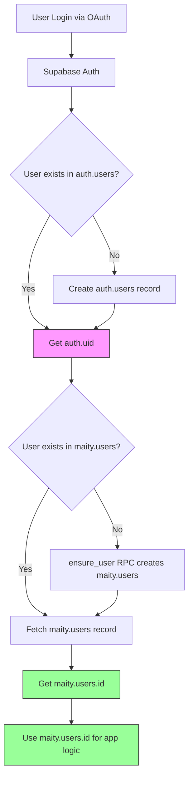

# Database Structure & RLS Policies Reference

**Last Updated:** October 31, 2025
**Version:** 1.3
**Purpose:** Comprehensive reference for implementing new features while avoiding common RLS and permissions errors.

---

## Table of Contents

1. [Quick Start Guide](#quick-start-guide)
2. [Key Concepts](#key-concepts)
   - [auth.uid() vs maity.users.id](#authuid-vs-maityusersid)
   - [Authentication Flow](#authentication-flow)
3. [Database Tables](#database-tables)
   - [Authentication & Users](#authentication--users)
   - [RPC Functions (Stored Procedures)](#rpc-functions-stored-procedures)
   - [Voice/Roleplay System](#voiceroleplay-system)
   - [Evaluations & Interviews](#evaluations--interviews)
   - [Forms & Documents](#forms--documents)
4. [RLS Patterns](#rls-patterns)
   - [By Table](#rls-policies-by-table)
   - [By Operation Type](#rls-policies-by-operation-type)
5. [Common Patterns](#common-patterns)
6. [Troubleshooting](#troubleshooting)
7. [Templates & Snippets](#templates--snippets)

---

## Quick Start Guide

### Checklist for Creating a New Table

- [ ] Design table schema with proper data types
- [ ] Create migration in `supabase/migrations/`
- [ ] Add foreign keys to `maity.users.id` (NOT `auth_id`)
- [ ] Enable RLS: `ALTER TABLE maity.table_name ENABLE ROW LEVEL SECURITY;`
- [ ] Create RLS policies (see [Templates](#templates--snippets))
- [ ] **GRANT permissions to `authenticated` role**
- [ ] Create public wrapper if using RPC functions
- [ ] Test with actual user credentials (not service role)
- [ ] Document in this file

### Most Common Error

```
Error: permission denied for table your_table
Code: 42501
```

**Cause:** Missing `GRANT` permissions even though RLS policies exist.
**Solution:**
```sql
GRANT SELECT, INSERT, UPDATE ON maity.your_table TO authenticated;
```

---

## Key Concepts

### auth.uid() vs maity.users.id

**CRITICAL DISTINCTION:**

| Concept | Type | Description | Example |
|---------|------|-------------|---------|
| `auth.uid()` | PostgreSQL Function | Returns the authenticated user's UUID from Supabase Auth | `550e8400-e29b-41d4-a716-446655440000` |
| `maity.users.auth_id` | Column | Foreign key to `auth.users.id` | Same UUID as `auth.uid()` |
| `maity.users.id` | Column | Primary key of `maity.users` (auto-generated) | `7c9e6679-7425-40de-944b-e07fc1f90ae7` |

#### The Problem

```sql
-- ❌ INCORRECT - Will fail with permission denied
CREATE POLICY "Users can view own sessions"
  ON maity.interview_sessions FOR SELECT
  USING (user_id = auth.uid());
```

**Why it fails:**
- `user_id` references `maity.users.id` (generated UUID)
- `auth.uid()` returns `maity.users.auth_id` (auth UUID)
- These are DIFFERENT values!

#### The Solution

```sql
-- ✅ CORRECT - Use subquery or JOIN
CREATE POLICY "Users can view own sessions"
  ON maity.interview_sessions FOR SELECT
  USING (
    user_id IN (
      SELECT id FROM maity.users WHERE auth_id = auth.uid()
    )
  );
```

#### In TypeScript Code

```typescript
// ❌ INCORRECT - Getting auth_id
const { data: { user } } = await supabase.auth.getUser();
const userId = user.id; // This is auth_id!

await supabase
  .from('interview_sessions')
  .insert({ user_id: userId }); // Will fail RLS!

// ✅ CORRECT - Getting maity.users.id
const { data: { user: authUser } } = await supabase.auth.getUser();

const { data: profile } = await supabase
  .schema('maity')
  .from('users')
  .select('id')
  .eq('auth_id', authUser.id)
  .single();

await supabase
  .schema('maity')
  .from('interview_sessions')
  .insert({ user_id: profile.id }); // Works!
```

### Authentication Flow



**Key Points:**
1. `auth.uid()` is available immediately after login
2. `maity.users.id` must be fetched via query
3. **Always use `maity.users.id` for foreign keys**
4. RLS policies must JOIN to convert `auth.uid()` → `maity.users.id`

---

## Database Tables

### Authentication & Users

#### maity.users

**Purpose:** Main user table linking Supabase Auth to application data.

**Schema:**
```sql
CREATE TABLE maity.users (
  id uuid PRIMARY KEY DEFAULT uuid_generate_v4(),
  company_id uuid REFERENCES maity.companies(id),
  auth_id uuid UNIQUE REFERENCES auth.users(id),
  name text DEFAULT '',
  email text,
  phone text UNIQUE,
  status text DEFAULT 'PENDING',
  registration_form_completed boolean DEFAULT false,
  platform_tour_completed boolean DEFAULT false,
  created_at timestamptz DEFAULT now(),
  updated_at timestamptz DEFAULT now()
);
```

**Key Columns:**
- `id` - Primary key used in app (NOT auth_id)
- `auth_id` - Links to Supabase Auth (unique)
- `company_id` - Organization membership
- `status` - User lifecycle state

**RLS Policies:**
```sql
-- Users can view their own data
USING (auth_id = auth.uid())

-- Users can update their own data
USING (auth.uid() = auth_id)
WITH CHECK (auth.uid() = auth_id)
```

**GRANT Permissions:**
```sql
GRANT SELECT, INSERT, UPDATE, DELETE ON maity.users TO authenticated;
```

**Common Queries:**
```typescript
// Get current user's profile
const { data: { user: authUser } } = await supabase.auth.getUser();
const { data: profile } = await supabase
  .schema('maity')
  .from('users')
  .select('*')
  .eq('auth_id', authUser.id)
  .single();
```

---

#### maity.user_roles

**Purpose:** Stores user roles for authorization (admin, manager, user).

**Schema:**
```sql
CREATE TABLE maity.user_roles (
  id uuid PRIMARY KEY DEFAULT gen_random_uuid(),
  user_id uuid UNIQUE REFERENCES maity.users(id),
  role app_role NOT NULL, -- ENUM: 'admin' | 'manager' | 'user'
  created_at timestamptz DEFAULT now()
);
```

**Key Points:**
- `user_id` references `maity.users.id` (NOT auth_id)
- One role per user (enforced by UNIQUE constraint)
- Used by RLS policies to check permissions

**RLS Policies:**
```sql
-- Users can view own role via auth_id
USING (
  user_id IN (
    SELECT id FROM maity.users WHERE auth_id = auth.uid()
  )
)

-- Platform admins can view all roles
USING (has_role(auth.uid(), 'admin'::app_role))

-- Users can insert their own role (for autojoin)
WITH CHECK (
  user_id IN (
    SELECT id FROM maity.users WHERE auth_id = auth.uid()
  )
)
```

**GRANT Permissions:**
```sql
GRANT SELECT, INSERT, UPDATE ON maity.user_roles TO authenticated;
```

---

#### maity.companies

**Purpose:** Organizations/companies that users belong to.

**Schema:**
```sql
CREATE TABLE maity.companies (
  id uuid PRIMARY KEY DEFAULT uuid_generate_v4(),
  name text NOT NULL,
  slug text UNIQUE,
  domain text, -- Email domain for autojoin
  auto_join_enabled boolean DEFAULT false,
  plan text DEFAULT 'free',
  timezone text DEFAULT 'America/Mexico_City',
  is_active boolean DEFAULT true,
  created_at timestamptz DEFAULT now()
);
```

**Key Features:**
- **Autojoin:** Users with matching email domain can auto-join
- `domain` must be lowercase, no @ symbol
- Only ONE company can claim a domain (unique constraint)

**RLS Policies:**
```sql
-- Users can view own company
USING (
  id IN (
    SELECT company_id FROM maity.users
    WHERE auth_id = auth.uid() AND company_id IS NOT NULL
  )
)

-- Authenticated users can view companies with autojoin enabled
USING (auto_join_enabled = true AND is_active = true)

-- Admins can view/manage all companies
USING (
  EXISTS (
    SELECT 1 FROM maity.user_roles ur
    JOIN maity.users u ON u.id = ur.user_id
    WHERE u.auth_id = auth.uid() AND ur.role = 'admin'
  )
)
```

**GRANT Permissions:**
```sql
GRANT SELECT, INSERT, UPDATE, DELETE ON maity.companies TO authenticated;
```

---

#### maity.user_company_history

**Purpose:** Audit trail for user-company associations (autojoin, invites, transfers).

**Schema:**
```sql
CREATE TABLE maity.user_company_history (
  id uuid PRIMARY KEY DEFAULT gen_random_uuid(),
  user_id uuid REFERENCES maity.users(id),
  company_id uuid REFERENCES maity.companies(id),
  action text CHECK (action IN ('assigned', 'transferred', 'invited', 'confirmed')),
  previous_company_id uuid REFERENCES maity.companies(id),
  invitation_source text,
  created_at timestamptz DEFAULT now()
);
```

**RLS Policies:**
```sql
-- Users can view their own history
USING (
  user_id IN (
    SELECT id FROM maity.users WHERE auth_id = auth.uid()
  )
)

-- Users can insert their own history (for autojoin)
WITH CHECK (
  user_id IN (
    SELECT id FROM maity.users WHERE auth_id = auth.uid()
  )
)
```

**GRANT Permissions:**
```sql
GRANT INSERT ON maity.user_company_history TO authenticated;
-- Note: Only INSERT for regular users, SELECT via RLS
```

---

#### maity.invite_links

**Purpose:** Company invitation system for managers to invite users.

**Schema:**
```sql
CREATE TABLE maity.invite_links (
  id uuid PRIMARY KEY DEFAULT uuid_generate_v4(),
  company_id uuid REFERENCES maity.companies(id) NOT NULL,
  audience text CHECK (audience IN ('USER', 'MANAGER')),
  token text UNIQUE NOT NULL,
  is_reusable boolean DEFAULT true,
  max_uses integer,
  used_count integer DEFAULT 0,
  expires_at timestamptz,
  is_revoked boolean DEFAULT false,
  metadata jsonb DEFAULT '{}',
  created_by uuid,
  created_at timestamptz DEFAULT now()
);
```

**Note:** RLS policies TBD based on manager invite workflow.

---

### RPC Functions (Stored Procedures)

#### public.create_company

**Purpose:** Creates a new company with automatic generation of invite tokens and optional autojoin configuration.

**Signature:**
```sql
CREATE OR REPLACE FUNCTION public.create_company(
  p_company_name text,
  p_domain text DEFAULT NULL,
  p_auto_join_enabled boolean DEFAULT false
)
RETURNS TABLE(
  id uuid,
  name text,
  slug text,
  plan text,
  timezone text,
  is_active boolean,
  created_at timestamp with time zone,
  domain text,
  auto_join_enabled boolean
)
```

**Parameters:**
- `p_company_name` - Name of the company (required)
- `p_domain` - Email domain for autojoin (optional, e.g., "acme.com")
- `p_auto_join_enabled` - Enable autojoin for the domain (default: false)

**Behavior:**
1. Generates a URL-friendly slug from company name
2. Validates domain format (no @ symbol, no spaces, lowercase)
3. Creates company record with autojoin settings
4. Generates two invite tokens (USER and MANAGER)
5. Creates two invite_links records
6. Returns complete company data including autojoin fields

**Security:**
- `SECURITY DEFINER` - Runs with elevated privileges
- `SET search_path TO 'maity', 'public'` - Prevents SQL injection

**Permissions:**
```sql
GRANT EXECUTE ON FUNCTION public.create_company(text, text, boolean) TO authenticated;
```

**Example Usage (TypeScript):**
```typescript
const { data, error } = await supabase.rpc('create_company', {
  p_company_name: 'Acme Corp',
  p_domain: 'acme.com',
  p_auto_join_enabled: true
});

// Returns:
// {
//   id: 'uuid',
//   name: 'Acme Corp',
//   slug: 'acme-corp',
//   domain: 'acme.com',
//   auto_join_enabled: true,
//   ...
// }
```

**Validations:**
- Domain cannot contain @ or spaces
- Domain is automatically converted to lowercase
- If no domain provided, auto_join_enabled is forced to false
- Raises exception if domain format is invalid

**Related Migration:**
- `update_create_company_with_autojoin_support.sql`

---

#### public.get_companies_with_invite_tokens

**Purpose:** Returns all companies with their invite tokens and autojoin configuration.

**Signature:**
```sql
CREATE OR REPLACE FUNCTION public.get_companies_with_invite_tokens()
RETURNS TABLE (
  id uuid,
  name text,
  slug text,
  plan text,
  timezone text,
  is_active boolean,
  created_at timestamp with time zone,
  domain text,
  auto_join_enabled boolean,
  user_invite_token text,
  manager_invite_token text
)
```

**Behavior:**
1. Joins `maity.companies` with `maity.invite_links`
2. Aggregates invite tokens by audience type (USER, MANAGER)
3. Returns autojoin configuration fields
4. Orders by creation date (newest first)

**Security:**
- `SECURITY DEFINER` - Admin-level access required
- `SET search_path = maity, public`

**Permissions:**
```sql
GRANT EXECUTE ON FUNCTION public.get_companies_with_invite_tokens() TO authenticated;
```

**RLS Note:** Access controlled by policies on `maity.companies` table. Only platform admins should be able to see all companies.

**Example Usage (TypeScript):**
```typescript
const { data: companies, error } = await supabase.rpc('get_companies_with_invite_tokens');

// Returns array:
// [
//   {
//     id: 'uuid',
//     name: 'Acme Corp',
//     slug: 'acme-corp',
//     domain: 'acme.com',
//     auto_join_enabled: true,
//     user_invite_token: 'token123...',
//     manager_invite_token: 'token456...',
//     ...
//   }
// ]
```

**Use Cases:**
- Admin dashboard displaying all companies
- Company management interface
- Invite link generation for users and managers

**Related Migration:**
- `update_get_companies_with_invite_tokens_add_autojoin.sql`

---

#### public.try_autojoin_by_domain

**Purpose:** Attempts to automatically assign a user to a company based on their email domain.

**Signature:**
```sql
CREATE OR REPLACE FUNCTION public.try_autojoin_by_domain(p_email TEXT)
RETURNS JSON
```

**Parameters:**
- `p_email` - User's email address

**Returns JSON with:**
```json
{
  "success": true/false,
  "error": "ERROR_CODE",
  "message": "Human-readable message",
  "company_id": "uuid",
  "company_name": "Company Name",
  "company_slug": "company-slug",
  "role_assigned": "user",
  "method": "autojoin",
  "domain": "domain.com"
}
```

**Behavior:**
1. Validates user is authenticated
2. Extracts domain from email (everything after @)
3. Checks if user already has a company (blocks if yes)
4. Looks for active company with matching domain and autojoin enabled
5. If match found:
   - Assigns user to company
   - Sets user status to ACTIVE
   - Creates user_role record with 'user' role
   - Logs action in user_company_history
6. Returns success/failure with details

**Error Codes:**
- `UNAUTHORIZED` - User not authenticated
- `INVALID_EMAIL` - Email is null or empty
- `INVALID_EMAIL_FORMAT` - Cannot extract domain
- `USER_NOT_FOUND` - User doesn't exist in maity.users
- `USER_ALREADY_HAS_COMPANY` - User already assigned to company
- `NO_MATCHING_DOMAIN` - No company found with autojoin for domain
- `UNEXPECTED_ERROR` - Database or runtime error

**Security:**
- `SECURITY DEFINER` - Runs with elevated privileges
- Only assigns 'user' role (not admin/manager)
- Requires user to be authenticated
- Prevents transfers (blocks if user has company)

**Related Tables:**
- `maity.users`
- `maity.companies` (domain, auto_join_enabled)
- `maity.user_roles`
- `maity.user_company_history`

**Related Migration:**
- `20251021_create_try_autojoin_by_domain_function.sql`

---

#### public.get_admin_scenario_config

**Purpose:** Gets complete profile + scenario configuration for admin testing. Allows administrators to test any profile and scenario combination without progression restrictions.

**Signature:**
```sql
CREATE OR REPLACE FUNCTION public.get_admin_scenario_config(
  p_profile_name TEXT,
  p_scenario_code TEXT
)
RETURNS TABLE(
  -- Scenario info
  scenario_id uuid,
  scenario_name varchar,
  scenario_code varchar,
  scenario_order integer,
  scenario_context text,
  scenario_skill text,
  scenario_instructions text,
  scenario_rules text,
  scenario_closing text,
  objectives text,
  -- Profile info
  profile_id uuid,
  profile_name varchar,
  profile_description text,
  profile_key_focus text,
  profile_communication_style text,
  profile_area text,
  profile_impact text,
  profile_personality_traits jsonb,
  -- Difficulty info
  difficulty_level integer,
  difficulty_name varchar,
  difficulty_mood varchar,
  difficulty_objection_frequency numeric,
  difficulty_time_pressure boolean,
  difficulty_interruption_tendency numeric,
  min_score_to_pass numeric
)
```

**Parameters:**
- `p_profile_name` - Profile name (CEO, CTO, CFO)
- `p_scenario_code` - Scenario code (e.g., 'first_visit', 'product_demo')

**Behavior:**
1. Validates profile exists and is active
2. Validates scenario exists and is active
3. Uses first difficulty level (Easy) by default
4. Returns complete configuration with all profile, scenario, and difficulty data
5. Raises exceptions if profile or scenario not found

**Security:**
- `SECURITY DEFINER` - Runs with elevated privileges
- `SET search_path TO 'maity', 'public'`
- Should only be called by administrators for testing purposes

**Permissions:**
```sql
GRANT EXECUTE ON FUNCTION public.get_admin_scenario_config(TEXT, TEXT) TO authenticated;
```

**Example Usage (TypeScript):**
```typescript
const { data, error } = await supabase.rpc('get_admin_scenario_config', {
  p_profile_name: 'CEO',
  p_scenario_code: 'first_visit'
});

// Returns complete configuration:
// {
//   scenario_id: 'uuid',
//   scenario_name: 'Primera Visita',
//   scenario_code: 'first_visit',
//   scenario_context: 'Full context...',
//   scenario_skill: 'escucha activa...',
//   profile_name: 'CEO',
//   profile_description: 'Description...',
//   difficulty_level: 1,
//   ...
// }
```

**Use Cases:**
- Admin testing of roleplay scenarios
- Quality assurance of scenario configurations
- Debugging profile + scenario combinations
- Testing without affecting user progress

**Related Migration:**
- `create_get_admin_scenario_config_function.sql`

---

#### public.get_analytics_dashboard

**Purpose:** Returns comprehensive analytics data for admin dashboard, aggregating statistics from interviews and roleplay sessions.

**Signature:**
```sql
CREATE OR REPLACE FUNCTION public.get_analytics_dashboard(
  p_company_id UUID DEFAULT NULL,
  p_type TEXT DEFAULT 'all',
  p_start_date TIMESTAMPTZ DEFAULT NULL,
  p_end_date TIMESTAMPTZ DEFAULT NULL,
  p_profile_id UUID DEFAULT NULL,
  p_scenario_id UUID DEFAULT NULL
)
RETURNS JSON
```

**Parameters:**
- `p_company_id` - Filter by specific company (NULL = all companies)
- `p_type` - Filter by session type: 'interview', 'roleplay', or 'all'
- `p_start_date` - Filter sessions started after this date
- `p_end_date` - Filter sessions started before this date
- `p_profile_id` - Filter roleplay sessions by profile (CEO, CTO, CFO)
- `p_scenario_id` - Filter roleplay sessions by scenario

**Returns JSON with:**
```json
{
  "overview": {
    "totalInterviews": 50,
    "totalRoleplaySessions": 200,
    "averageScore": 75.5,
    "passRate": 68.2,
    "totalDuration": 50000,
    "averageDuration": 200
  },
  "sessionsByCompany": [
    {
      "companyId": "uuid",
      "companyName": "Company Name",
      "interviewCount": 10,
      "roleplayCount": 40,
      "averageScore": 78.0,
      "passRate": 72.5
    }
  ],
  "sessionsByProfile": [
    {
      "profileId": "uuid",
      "profileName": "CEO",
      "sessionCount": 80,
      "averageScore": 72.0,
      "passRate": 65.0
    }
  ],
  "sessionsByScenario": [
    {
      "scenarioId": "uuid",
      "scenarioName": "Primera Visita",
      "sessionCount": 50,
      "averageScore": 70.0,
      "passRate": 60.0
    }
  ],
  "scoreDistribution": [
    { "range": "0-20", "count": 5 },
    { "range": "21-40", "count": 15 },
    { "range": "41-60", "count": 30 },
    { "range": "61-80", "count": 45 },
    { "range": "81-100", "count": 25 }
  ],
  "timeline": [
    {
      "date": "2025-01-01",
      "interviewCount": 2,
      "roleplayCount": 8,
      "averageScore": 75.0
    }
  ],
  "recentSessions": [
    {
      "id": "uuid",
      "type": "roleplay",
      "userId": "uuid",
      "userName": "John Doe",
      "companyId": "uuid",
      "companyName": "Company Name",
      "profileName": "CEO",
      "scenarioName": "Primera Visita",
      "score": 75,
      "passed": true,
      "duration": 180,
      "status": "completed",
      "startedAt": "2025-01-10T10:00:00Z",
      "endedAt": "2025-01-10T10:03:00Z"
    }
  ]
}
```

**Behavior:**
1. Verifies user has admin role
2. Aggregates data from `interview_sessions` and `voice_sessions` tables
3. Joins with related tables for enriched data
4. Applies filters based on parameters
5. Calculates statistics, distributions, and trends
6. Returns last 20 recent sessions
7. Returns top 10 companies by total sessions

**Security:**
- `SECURITY DEFINER` - Runs with elevated privileges
- `SET search_path = maity, public`
- Admin role required (verified at start of function)

**Permissions:**
```sql
GRANT EXECUTE ON FUNCTION public.get_analytics_dashboard(UUID, TEXT, TIMESTAMPTZ, TIMESTAMPTZ, UUID, UUID) TO authenticated;
```

**Example Usage (TypeScript):**
```typescript
const { data, error } = await supabase.rpc('get_analytics_dashboard', {
  p_company_id: null, // All companies
  p_type: 'all', // All types
  p_start_date: null, // No start filter
  p_end_date: null, // No end filter
  p_profile_id: null, // All profiles
  p_scenario_id: null // All scenarios
});

// Returns complete analytics dashboard data
console.log(data.overview.totalInterviews);
console.log(data.sessionsByCompany);
console.log(data.scoreDistribution);
```

**Use Cases:**
- Admin analytics dashboard
- Company performance comparison
- Score distribution analysis
- Profile and scenario effectiveness tracking
- Trend analysis over time
- Recent activity monitoring

**Related Migration:**
- `create_analytics_functions_for_admin.sql`

**Related Tables:**
- `maity.interview_sessions`
- `maity.voice_sessions`
- `maity.users`
- `maity.companies`
- `maity.voice_agent_profiles`
- `maity.voice_scenarios`
- `maity.voice_profile_scenarios`

---

#### maity.otk (One-Time Keys)

**Purpose:** Temporary tokens for Tally form submissions.

**Schema:**
```sql
CREATE TABLE maity.otk (
  id uuid PRIMARY KEY DEFAULT gen_random_uuid(),
  token text UNIQUE NOT NULL,
  auth_id uuid NOT NULL,
  expires_at timestamptz NOT NULL,
  created_at timestamptz DEFAULT now(),
  used_at timestamptz
);
```

**Note:** No RLS enabled (managed via RPC function `otk()` with service role).

---

### Voice/Roleplay System

#### maity.voice_agent_profiles

**Purpose:** AI agent profiles for roleplay practice (CEO, CTO, CFO) and specialized features (Tech Week).

**Schema:**
```sql
CREATE TABLE maity.voice_agent_profiles (
  id uuid PRIMARY KEY DEFAULT gen_random_uuid(),
  name varchar UNIQUE NOT NULL, -- 'CEO', 'CTO', 'CFO'
  description text,
  key_focus text,
  communication_style text,
  personality_traits jsonb,
  area text, -- Role area (e.g., 'Finanzas', 'Tecnología')
  impact text, -- Role impact (e.g., 'impacto financiero', 'decisiones técnicas')
  is_active boolean DEFAULT true,
  created_at timestamptz DEFAULT now(),
  updated_at timestamptz DEFAULT now()
);
```

**Key Columns:**
- `name` - Profile name (CEO, CTO, CFO)
- `communication_style` - Communication style of the profile
- `area` - Area of responsibility (e.g., "Finanzas", "Tecnología")
- `impact` - Impact of the role (e.g., "impacto financiero", "decisiones técnicas")
- `key_focus` - Key focus areas
- `personality_traits` - JSONB with personality characteristics

**RLS Policies:**
```sql
-- Public read access (authenticated users can view active profiles)
USING (is_active = true)
```

**GRANT Permissions:**
```sql
-- Read-only for authenticated users
GRANT SELECT ON maity.voice_agent_profiles TO authenticated;
```

**Note:** This table must be readable by all authenticated users to allow the admin selector and scenario loading to work properly.

**Usage in Roleplay:**
These fields are sent to configure the AI agent:
- `profile` → `name`
- `style` → `communication_style`
- `role_area` → `area`
- `role_impact` → `impact`

---

#### maity.voice_scenarios

**Purpose:** Practice scenarios (first visit, product demo, objection handling, etc.).

**Schema:**
```sql
CREATE TABLE maity.voice_scenarios (
  id uuid PRIMARY KEY DEFAULT gen_random_uuid(),
  name varchar NOT NULL,
  code varchar UNIQUE NOT NULL, -- 'first_visit', 'product_demo'
  order_index integer NOT NULL,
  context text NOT NULL, -- Scenario context (renamed from base_context)
  objectives text NOT NULL, -- Scenario objectives (JSON format)
  skill text, -- Main skill practiced (e.g., 'escucha activa y descubrimiento de necesidades')
  instructions text, -- Specific instructions for the scenario
  rules text, -- Rules for the scenario
  closing text, -- Closing message/script for the scenario
  estimated_duration integer DEFAULT 300, -- seconds
  category varchar, -- 'discovery', 'presentation', 'negotiation'
  is_active boolean DEFAULT true,
  created_at timestamptz DEFAULT now(),
  updated_at timestamptz DEFAULT now()
);
```

**Key Columns:**
- `name` - Scenario name (e.g., "Primera Visita", "Demostración de Producto")
- `code` - Unique code identifier
- `context` - Full context description for the scenario
- `skill` - Main skill being practiced
- `instructions` - Specific instructions for the user
- `rules` - Rules that govern the scenario
- `closing` - Closing script or message
- `objectives` - Learning objectives (text/JSON format)

**RLS Policies:**
```sql
-- Public read access to active scenarios
USING (is_active = true)
```

**GRANT Permissions:**
```sql
-- Read-only for authenticated users
GRANT SELECT ON maity.voice_scenarios TO authenticated;
```

**Note:** This table must be readable by all authenticated users to allow:
- Admin selector to list all available scenarios
- Users to view scenario information
- Proper scenario loading in roleplay sessions

**Usage in Roleplay:**
These fields are sent to configure the practice session:
- `scenario` → `name`
- `scenario_skill` → `skill`
- `scenario_context` → `context`
- `scenario_instructions` → `instructions`
- Additional: `rules`, `closing`, `objectives`

**Related Migrations:**
- `grant_permissions_voice_scenarios.sql` - Grants SELECT permissions to authenticated role
- `20251028102938_create_tech_week_profile_and_scenario.sql` - Creates Tech Week profile and scenario

---

#### Tech Week - Specialized Voice Practice

**Purpose:** Admin-only voice practice feature for Tech Week events and demonstrations.

**Key Components:**
- Profile: `Tech Week` in `voice_agent_profiles`
- Scenario: `tech_week_general` in `voice_scenarios`
- ElevenLabs Agent ID: `agent_3301k8nsyp5jeqfb84n0y0p5jd2g`

**Database Schema:**
```sql
-- Profile entry
INSERT INTO maity.voice_agent_profiles (name, description, key_focus, communication_style)
VALUES (
  'Tech Week',
  'Agente especializado para sesiones de Tech Week - eventos de tecnología y práctica intensiva.',
  'Evaluación técnica, presentación de proyectos, y práctica de habilidades de comunicación en contextos tecnológicos.',
  'Profesional y técnico, con enfoque en innovación y colaboración.'
);

-- Scenario entry
INSERT INTO maity.voice_scenarios (name, code, order_index, context, instructions, objectives)
VALUES (
  'Tech Week - Sesión General',
  'tech_week_general',
  1,
  'Estás participando en un evento de Tech Week...',
  'Durante esta sesión, el agente Tech Week interactuará contigo...',
  '["Comunicar ideas técnicas de forma clara", "Responder preguntas con confianza", "Demostrar profesionalismo"]'
);
```

**Access Control:**
- Routes protected by `AdminRoute` component
- Only users with `admin` role can access
- Frontend routes: `/tech-week`, `/tech-week/sessions`, `/tech-week/sessions/:sessionId`

**Features:**
- Simplified flow (no questionnaire)
- Single scenario configuration
- Pink/rose color theme (visual distinction)
- Full session persistence and evaluation
- Uses same `voice_sessions` table as roleplay
- n8n evaluation workflow integration

**Environment Variables:**
- `VITE_ELEVENLABS_TECH_WEEK_AGENT_ID` - Tech Week specific agent ID

**Related Files:**
- `src/features/tech-week/` - Feature implementation
- `src/components/AdminRoute.tsx` - Admin protection
- Migration: `20251028102938_create_tech_week_profile_and_scenario.sql`

---

#### maity.voice_difficulty_levels

**Purpose:** Difficulty levels for scenarios (Easy, Medium, Hard).

**Schema:**
```sql
CREATE TABLE maity.voice_difficulty_levels (
  id uuid PRIMARY KEY DEFAULT gen_random_uuid(),
  level integer UNIQUE CHECK (level >= 1 AND level <= 3),
  name varchar NOT NULL, -- 'Fácil', 'Medio', 'Difícil'
  code varchar UNIQUE NOT NULL, -- 'easy', 'medium', 'hard'
  mood_preset varchar,
  objection_frequency numeric CHECK (objection_frequency >= 0 AND objection_frequency <= 1),
  time_pressure boolean DEFAULT false,
  interruption_tendency numeric CHECK (interruption_tendency >= 0 AND interruption_tendency <= 1),
  created_at timestamptz DEFAULT now()
);
```

**RLS Policies:**
```sql
-- Public read access (all authenticated users)
USING (true)
```

---

#### maity.voice_profile_scenarios

**Purpose:** Combines profile + scenario + difficulty with specific configuration.

**Schema:**
```sql
CREATE TABLE maity.voice_profile_scenarios (
  id uuid PRIMARY KEY DEFAULT gen_random_uuid(),
  profile_id uuid REFERENCES maity.voice_agent_profiles(id) NOT NULL,
  scenario_id uuid REFERENCES maity.voice_scenarios(id) NOT NULL,
  difficulty_id uuid REFERENCES maity.voice_difficulty_levels(id) NOT NULL,
  company_id uuid REFERENCES maity.companies(id), -- NULL = global
  specific_context text,
  key_objections jsonb,
  success_criteria jsonb,
  talking_points jsonb,
  user_instructions text,
  min_score_to_pass numeric DEFAULT 70.00 CHECK (min_score_to_pass >= 0 AND min_score_to_pass <= 100),
  is_locked boolean DEFAULT true,
  unlock_after_scenario uuid REFERENCES maity.voice_scenarios(id),
  created_at timestamptz DEFAULT now(),
  updated_at timestamptz DEFAULT now()
);
```

**RLS Policies:**
```sql
-- Users can view profile scenarios (READ-ONLY)
USING (true)
```

---

#### maity.voice_pre_practice_questionnaire

**Purpose:** Pre-practice questionnaire to determine user's starting profile.

**Schema:**
```sql
CREATE TABLE maity.voice_pre_practice_questionnaire (
  id uuid PRIMARY KEY DEFAULT gen_random_uuid(),
  user_id uuid REFERENCES maity.users(id) NOT NULL,
  most_difficult_profile varchar CHECK (most_difficult_profile IN ('CEO', 'CTO', 'CFO')),
  practice_start_profile varchar CHECK (practice_start_profile IN ('CEO', 'CTO', 'CFO')),
  answered_at timestamptz DEFAULT now(),
  session_started boolean DEFAULT false,
  session_id uuid,
  created_at timestamptz DEFAULT now(),
  updated_at timestamptz DEFAULT now()
);
```

**RLS Policies:**
```sql
-- Users can view own questionnaire responses
USING (
  user_id IN (
    SELECT id FROM maity.users WHERE auth_id = auth.uid()
  )
)

-- Users can insert own responses
WITH CHECK (
  user_id IN (
    SELECT id FROM maity.users WHERE auth_id = auth.uid()
  )
)

-- Users can update own responses
USING (
  user_id IN (
    SELECT id FROM maity.users WHERE auth_id = auth.uid()
  )
)
WITH CHECK (
  user_id IN (
    SELECT id FROM maity.users WHERE auth_id = auth.uid()
  )
)
```

**GRANT Permissions:**
```sql
GRANT SELECT, INSERT, UPDATE, DELETE ON maity.voice_pre_practice_questionnaire TO authenticated;
```

---

#### maity.voice_sessions

**Purpose:** Practice sessions with AI agents.

**Schema:**
```sql
CREATE TABLE maity.voice_sessions (
  id uuid PRIMARY KEY DEFAULT gen_random_uuid(),
  user_id uuid REFERENCES maity.users(id) NOT NULL,
  company_id uuid REFERENCES maity.companies(id),
  profile_scenario_id uuid REFERENCES maity.voice_profile_scenarios(id) NOT NULL,
  questionnaire_id uuid REFERENCES maity.voice_pre_practice_questionnaire(id),
  status varchar DEFAULT 'in_progress' CHECK (status IN ('in_progress', 'completed', 'abandoned', 'evaluating')),
  started_at timestamptz DEFAULT now(),
  ended_at timestamptz,
  duration_seconds integer,
  recording_url text,
  raw_transcript text,
  ai_agent_config jsonb,
  processed_feedback jsonb,
  score numeric CHECK (score >= 0 AND score <= 100),
  passed boolean,
  min_score_to_pass numeric CHECK (min_score_to_pass >= 0 AND min_score_to_pass <= 100),
  session_metadata jsonb,
  created_at timestamptz DEFAULT now(),
  updated_at timestamptz DEFAULT now()
);
```

**RLS Policies:**
```sql
-- Users can view own sessions
USING (
  user_id IN (
    SELECT id FROM maity.users WHERE auth_id = auth.uid()
  )
)

-- Users can create own sessions
WITH CHECK (
  auth.uid() IN (
    SELECT auth_id FROM maity.users WHERE id = voice_sessions.user_id
  )
)

-- Users can update own sessions
USING (
  user_id IN (
    SELECT id FROM maity.users WHERE auth_id = auth.uid()
  )
)
```

**GRANT Permissions:**
```sql
GRANT SELECT, UPDATE ON maity.voice_sessions TO authenticated;
-- Note: INSERT is done via RPC function
```

---

#### maity.voice_user_progress

**Purpose:** Tracks user progress per agent profile.

**Schema:**
```sql
CREATE TABLE maity.voice_user_progress (
  id uuid PRIMARY KEY DEFAULT gen_random_uuid(),
  user_id uuid REFERENCES maity.users(id) NOT NULL,
  company_id uuid REFERENCES maity.companies(id),
  profile_id uuid REFERENCES maity.voice_agent_profiles(id) NOT NULL,
  current_scenario_order integer DEFAULT 1,
  current_difficulty_level integer DEFAULT 1,
  scenarios_completed integer DEFAULT 0,
  scenarios_failed integer DEFAULT 0,
  total_sessions integer DEFAULT 0,
  total_practice_time integer DEFAULT 0, -- seconds
  average_score numeric,
  best_score numeric,
  streak_days integer DEFAULT 0,
  last_session_date date,
  achievements_unlocked integer DEFAULT 0,
  total_points integer DEFAULT 0,
  created_at timestamptz DEFAULT now(),
  updated_at timestamptz DEFAULT now()
);
```

**RLS Policies:**
```sql
-- Users can manage own progress
USING (
  auth.uid() IN (
    SELECT auth_id FROM maity.users WHERE id = voice_user_progress.user_id
  )
)

-- Managers can view company progress
USING (
  EXISTS (
    SELECT 1 FROM maity.users u
    JOIN maity.user_roles ur ON u.id = ur.user_id
    WHERE u.auth_id = auth.uid()
      AND ur.role IN ('manager', 'admin')
      AND u.company_id = voice_user_progress.company_id
  )
)
```

---

#### maity.voice_progress_history

**Purpose:** Daily progress snapshots for charts and analytics.

**Schema:**
```sql
CREATE TABLE maity.voice_progress_history (
  id uuid PRIMARY KEY DEFAULT gen_random_uuid(),
  user_id uuid REFERENCES maity.users(id) NOT NULL,
  profile_id uuid REFERENCES maity.voice_agent_profiles(id),
  date date NOT NULL,
  sessions_count integer DEFAULT 0,
  practice_time_seconds integer DEFAULT 0,
  average_score numeric,
  scenarios_completed integer DEFAULT 0,
  created_at timestamptz DEFAULT now()
);
```

**RLS Policies:**
```sql
-- Users can manage own history
USING (
  auth.uid() IN (
    SELECT auth_id FROM maity.users WHERE id = voice_progress_history.user_id
  )
)
```

---

#### maity.voice_metric_types

**Purpose:** Defines types of metrics used to evaluate sessions.

**Schema:**
```sql
CREATE TABLE maity.voice_metric_types (
  id uuid PRIMARY KEY DEFAULT gen_random_uuid(),
  code varchar UNIQUE NOT NULL,
  name varchar NOT NULL,
  description text,
  category varchar,
  calculation_method text,
  weight numeric DEFAULT 1.0 CHECK (weight >= 0 AND weight <= 2),
  is_active boolean DEFAULT true,
  created_at timestamptz DEFAULT now()
);
```

**RLS Policies:**
```sql
-- Public read access to active metrics
USING (is_active = true)
```

---

#### maity.voice_session_metrics

**Purpose:** Calculated metrics per session.

**Schema:**
```sql
CREATE TABLE maity.voice_session_metrics (
  id uuid PRIMARY KEY DEFAULT gen_random_uuid(),
  session_id uuid REFERENCES maity.voice_sessions(id) NOT NULL,
  metric_type_id uuid REFERENCES maity.voice_metric_types(id) NOT NULL,
  metric_value numeric NOT NULL,
  normalized_score numeric,
  metadata jsonb,
  created_at timestamptz DEFAULT now()
);
```

**RLS Policies:**
```sql
-- Users can view metrics of own sessions
USING (
  EXISTS (
    SELECT 1 FROM maity.voice_sessions vs
    JOIN maity.users u ON vs.user_id = u.id
    WHERE vs.id = voice_session_metrics.session_id
      AND u.auth_id = auth.uid()
  )
)
```

---

#### maity.voice_session_moments

**Purpose:** Key moments identified in conversations (objections, closing attempts, etc.).

**Schema:**
```sql
CREATE TABLE maity.voice_session_moments (
  id uuid PRIMARY KEY DEFAULT gen_random_uuid(),
  session_id uuid REFERENCES maity.voice_sessions(id) NOT NULL,
  moment_type varchar NOT NULL, -- 'objection', 'closing_attempt', 'rapport_building'
  timestamp_seconds integer NOT NULL,
  transcript_snippet text,
  ai_analysis jsonb,
  score numeric,
  created_at timestamptz DEFAULT now()
);
```

**RLS Policies:**
```sql
-- Users can view moments of own sessions
USING (
  EXISTS (
    SELECT 1 FROM maity.voice_sessions vs
    JOIN maity.users u ON vs.user_id = u.id
    WHERE vs.id = voice_session_moments.session_id
      AND u.auth_id = auth.uid()
  )
)
```

---

### Evaluations & Interviews

#### maity.evaluations

**Purpose:** AI evaluations of practice sessions (processed via n8n).

**Schema:**
```sql
CREATE TABLE maity.evaluations (
  request_id uuid PRIMARY KEY,
  user_id uuid REFERENCES maity.users(id) NOT NULL,
  session_id uuid REFERENCES maity.voice_sessions(id),
  status text DEFAULT 'pending' CHECK (status IN ('pending', 'processing', 'complete', 'error')),
  result jsonb,
  error_message text,
  created_at timestamptz DEFAULT now(),
  updated_at timestamptz DEFAULT now()
);
```

**RLS Policies:**
```sql
-- Users can view own evaluations
USING (
  user_id IN (
    SELECT id FROM maity.users WHERE auth_id = auth.uid()
  )
)
```

**GRANT Permissions:**
```sql
GRANT SELECT ON maity.evaluations TO authenticated;
-- Updates handled via service role (n8n webhook)
```

---

#### maity.interview_sessions

**Purpose:** Practice interview sessions with AI interviewer.

**Schema:**
```sql
CREATE TABLE maity.interview_sessions (
  id uuid PRIMARY KEY DEFAULT gen_random_uuid(),
  user_id uuid REFERENCES maity.users(id) NOT NULL,
  started_at timestamptz DEFAULT now(),
  ended_at timestamptz,
  duration_seconds integer,
  raw_transcript text,
  score integer CHECK (score >= 0 AND score <= 100),
  processed_feedback jsonb,
  status text DEFAULT 'in_progress' CHECK (status IN ('in_progress', 'completed', 'cancelled')),
  evaluation_id uuid REFERENCES maity.interview_evaluations(request_id) ON DELETE SET NULL,
  created_at timestamptz DEFAULT now(),
  updated_at timestamptz DEFAULT now()
);
```

**Note:** The `evaluation_id` field links to `interview_evaluations.request_id` to track the analysis status.

**RLS Policies:**
```sql
-- Users can view own interview sessions
USING (
  user_id IN (
    SELECT id FROM maity.users WHERE auth_id = auth.uid()
  )
)

-- Users can create own sessions
WITH CHECK (
  user_id IN (
    SELECT id FROM maity.users WHERE auth_id = auth.uid()
  )
)

-- Users can update own sessions
USING (
  user_id IN (
    SELECT id FROM maity.users WHERE auth_id = auth.uid()
  )
)
WITH CHECK (
  user_id IN (
    SELECT id FROM maity.users WHERE auth_id = auth.uid()
  )
)

-- Admins can view all sessions
USING (
  EXISTS (
    SELECT 1 FROM maity.user_roles ur
    JOIN maity.users u ON u.id = ur.user_id
    WHERE u.auth_id = auth.uid() AND ur.role = 'admin'
  )
)
```

**GRANT Permissions:**
```sql
GRANT SELECT, INSERT, UPDATE ON maity.interview_sessions TO authenticated;
```

**Example Usage:**
```typescript
// ✅ CORRECT - Get user's maity.users.id first
const { data: { user: authUser } } = await supabase.auth.getUser();

const { data: profile } = await supabase
  .schema('maity')
  .from('users')
  .select('id, name')
  .eq('auth_id', authUser.id)
  .single();

// Create session with correct user_id
const { data: session } = await supabase
  .schema('maity')
  .from('interview_sessions')
  .insert({
    user_id: profile.id, // maity.users.id, not auth_id!
    status: 'in_progress',
    started_at: new Date().toISOString()
  })
  .select('id')
  .single();
```

---

#### maity.interview_evaluations

**Purpose:** AI-generated analysis of interview sessions (processed via n8n).

**Schema:**
```sql
CREATE TABLE maity.interview_evaluations (
  request_id uuid PRIMARY KEY DEFAULT gen_random_uuid(),
  session_id uuid REFERENCES maity.interview_sessions(id) ON DELETE CASCADE NOT NULL,
  user_id uuid REFERENCES maity.users(id) ON DELETE CASCADE NOT NULL,
  status text DEFAULT 'pending' CHECK (status IN ('pending', 'processing', 'complete', 'error')),
  analysis_text text,
  interviewee_name text,
  error_message text,
  created_at timestamptz DEFAULT now(),
  updated_at timestamptz DEFAULT now()
);
```

**Key Relationships:**
- `request_id`: Primary key used for n8n workflow tracking
- `session_id`: Links to `interview_sessions.id`
- `user_id`: References `maity.users.id` (not auth_id!)
- `status`: Workflow state (pending → processing → complete/error)
- `analysis_text`: AI-generated narrative analysis from n8n
- `interviewee_name`: User name extracted from interview transcript

**RLS Policies:**
```sql
-- Admins can view all interview evaluations
USING (
  EXISTS (
    SELECT 1 FROM maity.user_roles ur
    JOIN maity.users u ON u.id = ur.user_id
    WHERE u.auth_id = auth.uid() AND ur.role = 'admin'
  )
)

-- Users can view their own interview evaluations
USING (
  user_id IN (
    SELECT id FROM maity.users WHERE auth_id = auth.uid()
  )
)
```

**GRANT Permissions:**
```sql
GRANT SELECT ON maity.interview_evaluations TO authenticated;
-- Note: INSERT/UPDATE handled via RPC functions or service role (n8n webhook)
```

**RPC Functions:**
```sql
-- Create interview evaluation (returns request_id for n8n tracking)
public.create_interview_evaluation(p_session_id UUID, p_user_id UUID) RETURNS UUID

-- Get interview sessions history (admin sees all, users see own)
public.get_interview_sessions_history(p_user_id UUID DEFAULT NULL) RETURNS TABLE (
  session_id UUID,
  user_id UUID,
  user_name TEXT,
  interviewee_name TEXT,
  started_at TIMESTAMPTZ,
  ended_at TIMESTAMPTZ,
  duration_seconds INTEGER,
  status TEXT,
  evaluation_status TEXT,
  analysis_preview TEXT,
  created_at TIMESTAMPTZ
)
```

**Example Usage:**
```typescript
// Create evaluation after session ends
const requestId = await InterviewService.createEvaluation(sessionId, userId);

// Send transcript to n8n for analysis
const webhookUrl = env.n8nInterviewWebhookUrl;
await fetch(webhookUrl, {
  method: 'POST',
  headers: { 'Content-Type': 'application/json' },
  body: JSON.stringify({
    request_id: requestId,
    session_id: sessionId,
    transcript: transcript,
    metadata: {
      user_id: userId,
      user_name: userName,
      duration_seconds: duration,
    }
  })
});

// Monitor evaluation status with realtime hook
const { evaluation, isLoading } = useInterviewEvaluationRealtime({
  requestId,
  onComplete: (analysis) => {
    console.log('Analysis completed:', analysis);
  }
});
```

**Workflow:**
1. Frontend creates evaluation record (status='pending')
2. Frontend sends transcript to n8n webhook
3. n8n processes with LLM
4. n8n calls `/api/interview-analysis-complete` with analysis
5. Backend updates evaluation (status='complete', analysis_text)
6. Frontend receives realtime update

**API Endpoint:**
- `/api/interview-analysis-complete` - Receives analysis from n8n
- Webhook URL: https://aca-maity.lemonglacier-45d07388.eastus2.azurecontainerapps.io/webhook/analysis

---

### Forms & Documents

#### maity.tally_submissions

**Purpose:** Submissions from Tally forms.

**Schema:**
```sql
CREATE TABLE maity.tally_submissions (
  id uuid PRIMARY KEY DEFAULT gen_random_uuid(),
  user_id uuid REFERENCES maity.users(id) NOT NULL,
  submission_data jsonb NOT NULL,
  tally_response_id text,
  form_id text,
  created_at timestamptz DEFAULT now()
);
```

**RLS Policies:**
```sql
-- Users can view own submissions
USING (user_id = auth.uid())

-- Platform admins can view all
USING (has_role(auth.uid(), 'admin'::app_role))
```

**GRANT Permissions:**
```sql
GRANT SELECT ON maity.tally_submissions TO authenticated;
```

---

#### maity.form_responses

**Purpose:** Generic form responses storage.

**Schema:**
```sql
CREATE TABLE maity.form_responses (
  id uuid PRIMARY KEY DEFAULT gen_random_uuid(),
  user_id uuid UNIQUE REFERENCES maity.users(id),
  submitted_at timestamptz DEFAULT now(),
  q1 text,
  q2 text,
  q3 text,
  -- ... up to q12
  raw jsonb
);
```

**Note:** RLS policies TBD based on usage.

---

#### public.documents

**Purpose:** Document embeddings for RAG (Retrieval Augmented Generation).

**Schema:**
```sql
CREATE TABLE public.documents (
  id bigserial PRIMARY KEY,
  content text,
  metadata jsonb,
  embedding vector -- pgvector extension
);
```

**RLS Policies:**
```sql
-- Users can access if they belong to active company
USING (
  EXISTS (
    SELECT 1 FROM maity.users u
    WHERE u.auth_id = auth.uid()
      AND u.company_id IS NOT NULL
      AND u.status = 'ACTIVE'
  )
)
```

**GRANT Permissions:**
```sql
GRANT SELECT, INSERT, UPDATE, DELETE ON public.documents TO authenticated;
```

---

#### public.n8n_chat_histories

**Purpose:** Chat history for n8n conversational workflows.

**Schema:**
```sql
CREATE TABLE public.n8n_chat_histories (
  id serial PRIMARY KEY,
  session_id varchar NOT NULL,
  message jsonb NOT NULL
);
```

**RLS Policies:**
```sql
-- Same as documents - users must be active
USING (
  EXISTS (
    SELECT 1 FROM maity.users u
    WHERE u.auth_id = auth.uid()
      AND u.company_id IS NOT NULL
      AND u.status = 'ACTIVE'
  )
)
```

---

## RLS Patterns

### RLS Policies By Table

See individual table sections above for complete policy definitions.

### RLS Policies By Operation Type

#### SELECT Policies (Read)

**Pattern 1: Own Records via auth_id**
```sql
-- For tables with auth_id column
USING (auth_id = auth.uid())
```

**Pattern 2: Own Records via JOIN to users**
```sql
-- For tables with user_id referencing maity.users.id
USING (
  user_id IN (
    SELECT id FROM maity.users WHERE auth_id = auth.uid()
  )
)
```

**Pattern 3: Company-wide Access**
```sql
-- For managers/admins viewing company data
USING (
  company_id IN (
    SELECT company_id FROM maity.users WHERE auth_id = auth.uid()
  )
  AND EXISTS (
    SELECT 1 FROM maity.user_roles ur
    JOIN maity.users u ON u.id = ur.user_id
    WHERE u.auth_id = auth.uid()
      AND ur.role IN ('manager', 'admin')
  )
)
```

**Pattern 4: Public Read Access**
```sql
-- For reference data (profiles, scenarios, etc.)
USING (is_active = true)
-- or
USING (true)
```

**Pattern 5: Admin-Only Access**
```sql
USING (
  EXISTS (
    SELECT 1 FROM maity.user_roles ur
    JOIN maity.users u ON u.id = ur.user_id
    WHERE u.auth_id = auth.uid() AND ur.role = 'admin'
  )
)
```

#### INSERT Policies (Create)

**Pattern 1: Own Records Only**
```sql
WITH CHECK (
  user_id IN (
    SELECT id FROM maity.users WHERE auth_id = auth.uid()
  )
)
```

**Pattern 2: Admin-Restricted**
```sql
WITH CHECK (
  EXISTS (
    SELECT 1 FROM maity.user_roles ur
    JOIN maity.users u ON u.id = ur.user_id
    WHERE u.auth_id = auth.uid() AND ur.role = 'admin'
  )
)
```

#### UPDATE Policies (Modify)

**Pattern: Both USING and WITH CHECK**
```sql
USING (
  user_id IN (
    SELECT id FROM maity.users WHERE auth_id = auth.uid()
  )
)
WITH CHECK (
  user_id IN (
    SELECT id FROM maity.users WHERE auth_id = auth.uid()
  )
)
```

**Why both?**
- `USING` - Can they SELECT the row to update?
- `WITH CHECK` - Are the new values valid?

#### DELETE Policies (Remove)

**Pattern: Restricted (Usually Admin-Only)**
```sql
USING (
  EXISTS (
    SELECT 1 FROM maity.user_roles ur
    JOIN maity.users u ON u.id = ur.user_id
    WHERE u.auth_id = auth.uid() AND ur.role = 'admin'
  )
)
```

---

## Common Patterns

### The "User Record Lookup" Pattern

**Problem:** You need to get `maity.users.id` from `auth.uid()` frequently.

**Solution:** Create a helper service:

```typescript
// packages/shared/src/domain/auth/auth.service.ts
export class AuthService {
  /**
   * Gets current user's maity.users record (NOT just auth)
   */
  static async getUserProfile() {
    const { data: { user: authUser } } = await supabase.auth.getUser();
    if (!authUser) throw new Error('Not authenticated');

    const { data: profile, error } = await supabase
      .schema('maity')
      .from('users')
      .select('id, name, email, company_id, status')
      .eq('auth_id', authUser.id)
      .single();

    if (error) throw error;
    return profile;
  }
}

// Usage
const profile = await AuthService.getUserProfile();
await supabase
  .schema('maity')
  .from('interview_sessions')
  .insert({ user_id: profile.id }); // Correct!
```

### The "Check Has Role" Pattern

**Problem:** Need to verify if user has specific role in RLS or code.

**RLS Function:**
```sql
CREATE OR REPLACE FUNCTION has_role(p_auth_id uuid, p_role app_role)
RETURNS boolean AS $$
BEGIN
  RETURN EXISTS (
    SELECT 1 FROM maity.user_roles ur
    JOIN maity.users u ON u.id = ur.user_id
    WHERE u.auth_id = p_auth_id AND ur.role = p_role
  );
END;
$$ LANGUAGE plpgsql SECURITY DEFINER;
```

**Usage in RLS:**
```sql
CREATE POLICY "Admins can delete"
  ON maity.some_table FOR DELETE
  USING (has_role(auth.uid(), 'admin'::app_role));
```

---

## Troubleshooting

### Error: "permission denied for table X" (Code 42501)

**Symptoms:**
```
Error: permission denied for table interview_sessions
Code: 42501
```

**Common Causes:**

#### 1. Missing GRANT Permissions
Even with RLS policies, you need base permissions:

```sql
-- Check current permissions
SELECT grantee, privilege_type
FROM information_schema.table_privileges
WHERE table_schema = 'maity' AND table_name = 'your_table';

-- Fix: Grant to authenticated
GRANT SELECT, INSERT, UPDATE ON maity.your_table TO authenticated;
```

#### 2. Wrong Schema
```typescript
// ❌ Missing schema (defaults to public)
await supabase.from('interview_sessions').select('*');

// ✅ Specify schema
await supabase.schema('maity').from('interview_sessions').select('*');
```

#### 3. auth_id vs user_id Confusion
```sql
-- ❌ INCORRECT - Comparing different UUIDs
USING (user_id = auth.uid())

-- ✅ CORRECT - JOIN to convert
USING (
  user_id IN (
    SELECT id FROM maity.users WHERE auth_id = auth.uid()
  )
)
```

#### 4. RLS Enabled But No Policies
```sql
-- Check if RLS is enabled
SELECT schemaname, tablename, rowsecurity
FROM pg_tables
WHERE schemaname = 'maity' AND tablename = 'your_table';

-- If RLS is ON but no policies exist, ALL access is denied
-- Solution: Add policies or disable RLS temporarily
ALTER TABLE maity.your_table DISABLE ROW LEVEL SECURITY;
```

### Error: "No rows returned" When You Expect Data

**Symptoms:**
```typescript
const { data, error } = await supabase
  .schema('maity')
  .from('my_table')
  .select('*');
// data = null, error = null, but should have rows
```

**Causes:**

1. **RLS blocking the query** - Policy doesn't match
2. **Wrong user_id** - Used auth_id instead of maity.users.id
3. **Missing JOIN** - Policy can't resolve auth.uid() to user_id

**Debug:**
```sql
-- Test policy directly in SQL editor (as service_role)
SELECT * FROM maity.my_table
WHERE user_id IN (
  SELECT id FROM maity.users WHERE auth_id = 'YOUR_AUTH_UID'
);
```

### Error: "new row violates row-level security policy"

**Symptoms:**
```
new row violates row-level security policy for table "my_table"
```

**Cause:** INSERT/UPDATE `WITH CHECK` policy failed.

**Solution:**
```sql
-- Check WITH CHECK policies
SELECT policyname, cmd, with_check
FROM pg_policies
WHERE schemaname = 'maity' AND tablename = 'my_table' AND cmd IN ('INSERT', 'UPDATE');

-- Ensure data being inserted matches WITH CHECK
-- Example: If policy requires user_id = current user
const { data: profile } = await AuthService.getUserProfile();
await supabase.insert({
  user_id: profile.id, // Must match current user!
  ...
});
```

---

## Templates & Snippets

### Template: New Table With RLS

```sql
-- 1. Create table
CREATE TABLE maity.your_table (
  id uuid PRIMARY KEY DEFAULT gen_random_uuid(),
  user_id uuid REFERENCES maity.users(id) NOT NULL,
  company_id uuid REFERENCES maity.companies(id),
  name text NOT NULL,
  status text DEFAULT 'active',
  created_at timestamptz DEFAULT now(),
  updated_at timestamptz DEFAULT now()
);

-- 2. Enable RLS
ALTER TABLE maity.your_table ENABLE ROW LEVEL SECURITY;

-- 3. Create policies

-- SELECT: Users can view own records
CREATE POLICY "Users can view own records"
  ON maity.your_table FOR SELECT
  USING (
    user_id IN (
      SELECT id FROM maity.users WHERE auth_id = auth.uid()
    )
  );

-- INSERT: Users can create own records
CREATE POLICY "Users can create own records"
  ON maity.your_table FOR INSERT
  WITH CHECK (
    user_id IN (
      SELECT id FROM maity.users WHERE auth_id = auth.uid()
    )
  );

-- UPDATE: Users can update own records
CREATE POLICY "Users can update own records"
  ON maity.your_table FOR UPDATE
  USING (
    user_id IN (
      SELECT id FROM maity.users WHERE auth_id = auth.uid()
    )
  )
  WITH CHECK (
    user_id IN (
      SELECT id FROM maity.users WHERE auth_id = auth.uid()
    )
  );

-- DELETE: Admin-only
CREATE POLICY "Admins can delete records"
  ON maity.your_table FOR DELETE
  USING (
    EXISTS (
      SELECT 1 FROM maity.user_roles ur
      JOIN maity.users u ON u.id = ur.user_id
      WHERE u.auth_id = auth.uid() AND ur.role = 'admin'
    )
  );

-- 4. GRANT permissions (CRITICAL!)
GRANT SELECT, INSERT, UPDATE ON maity.your_table TO authenticated;
GRANT DELETE ON maity.your_table TO authenticated; -- If allowing deletes

-- 5. Optional: Admins can see all records
CREATE POLICY "Admins can view all records"
  ON maity.your_table FOR SELECT
  USING (
    EXISTS (
      SELECT 1 FROM maity.user_roles ur
      JOIN maity.users u ON u.id = ur.user_id
      WHERE u.auth_id = auth.uid() AND ur.role = 'admin'
    )
  );
```

### Template: Migration File

```sql
-- supabase/migrations/YYYYMMDDHHMMSS_create_your_table.sql
BEGIN;

-- Create table
CREATE TABLE IF NOT EXISTS maity.your_table (
  id uuid PRIMARY KEY DEFAULT gen_random_uuid(),
  user_id uuid NOT NULL REFERENCES maity.users(id) ON DELETE CASCADE,
  company_id uuid REFERENCES maity.companies(id) ON DELETE SET NULL,
  -- Add your columns
  created_at timestamptz NOT NULL DEFAULT now(),
  updated_at timestamptz NOT NULL DEFAULT now()
);

-- Add indexes
CREATE INDEX idx_your_table_user_id ON maity.your_table(user_id);
CREATE INDEX idx_your_table_company_id ON maity.your_table(company_id);

-- Enable RLS
ALTER TABLE maity.your_table ENABLE ROW LEVEL SECURITY;

-- Create policies (see template above)
-- ...

-- Grant permissions
GRANT SELECT, INSERT, UPDATE ON maity.your_table TO authenticated;

COMMIT;
```

### Template: Service with Correct User Handling

```typescript
// packages/shared/src/domain/your-feature/your-feature.service.ts
import { supabase } from '@maity/shared';

export class YourFeatureService {
  /**
   * Create a new record for the current user
   */
  static async createRecord(data: { name: string }) {
    // 1. Get auth user
    const { data: { user: authUser } } = await supabase.auth.getUser();
    if (!authUser) throw new Error('Not authenticated');

    // 2. Get maity.users.id (NOT auth_id!)
    const { data: profile } = await supabase
      .schema('maity')
      .from('users')
      .select('id, company_id')
      .eq('auth_id', authUser.id)
      .single();

    if (!profile) throw new Error('User profile not found');

    // 3. Insert with correct user_id
    const { data: record, error } = await supabase
      .schema('maity')
      .from('your_table')
      .insert({
        user_id: profile.id, // ✅ maity.users.id
        company_id: profile.company_id,
        name: data.name,
      })
      .select()
      .single();

    if (error) throw error;
    return record;
  }

  /**
   * Get user's records
   */
  static async getUserRecords() {
    // RLS will filter automatically!
    const { data, error } = await supabase
      .schema('maity')
      .from('your_table')
      .select('*')
      .order('created_at', { ascending: false });

    if (error) throw error;
    return data || [];
  }
}
```

### Template: React Component with RLS

```typescript
import { useEffect, useState } from 'react';
import { AuthService } from '@maity/shared';
import { supabase } from '@maity/shared';
import { useToast } from '@/ui/components/ui/use-toast';

export function YourComponent() {
  const { toast } = useToast();
  const [userId, setUserId] = useState<string>('');
  const [records, setRecords] = useState([]);

  useEffect(() => {
    const initialize = async () => {
      try {
        // Get auth user
        const authUser = await AuthService.getUser();
        if (!authUser) return;

        // Get maity.users.id
        const { data: profile } = await supabase
          .schema('maity')
          .from('users')
          .select('id')
          .eq('auth_id', authUser.id)
          .single();

        if (!profile) return;
        setUserId(profile.id);

        // Fetch records (RLS filters automatically)
        const { data } = await supabase
          .schema('maity')
          .from('your_table')
          .select('*');

        setRecords(data || []);
      } catch (error) {
        console.error('Error initializing:', error);
        toast({
          variant: 'destructive',
          title: 'Error',
          description: 'Failed to load data',
        });
      }
    };

    initialize();
  }, [toast]);

  const handleCreate = async (name: string) => {
    try {
      const { error } = await supabase
        .schema('maity')
        .from('your_table')
        .insert({
          user_id: userId, // ✅ Correct maity.users.id
          name,
        });

      if (error) throw error;

      toast({
        title: 'Success',
        description: 'Record created',
      });
    } catch (error) {
      console.error('Error creating record:', error);
      toast({
        variant: 'destructive',
        title: 'Error',
        description: 'Failed to create record',
      });
    }
  };

  return (
    <div>
      {/* Your UI */}
    </div>
  );
}
```

---

## Summary

### Key Takeaways

1. **Always use `maity.users.id` for foreign keys**, not `auth_id`
2. **RLS policies must JOIN** to convert `auth.uid()` → `maity.users.id`
3. **GRANT permissions are required** even with RLS policies
4. **Specify schema** explicitly: `.schema('maity')`
5. **Test with actual user credentials**, not service role
6. **Both `USING` and `WITH CHECK`** for UPDATE policies

### Quick Reference Card

```
┌─────────────────────────────────────────────────┐
│ RLS QUICK REFERENCE                             │
├─────────────────────────────────────────────────┤
│                                                 │
│ ✅ DO                          │ ❌ DON'T        │
│ ─────────────────────────────────────────────── │
│ user_id IN (SELECT id...)     │ user_id = auth.uid() │
│ .schema('maity').from(...)    │ .from(...) only      │
│ GRANT ... TO authenticated    │ Skip GRANT           │
│ Use maity.users.id            │ Use auth_id directly │
│ WITH CHECK on INSERT/UPDATE   │ USING only           │
│                                                 │
└─────────────────────────────────────────────────┘
```

---

**End of Document**

For questions or updates, contact the development team.