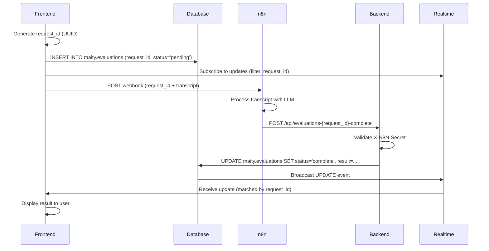
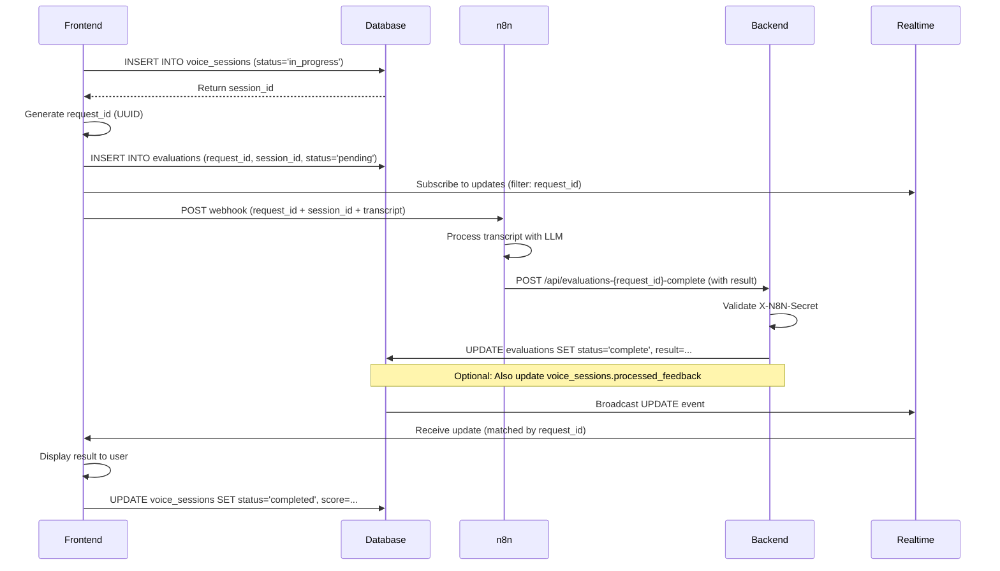

# n8n Integration Guide: Voice Transcript Evaluation

## Overview

This document describes how to configure n8n to process voice transcripts and POST evaluation results back to the Maity backend.

## Architecture Flow

1. **Frontend** → Creates `request_id` (UUID) → Calls RPC `maity.create_evaluation` → Inserts `pending` row
2. **Frontend** → Sends transcript + `request_id` to n8n webhook
3. **n8n** → Receives webhook → Runs LLM chain → POSTs result to backend (using same `request_id`)
4. **Backend** → Validates secret → Updates evaluation row → Returns status
5. **Frontend** → Listens via Realtime (filtered by `request_id`) → Shows feedback to user

⚠️ **Important**: Always use RPC functions for database operations that require special permissions. Direct table access from the frontend will fail due to RLS policies.

⚠️ **Key Point**: The `request_id` generated by the frontend must flow through the entire pipeline: Frontend → n8n webhook → LLM processing → Backend API → Realtime update

---

## Backend Endpoint

### URL
```
POST https://api.maity.com.mx/api/evaluations-{request_id}-complete
```

Replace `{request_id}` with the actual UUID.

### Required Header
```
X-N8N-Secret: your-secret-value
```

**Security**: The secret must match `process.env.N8N_BACKEND_SECRET` configured in your backend environment.

### Request Body (JSON)

#### Successful Evaluation
```json
{
  "status": "complete",
  "result": {
    "score": 85,
    "strengths": ["Good rapport building", "Clear communication"],
    "weaknesses": ["Missed objection handling", "No clear close"],
    "feedback": "Overall strong performance with room for improvement in closing techniques.",
    "metrics": {
      "talk_ratio": 0.65,
      "response_time_avg_ms": 1200,
      "keywords_hit": 8
    }
  }
}
```

#### Failed Evaluation (Error)
```json
{
  "status": "error",
  "error_message": "LLM rate limit exceeded. Please try again later."
}
```

### Response Codes

| Code | Status | Description |
|------|--------|-------------|
| 200  | OK     | Evaluation updated successfully |
| 400  | Bad Request | Missing/invalid parameters |
| 401  | Unauthorized | Invalid or missing `X-N8N-Secret` |
| 404  | Not Found | Evaluation with `request_id` not found |
| 409  | Conflict | Evaluation already finalized (idempotency violation) |
| 500  | Server Error | Internal server/database error |

### Example Success Response
```json
{
  "ok": true,
  "evaluation": {
    "request_id": "abc-123-def-456",
    "status": "complete",
    "updated_at": "2025-09-29T12:34:56.789Z"
  }
}
```

### Example Error Response (409 Conflict)
```json
{
  "error": "ALREADY_FINALIZED",
  "current_status": "complete"
}
```

---

## n8n Workflow Configuration

### 1. Webhook Node (Trigger)

**Method**: `POST`
**Path**: `/webhook/voice-transcript`

**Expected Payload from Frontend**:
```json
{
  "request_id": "550e8400-e29b-41d4-a716-446655440000",
  "transcript": "Hello, I'd like to discuss your product pricing...",
  "metadata": {
    "session_id": "session-xyz",
    "user_id": "user-789"
  }
}
```

⚠️ **CRITICAL**: The `request_id` must be sent by the frontend and passed through the entire n8n workflow to identify which evaluation row to update.

### 2. LLM Chain Node

Configure your LLM node (OpenAI, Claude, etc.) to process the transcript.

**Example Prompt**:
```
Analyze the following sales call transcript and provide:
1. Overall score (0-100)
2. Key strengths (array)
3. Areas for improvement (array)
4. Detailed feedback

Transcript:
{{$json["transcript"]}}
```

### 3. HTTP Request Node

**Method**: `POST`
**URL**: `https://api.maity.com.mx/api/evaluations-{{$json["request_id"]}}-complete`

⚠️ **IMPORTANT**: Use `{{$json["request_id"]}}` from the webhook payload (not from LLM output). If your LLM node doesn't preserve the request_id, add a **Set Node** before the HTTP Request to merge:
```javascript
// Set Node - Merge Data
{
  request_id: $('Webhook').item.json.request_id,
  score: $json.score,
  strengths: $json.strengths,
  weaknesses: $json.weaknesses,
  feedback: $json.feedback,
  metrics: $json.metrics
}
```

**Authentication**: None (custom header)

**Headers**:
```json
{
  "Content-Type": "application/json",
  "X-N8N-Secret": "{{$env.N8N_BACKEND_SECRET}}"
}
```

**Body** (JSON):
```json
{
  "status": "complete",
  "result": {
    "score": {{$json["score"]}},
    "strengths": {{$json["strengths"]}},
    "weaknesses": {{$json["weaknesses"]}},
    "feedback": {{$json["feedback"]}},
    "metrics": {{$json["metrics"]}}
  }
}
```

**Example curl command** (for testing):
```bash
curl -X POST "https://api.maity.com.mx/api/evaluations-abc123-complete" \
  -H "Content-Type: application/json" \
  -H "X-N8N-Secret: your-secret-here" \
  -d '{
    "status": "complete",
    "result": {
      "score": 85,
      "feedback": "Good performance"
    }
  }'
```

### 4. Error Handling Node (Optional)

Add an error handler to catch LLM failures:

**On Error** → HTTP Request Node:

**Body**:
```json
{
  "status": "error",
  "error_message": "{{$json["error"]["message"]}}"
}
```

---

## Environment Variables

### Backend (.env)
```bash
N8N_BACKEND_SECRET=your-strong-random-secret-here
SUPABASE_URL=https://your-project.supabase.co
SUPABASE_SERVICE_ROLE_KEY=your-service-role-key
CORS_ORIGINS=https://your-frontend.com,https://www.your-frontend.com
```

### n8n (.env or Settings)
```bash
N8N_BACKEND_SECRET=your-strong-random-secret-here
```

**Important**: Both values must match exactly.

---

## Frontend Integration Example

### RPC Function for Creating Evaluations

The frontend uses an RPC function to create evaluations, which bypasses RLS restrictions:

```sql
-- Function signature
maity.create_evaluation(
  p_request_id UUID,
  p_user_id UUID,
  p_session_id UUID DEFAULT NULL
) RETURNS maity.evaluations
```

This function:
- Validates that the user_id belongs to the authenticated user
- Validates that the session_id belongs to the user (if provided)
- Creates the evaluation record with 'pending' status
- Returns the created record

### Complete Working Example

See full implementation in: `src/components/VoiceEvaluationExample.tsx`

```tsx
import { useState, useEffect } from 'react';
import { useEvaluationRealtime, createEvaluation } from '@/hooks/useEvaluationRealtime';
import { supabase } from '@/integrations/supabase/client';

function VoiceEvaluationComponent() {
  const [requestId, setRequestId] = useState<string | null>(null);
  const [maityUserId, setMaityUserId] = useState<string | null>(null);

  // Get maity user_id from auth
  useEffect(() => {
    async function fetchMaityUserId() {
      const { data: { user } } = await supabase.auth.getUser();
      if (!user) return;

      // Get maity.users.id from auth_id
      const { data } = await supabase
        .schema('maity')
        .from('users')
        .select('id')
        .eq('auth_id', user.id)
        .single();

      if (data) setMaityUserId(data.id);
    }
    fetchMaityUserId();
  }, []);

  const { evaluation, isLoading, error } = useEvaluationRealtime({
    requestId: requestId || '',
    onComplete: (result) => {
      console.log('✅ Evaluation complete!', result);
      alert(`Score: ${result.score}/100`);
    },
    onError: (errorMessage) => {
      console.error('❌ Evaluation error:', errorMessage);
      alert(`Error: ${errorMessage}`);
    },
  });

  const handleStartEvaluation = async (transcript: string, sessionId?: string) => {
    if (!maityUserId) return;

    // 1. Generate unique request_id
    const newRequestId = crypto.randomUUID();

    // 2. Create pending evaluation in database (linked to maity.users.id and optionally to voice_sessions.id)
    const { data, error: createError } = await createEvaluation(
      newRequestId,
      maityUserId,
      sessionId // Optional: pass voice_sessions.id to link evaluation to session
    );

    if (createError) {
      console.error('Failed to create evaluation:', createError);
      return;
    }

    // 3. Start listening for realtime updates
    setRequestId(newRequestId);

    // 4. Send transcript + request_id to n8n webhook
    try {
      await fetch('https://your-n8n-instance.com/webhook/voice-transcript', {
        method: 'POST',
        headers: { 'Content-Type': 'application/json' },
        body: JSON.stringify({
          request_id: newRequestId, // ⚠️ CRITICAL: Must be included
          transcript: transcript,
          metadata: { user_id: maityUserId },
        }),
      });

      console.log('✅ Transcript sent to n8n with request_id:', newRequestId);
    } catch (err) {
      console.error('❌ Error sending to n8n:', err);
    }
  };

  return (
    <div>
      <button onClick={() => handleStartEvaluation('Sample transcript...', 'optional-session-id')}>
        Start Evaluation
      </button>

      {isLoading && <p>⏳ Waiting for evaluation...</p>}
      {error && <p>❌ Error: {error}</p>}
      {evaluation?.status === 'complete' && (
        <div>
          <p>Score: {evaluation.result.score}/100</p>
          <p>{evaluation.result.feedback}</p>
          {evaluation.session_id && <p className="text-sm text-gray-500">Session: {evaluation.session_id}</p>}
        </div>
      )}
    </div>
  );
}
```

### Linking to Voice Sessions

When creating an evaluation for a voice practice session:

```tsx
// After creating a voice_session
const { data: session } = await supabase
  .schema('maity')
  .from('voice_sessions')
  .insert({
    user_id: maityUserId,
    company_id: companyId,
    profile_scenario_id: scenarioId,
    status: 'in_progress'
  })
  .select()
  .single();

// Create evaluation linked to the session
const requestId = crypto.randomUUID();
await createEvaluation(requestId, maityUserId, session.id);

// After getting transcript, send to n8n
fetch('https://n8n-webhook-url', {
  method: 'POST',
  body: JSON.stringify({
    request_id: requestId,
    session_id: session.id, // Also send session_id to n8n for context
    transcript: transcriptText
  })
});

// When evaluation completes, you can query both tables
const { data: evaluation } = await supabase
  .schema('maity')
  .from('evaluations')
  .select(`
    *,
    voice_session:voice_sessions(*)
  `)
  .eq('request_id', requestId)
  .single();
```

### Complete Flow Diagram

#### Option 1: Standalone Evaluation (No Session)


#### Option 2: Evaluation Linked to Voice Session


---

## Security Considerations

1. **Secret Validation**: Always validate `X-N8N-Secret` header on the backend
2. **Service Role Usage**: Backend uses service role key to bypass RLS (required for updates)
3. **Idempotency**: Backend prevents duplicate updates via status check
4. **RLS**: Frontend can only SELECT/INSERT own evaluations (no updates)
5. **CORS**: Configure `CORS_ORIGINS` to whitelist your frontend domain

---

## Troubleshooting

### 401 Unauthorized
- Check that `X-N8N-Secret` header is present
- Verify secret matches `N8N_BACKEND_SECRET` in backend env
- Check header name is exactly `X-N8N-Secret` (case-sensitive)

### 404 Not Found
- Verify `request_id` exists in `maity.evaluations` table
- Check frontend created the row before n8n POSTs
- Confirm `request_id` format is valid UUID

### 409 Conflict
- Evaluation already finalized (complete/error)
- This is expected for duplicate requests (idempotency protection)
- Check n8n workflow isn't sending duplicate POSTs

### 500 Server Error
- Check backend logs for detailed error
- Verify Supabase connection (URL, service role key)
- Ensure `maity.evaluations` table exists with correct schema

### Realtime Not Updating
- Verify `ALTER PUBLICATION supabase_realtime ADD TABLE maity.evaluations;` was run
- Check frontend subscription filter matches `request_id`
- Confirm user has RLS permissions (SELECT policy)
- Test with Supabase Realtime inspector in dashboard

---

## Testing the Integration

### 1. Complete Evaluation (n8n Simulation)

**Basic test with minimal payload:**
```bash
curl -X POST "https://api.maity.com.mx/api/evaluations-550e8400-e29b-41d4-a716-446655440000-complete" \
  -H "Content-Type: application/json" \
  -H "X-N8N-Secret: your-secret-here" \
  -d '{
    "status": "complete",
    "result": {
      "score": 90,
      "feedback": "Great job!"
    }
  }'
```

**Full payload with all fields:**
```bash
curl -X POST "https://api.maity.com.mx/api/evaluations-550e8400-e29b-41d4-a716-446655440000-complete" \
  -H "Content-Type: application/json" \
  -H "X-N8N-Secret: your-secret-here" \
  -d '{
    "status": "complete",
    "result": {
      "score": 85,
      "strengths": [
        "Excellent rapport building",
        "Clear value proposition",
        "Active listening demonstrated"
      ],
      "weaknesses": [
        "Could improve objection handling",
        "Missed opportunity to discuss ROI"
      ],
      "feedback": "Strong performance overall. Focus on addressing objections with data-backed responses and quantifying value propositions.",
      "metrics": {
        "talk_ratio": 0.65,
        "response_time_avg_ms": 1200,
        "keywords_hit": 8,
        "objections_handled": 3,
        "questions_asked": 5
      },
      "transcript_analysis": {
        "total_words": 1524,
        "sentiment": "positive",
        "key_moments": [
          {"timestamp": "00:02:15", "event": "Identified pain point"},
          {"timestamp": "00:05:30", "event": "Presented solution"},
          {"timestamp": "00:08:45", "event": "Handled pricing objection"}
        ]
      }
    }
  }'
```

**Error status test:**
```bash
curl -X POST "https://api.maity.com.mx/api/evaluations-550e8400-e29b-41d4-a716-446655440000-complete" \
  -H "Content-Type: application/json" \
  -H "X-N8N-Secret: your-secret-here" \
  -d '{
    "status": "error",
    "error_message": "LLM rate limit exceeded. Please try again in 60 seconds."
  }'
```

**Expected Success Response (200):**
```json
{
  "ok": true,
  "evaluation": {
    "request_id": "550e8400-e29b-41d4-a716-446655440000",
    "status": "complete",
    "updated_at": "2025-09-29T12:34:56.789Z"
  }
}
```

**Expected Error Response (401 - Invalid Secret):**
```json
{
  "error": "UNAUTHORIZED"
}
```

**Expected Error Response (404 - Request ID not found):**
```json
{
  "error": "EVALUATION_NOT_FOUND"
}
```

**Expected Error Response (409 - Already Finalized):**
```json
{
  "error": "ALREADY_FINALIZED",
  "current_status": "complete"
}
```

### 2. Verify Realtime (Frontend)
Open browser console and watch for:
```
[useEvaluationRealtime] Subscribed to updates for: 550e8400-e29b-41d4-a716-446655440000
[useEvaluationRealtime] Received update: { ... }
```

---

## Next Steps

1. Configure n8n workflow with webhook + LLM + HTTP nodes
2. Set `N8N_BACKEND_SECRET` in both n8n and backend environments
3. Test end-to-end flow with a sample transcript
4. Monitor backend logs for errors
5. Set up alerting for 401/500 errors in production